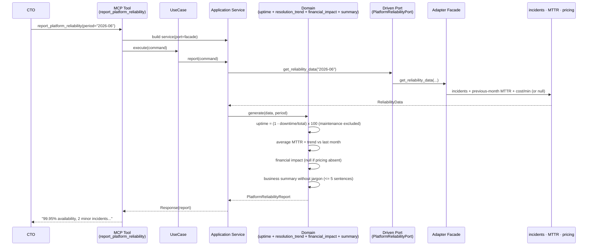
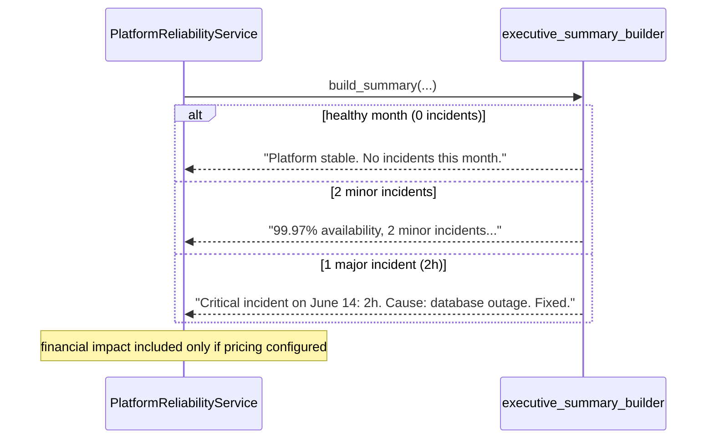
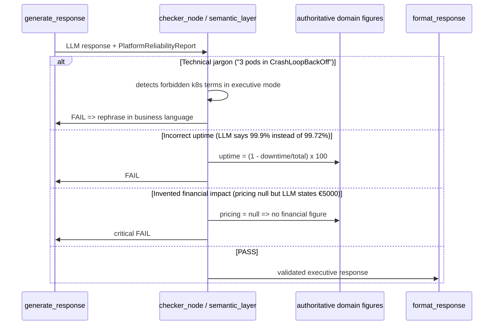

# Use Case 106 — CTO Reliability Report (business language)

Answers: *"How reliable was our platform this month?"* — for a non-technical
executive, in business language, with zero Kubernetes jargon.

Aggregates the month's incidents into an executive report: availability in
plain language, incident count by severity (major/minor), average resolution
time with trend vs the previous month, and estimated financial impact (only if
pricing is configured — never invented). The executive summary fits in fewer
than 5 sentences; the technical detail stays available via drill-down.

## Sample Questions

- "How reliable was our platform this month?"
- "How many incidents did we have this month, and how severe?"
- "Is our resolution time improving compared to last month?"
- "What was the financial impact of downtime this month?"
- "Give me a plain-language platform health summary for leadership."

## 1. Happy Path — full hexagonal chain



## 2. Content Scenarios



## 3. Checker Node — LLM validations (business language)



## Key Points

- **Zero Kubernetes jargon**: the executive summary is built in the domain, in
  business language, and never contains pod/kubectl/namespace/node.
- **Authoritative uptime formula**: `(1 - downtime/total) x 100`, planned
  maintenance excluded — the source of truth the checker validates (2h/720h → 99.72%).
- **Honest financial impact**: strict `None` if pricing is not configured; no
  financial figure is ever invented.
- **Signed MTTR trend** ("-15% vs last month") + improving/degrading/stable.
- **Business severity** (major/minor), not k8s technical levels.
- **Summary ≤ 5 sentences** in executive mode; technical drill-down via `incidents[]`.

## Tests

Test files created for this use case:

```
tests/unit/test_platform_reliability.py                          # domain model
tests/unit/test_platform_reliability_port.py                     # driven port + TypedDicts
tests/unit/test_platform_uptime_calculator.py                    # uptime formula + maintenance
tests/unit/test_resolution_trend.py                              # MTTR + delta% + trend
tests/unit/test_financial_impact.py                              # null if no pricing
tests/unit/test_executive_summary_builder.py                     # business language, no jargon, <=5 sentences
tests/unit/test_platform_reliability_service.py                  # orchestration
tests/unit/test_platform_reliability_adapter.py                  # Facade delegation
tests/unit/test_platform_reliability_source.py                   # default source (healthy month)
tests/unit/test_report_platform_reliability_command.py           # driving command
tests/unit/test_report_platform_reliability_response.py          # driving response
tests/unit/test_report_platform_reliability_service_port.py      # driving service port (ABC)
tests/unit/test_report_platform_reliability_service.py           # application service
tests/unit/test_report_platform_reliability_use_case.py          # use case
tests/unit/test_report_platform_reliability_mcp.py               # MCP tool
tests/unit/test_server.py                                        # build_platform_reliability_adapter factory
```

Domain logic stubs (uptime, trend, impact, summary):

```python
def test_two_hours_over_thirty_days_is_99_72():
    # 120 min / 43200 min => 99.72% (formula verified by the checker)
    ...

def test_planned_maintenance_excluded():
    # maintenance window => excluded from downtime
    ...

def test_none_when_pricing_not_configured():
    # cost_per_minute None => financial impact None (never invented)
    ...

def test_improving_when_faster_than_previous():
    # 12 min vs 14 => -15%, improving trend
    ...

def test_summary_contains_no_kubernetes_jargon():
    # summary without pod/kubectl/namespace/node
    ...

def test_summary_at_most_five_sentences():
    # executive mode <= 5 sentences
    ...
```

| Scenario (ticket) | Test | Status |
|---|---|---|
| Healthy month (0 incidents) → "Platform stable" | `test_zero_incidents` | ✅ |
| 2 minor incidents → 99.9x% + RCA available | `test_two_minor_incidents` | ✅ |
| 1 major incident (2h) → date + root cause | `test_major_incident` | ✅ |
| Technical drill-down | `incidents[]` in the tool response | ✅ |
| Forbidden jargon detected | `test_summary_contains_no_kubernetes_jargon` | ✅ |
| Uptime = (1 - downtime/total) | `test_two_hours_over_thirty_days_is_99_72` | ✅ |
| Financial impact null without pricing | `test_no_financial_figure_without_pricing` | ✅ |
| Trend vs previous month | `test_resolution_trend_improving` | ✅ |

## Related Files

- `src/hexawyn/domain/models/platform_reliability.py`
- `src/hexawyn/domain/services/platform_reliability/uptime_calculator.py`
- `src/hexawyn/domain/services/platform_reliability/resolution_trend.py`
- `src/hexawyn/domain/services/platform_reliability/financial_impact.py`
- `src/hexawyn/domain/services/platform_reliability/executive_summary_builder.py`
- `src/hexawyn/domain/services/platform_reliability/platform_reliability_service.py`
- `src/hexawyn/application/ports/driven/platform_reliability_port.py`
- `src/hexawyn/application/ports/driving/report_platform_reliability/`
- `src/hexawyn/application/service/report_platform_reliability_service.py`
- `src/hexawyn/application/use_case/report_platform_reliability/report_platform_reliability_use_case.py`
- `src/hexawyn/adapters/secondary/gitops/platform_reliability_adapter.py`
- `src/hexawyn/adapters/secondary/gitops/platform_reliability_source.py`
- `src/hexawyn/mcp/tools/report_platform_reliability.py`
- `src/hexawyn/mcp/server.py` (`build_platform_reliability_adapter`)
