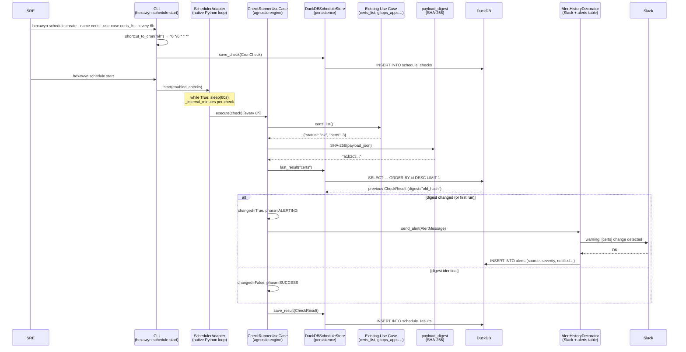
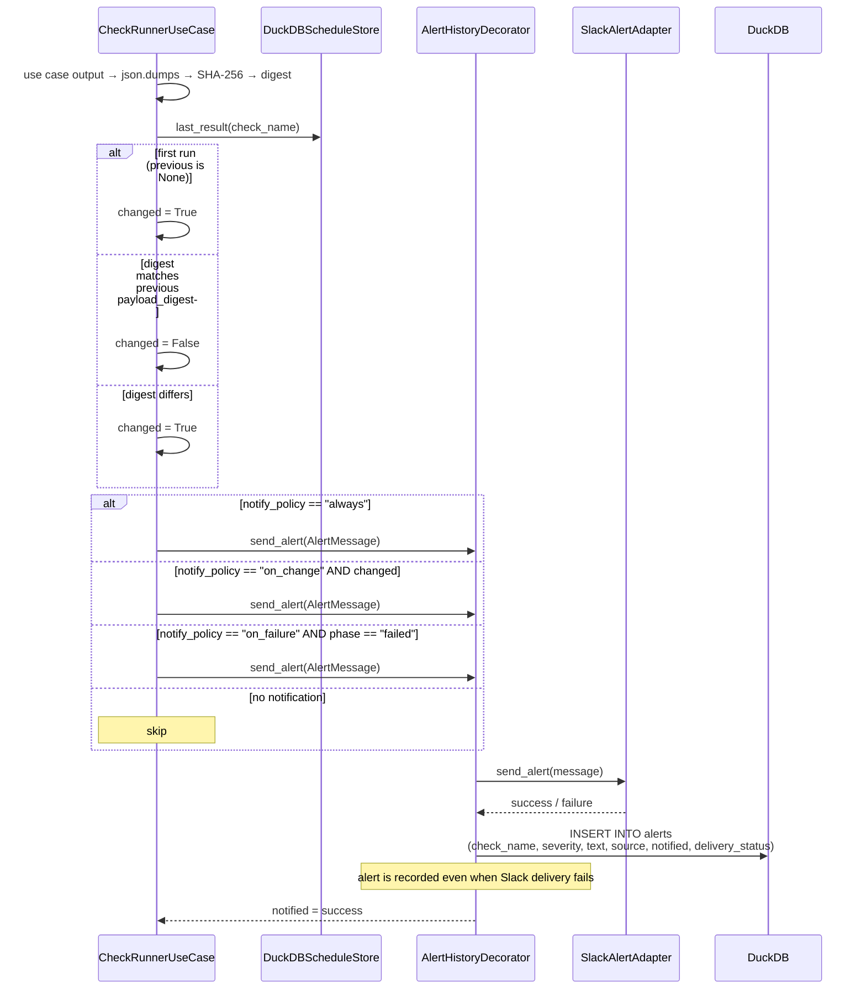
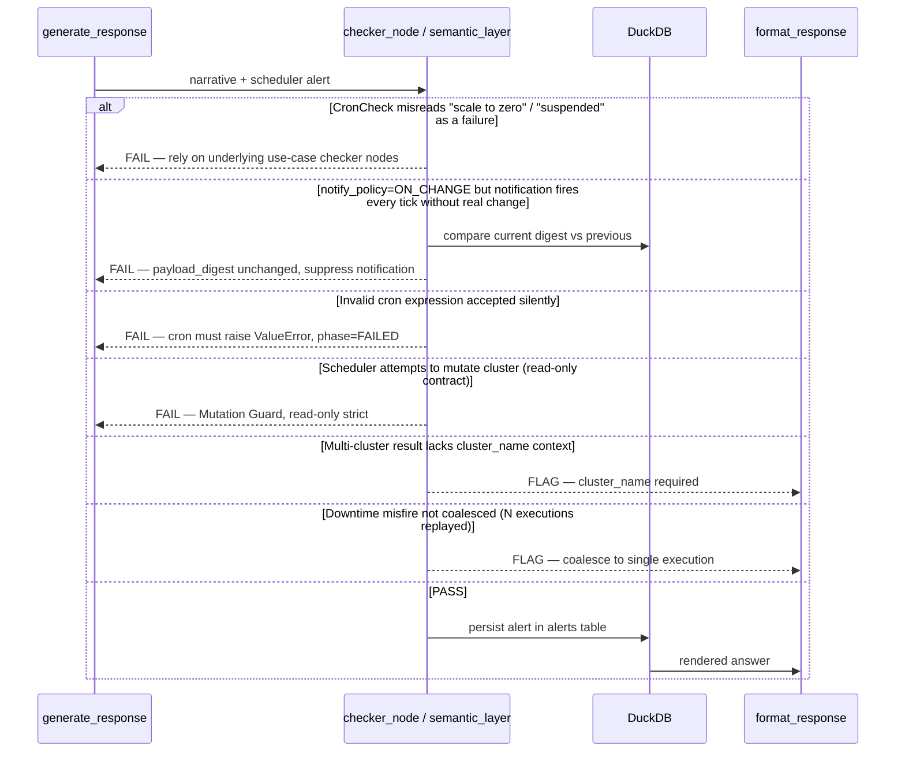
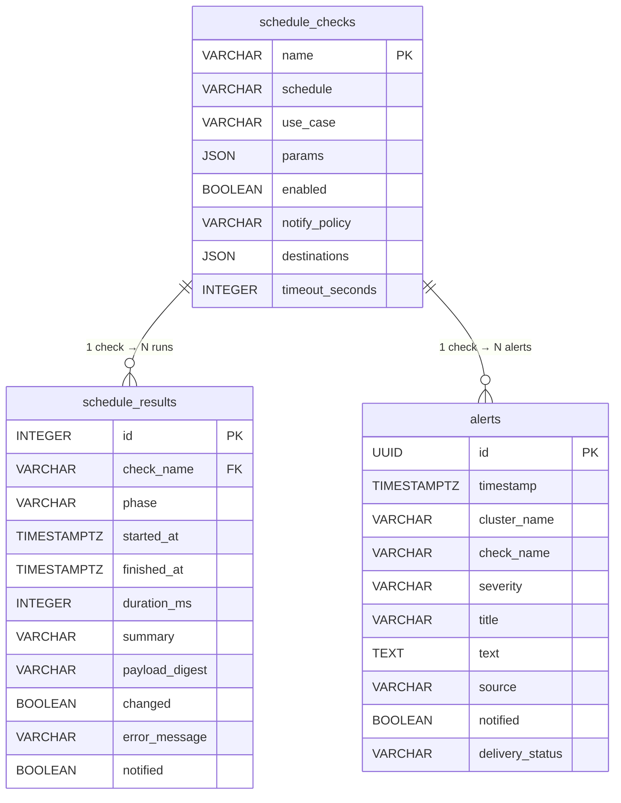

# Use Case 115 — Generic Scheduling Engine (ECA-157)

Periodically executes existing use cases (cert audits, GitOps drift, SLO
breach…) on a configurable cron schedule, detects state changes via
`payload_digest`, and notifies Slack when a result differs from the previous
run.

The scheduler is **agnostic**: it knows no specific use case — it runs a
use case by name, computes a digest, compares it with the last run, and
decides whether to notify. This is what allows the control-plane (ECA-125)
to reuse it unchanged.

## CLI Commands (v1 — no natural language interface)

```bash
# Create a scheduled check
hexawyn schedule create --name certs --use-case certs_list --every 6h --notify on-change

# List all checks
hexawyn schedule list

# Detail of a check
hexawyn schedule get certs

# Execution history
hexawyn schedule history certs --limit 10

# Overview
hexawyn schedule status

# Enable / disable
hexawyn schedule enable certs
hexawyn schedule disable certs

# Delete
hexawyn schedule delete certs

# Manual run (outside cron)
hexawyn schedule run certs

# Start the scheduler (long-running)
hexawyn schedule start
hexawyn schedule start --dry-run
```

---

## 1. Happy Path — Full Hexagonal Chain



---

## 2. Change Detection & Notification Flows



---

## 3. Checker Node



---

## 4. DuckDB — Schedule Schema



---

## Key Points

- **Use-case agnostic**: the scheduler knows no specific use case; it runs a
  string name via an injected `UseCaseRegistry` and compares results.
- **Change detection via `payload_digest`** (SHA-256): compares the hash of the
  current output with the last run. No heuristics, no thresholds.
- **Notify policy**: `always` (every tick), `on_change` (only when digest
  differs), `on_failure` (only on error).
- **Alerts persisted**: every alert sent (or attempted) is recorded in the
  `alerts` table via `AlertHistoryDecorator`, with delivery status.
- **Native Python scheduler**: `while True` + `time.sleep(60)`, zero external
  dependencies. Supports `--every` shortcuts (15m, 30m, 1h, 6h, 12h, 24h).
- **Disabled by default**: `HEXAWYN_SCHEDULER_ENABLED=false` — existing MCP
  behaviour is completely unchanged for users who do not activate it.

---

## Related Files

- `src/hexawyn/domain/models/schedule.py`
- `src/hexawyn/domain/services/schedule/check_runner.py`
- `src/hexawyn/domain/services/schedule/cron_shortcut.py`
- `src/hexawyn/domain/services/schedule/duckdb_schedule_store.py`
- `src/hexawyn/domain/services/schedule/alert_history.py`
- `src/hexawyn/application/ports/driven/schedule_store_port.py`
- `src/hexawyn/infrastructure/config/schedule_source.py`
- `src/hexawyn/cli/commands/schedule_command.py`
- `src/hexawyn/infrastructure/memory/sql/schema.sql`
- `src/hexawyn/infrastructure/memory/sql/migrations/v004_add_alerts.sql`
