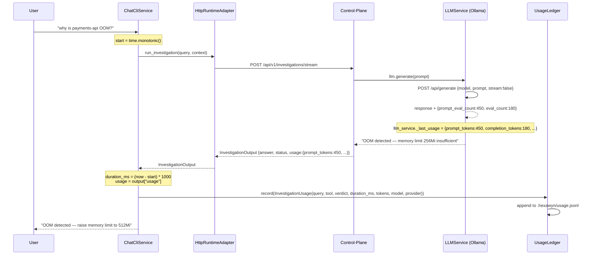
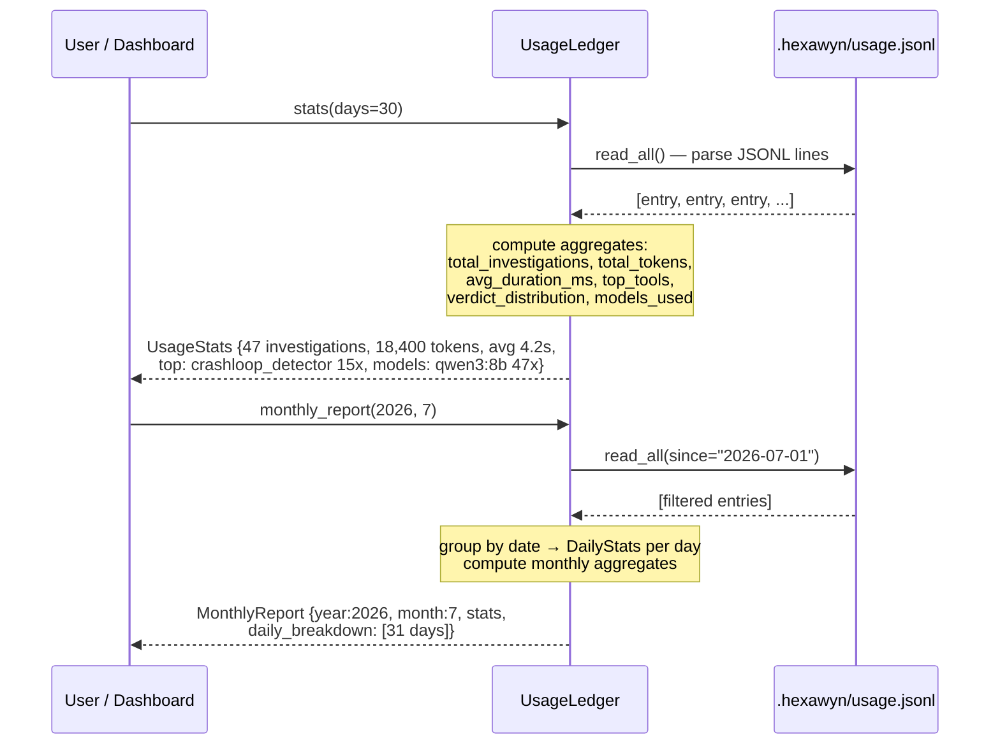
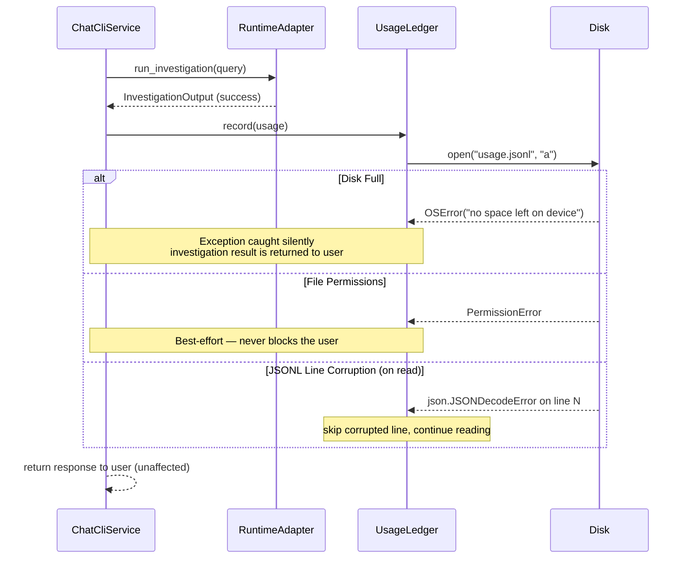
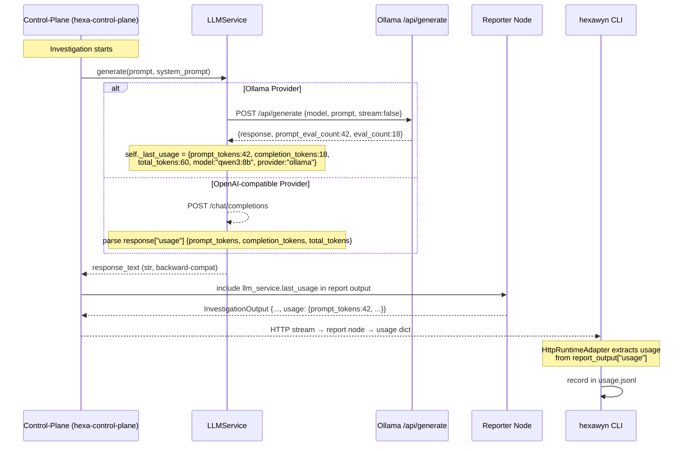

# Use Case 116 — Usage Ledger: Investigation Audit Trail

## Sample Questions

- "How many investigations did I run this month?"
- "Which tools consume the most SLM time?"
- "What's my average investigation duration this week?"
- "How many tokens did the SLM consume last month across all investigations?"
- "Show me my monthly usage report for July 2026"

---

Every investigation executed by `ChatCliService` is recorded in an append-only JSONL ledger (`.hexawyn/usage.jsonl`). The flow goes through: ChatCliService → UsageLedger (best-effort, never blocks the investigation). Token usage data originates from the control-plane `LLMService.last_usage` and is carried through `InvestigationOutput.usage` back to the CLI. The ledger supports read-back with time and tool filters, aggregate stats over N days, and monthly reports grouped by day.

### Flow 1 — Happy Path: Record Usage After Investigation

### Flow 2 — Read: Stats and Monthly Report

### Flow 3 — Error: Best-Effort (Ledger Never Blocks)

### Flow 4 — Token Tracking: Control-Plane LLMService → CLI UsageLedger

## Key Points

- **Append-only JSONL** — one line per investigation, human-readable, grep-friendly. No database required.
- **Best-effort** — the ledger never blocks or crashes an investigation. Disk full, permission errors, JSON corruption are all caught silently.
- **Token tracking via `LLMService.last_usage`** — the control-plane LLM service now stores usage metadata on every `generate()` call. Ollama `prompt_eval_count`+`eval_count`, OpenAI-compatible `usage` field.
- **Backward-compat** — `LLMService.generate()` still returns `str`. The `last_usage` property is read separately by the caller (Reporter node) when assembling `InvestigationOutput`.
- **`InvestigationOutput.usage`** — new optional dict field (`{prompt_tokens, completion_tokens, total_tokens, model, provider}`). Absent or empty means no LLM was called (e.g. `list_pods`).
- **Monthly rotation** — the ledger supports reading by date range, and a future rotation mechanism (one file per month) will handle files > 100k lines.
- **Stats aggregation** — `stats(days)` computes total investigations, tokens, duration, top tools, verdict distribution, and models used. `monthly_report(year, month)` adds daily breakdown.
- **FinOps transparency** — the ledger is not for billing (SLM local + abonnement fixe) but for monitoring, debugging performance regressions, and monthly usage transparency.

## Test Coverage

| Test | File | Status |
|---|---|---|
| `test_required_fields` | `tests/unit/test_usage.py` | ✅ |
| `test_namespace_can_be_none` | `tests/unit/test_usage.py` | ✅ |
| `test_zero_tokens_for_non_llm_investigation` | `tests/unit/test_usage.py` | ✅ |
| `test_empty_stats` | `tests/unit/test_usage.py` | ✅ |
| `test_record_writes_line_to_file` | `tests/unit/test_usage_ledger.py` | ✅ |
| `test_record_creates_parent_directories` | `tests/unit/test_usage_ledger.py` | ✅ |
| `test_record_appends_multiple_entries` | `tests/unit/test_usage_ledger.py` | ✅ |
| `test_read_all_returns_entries` | `tests/unit/test_usage_ledger.py` | ✅ |
| `test_read_all_since_filters_by_timestamp` | `tests/unit/test_usage_ledger.py` | ✅ |
| `test_read_all_tool_filter` | `tests/unit/test_usage_ledger.py` | ✅ |
| `test_read_all_skips_corrupted_lines` | `tests/unit/test_usage_ledger.py` | ✅ |
| `test_stats_computes_aggregates` | `tests/unit/test_usage_ledger.py` | ✅ |
| `test_stats_top_tools_sorted_by_count` | `tests/unit/test_usage_ledger.py` | ✅ |
| `test_monthly_report_groups_by_day` | `tests/unit/test_usage_ledger.py` | ✅ |
| `test_records_usage_after_investigation` | `tests/unit/test_chat_cli_service.py` | ✅ |
| `test_no_ledger_is_safe` | `tests/unit/test_chat_cli_service.py` | ✅ |
| `test_ledger_exception_does_not_block_investigation` | `tests/unit/test_chat_cli_service.py` | ✅ |
| `test_ollama_generate_tracks_usage` | `tests/unit/test_llm_service.py` (hexa-control-plane) | ✅ |
| `test_openai_generate_tracks_usage` | `tests/unit/test_llm_service.py` (hexa-control-plane) | ✅ |
| `test_last_usage_reset_on_error` | `tests/unit/test_llm_service.py` (hexa-control-plane) | ✅ |

## Related Files

- `src/hexawyn/domain/models/usage.py` — InvestigationUsage, UsageStats, DailyStats, MonthlyReport TypedDicts/dataclasses
- `src/hexawyn/application/ports/driven/usage_ledger_port.py` — UsageLedgerPort ABC
- `src/hexawyn/infrastructure/monitoring/usage_ledger.py` — UsageLedger (JSONL append-only implementation)
- `src/hexawyn/application/ports/driven/runtime_port.py` — InvestigationOutput (added `usage` field)
- `src/hexawyn/application/service/chat_cli_service.py` — ChatCliService (UsageLedger injection + _record_usage)
- `src/hexawyn/application/service/http_runtime_adapter.py` — HttpRuntimeAdapter (extracts usage from report output)
- `src/hexawyn/application/service/runtime_adapter.py` — StubRuntimeAdapter (usage={})
- `src/hexawyn/lang_graph/services/llm_service.py` (hexa-control-plane) — LLMService.last_usage, LLMUsageInfo TypedDict
