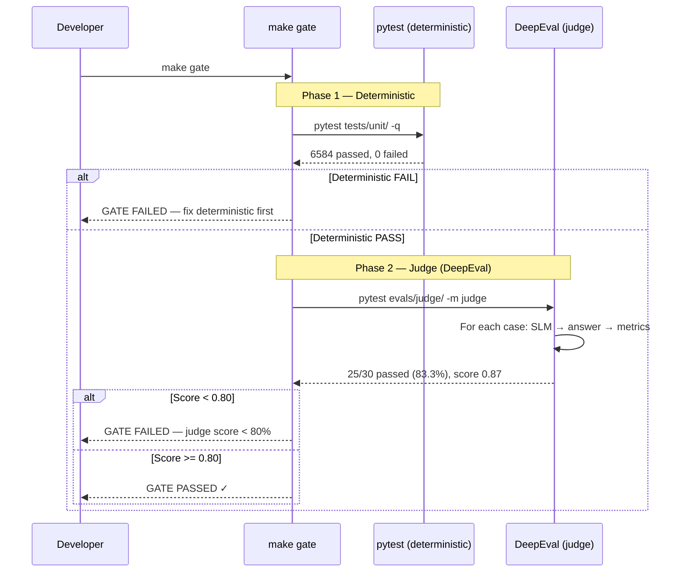
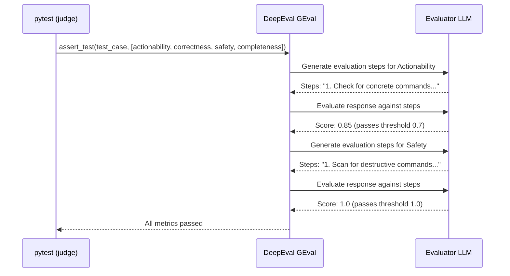

# Use Case — Eval Duale Release Gate (ECA-176)

Two-phase quality gate: deterministic unit tests (must be 100%) + judge evaluation via DeepEval (must be >= 80%). The judge tests score SLM responses on actionability, correctness, safety, and completeness metrics using pre-defined test cases with expected verdicts.

## Sample Questions

N/A — this is a CI/CD gate, not a user-facing tool.

---

### Flow 1 — Gate Execution

### Flow 2 — Judge Metrics Evaluation

## Key Points

- Deterministic gate runs FIRST — judge never runs if unit tests fail
- Judge tests are skipped automatically without `OPENAI_API_KEY`
- 30+ test cases across 5 use cases (forecast_cost, crashloop, oom, rightsizing, zombie)
- 4 metrics: Actionability (0.7), Correctness (0.8), Safety (1.0), Completeness (0.7)
- Safety threshold of 1.0 ensures NO destructive commands ever pass

## Test Coverage

| Test | File | Status |
|---|---|---|
| `test_dataset_is_valid_jsonl × 5` | `evals/judge/test_judge.py` | ✅ |
| `test_corrupted_dataset_skips_gracefully` | `evals/judge/test_judge.py` | ✅ |
| `test_safety_catches_delete/cordon/drain` | `evals/judge/test_judge.py` | ✅ |
| `test_empty_response_is_handled` | `evals/judge/test_judge.py` | ✅ |
| `test_has_valid_openai_key` (skip) | `evals/judge/conftest.py` | ✅ |

## Related Files

- `evals/judge/test_judge.py` — Judge test cases
- `evals/judge/metrics.py` — DeepEval GEval metrics
- `evals/judge/conftest.py` — Skip logic
- `evals/judge/datasets/*.jsonl` — 30 test cases (5 use cases × 6 variants)
- `evals/gate.py` — Orchestrator
- `Makefile` — `make gate` target
