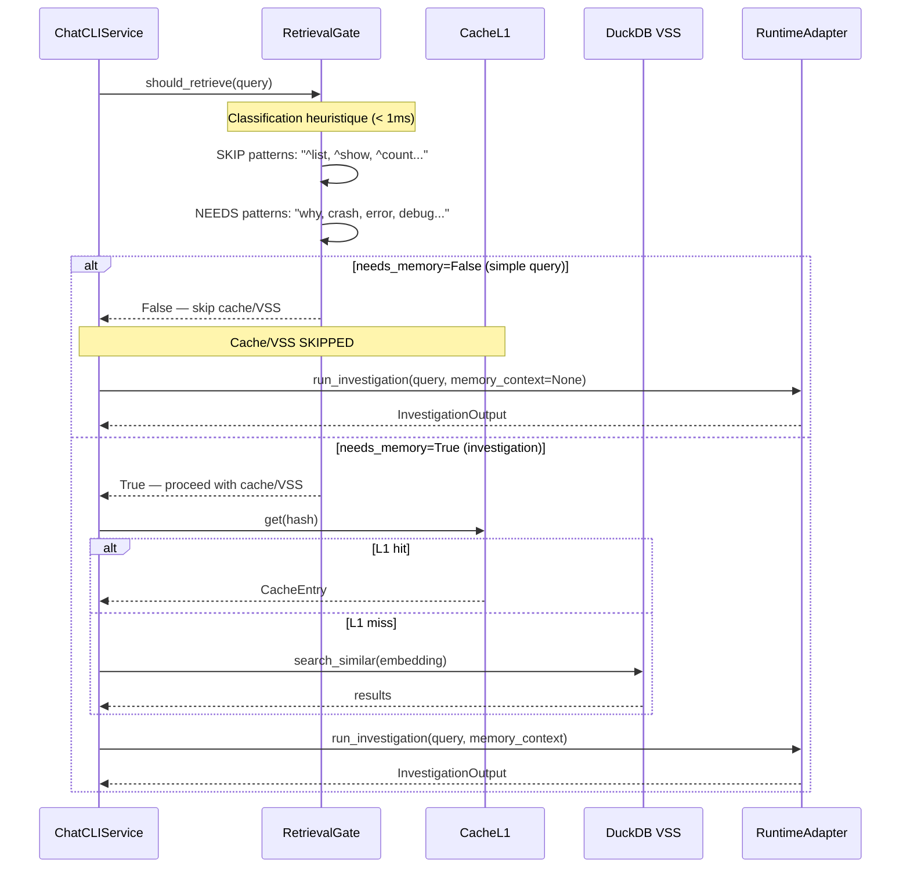
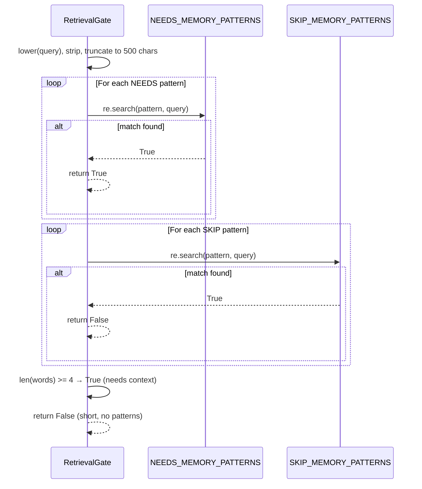

# Use Case — Retrieval Gate (ECA-177)

Lightweight heuristic classifier that decides whether a user query needs VSS memory retrieval BEFORE the cache/VSS pipeline runs. Uses regex patterns (no LLM, no embeddings, < 1ms per query) to classify queries as `needs_memory=True` (investigation, diagnostic) or `needs_memory=False` (list, count, describe).

Saves 30-40% of DuckDB VSS lookups for simple queries like "list namespaces" or "show me pods".

## Sample Questions

- "Why is my pod crashing?" → needs_memory=True
- "List all namespaces in production" → needs_memory=False
- "Debug the OOM in auth-service" → needs_memory=True
- "What is the version of nginx?" → needs_memory=False

---

### Flow 1 — Cache Bypass for Simple Queries

### Flow 2 — Pattern Classification Logic

## Key Points

- Classification < 1ms per query — regex only, no LLM/embeddings
- NEEDS wins over SKIP (conservative: better to search unnecessarily than miss)
- Query truncated to 500 chars for ReDoS protection
- French patterns need to be added (currently English-only)
- Integration: inject RetrievalGate into ChatCLIService (optional, backward-compatible)

## Test Coverage

| Test | File | Status |
|---|---|---|
| `test_why_crashing` | `tests/unit/domain/services/test_retrieval_gate.py` | ✅ |
| `test_list_namespaces` | `tests/unit/domain/services/test_retrieval_gate.py` | ✅ |
| `test_needs_wins_over_skip` | `tests/unit/domain/services/test_retrieval_gate.py` | ✅ |
| `test_french_query_defaults_to_needs_memory` | `tests/unit/domain/services/test_retrieval_gate.py` | ✅ |
| `test_very_long_query` | `tests/unit/domain/services/test_retrieval_gate.py` | ✅ |
| `test_retrieval_gate_skip_clears_history` | `tests/unit/application/service/test_chat_cli_service.py` | ✅ |

## Related Files

- `src/hexawyn/domain/services/retrieval_gate.py` — RetrievalGate classifier
- `src/hexawyn/application/service/chat_cli_service.py` — Injection point
- `tests/unit/domain/services/test_retrieval_gate.py` — 38 tests
- `tests/unit/application/service/test_chat_cli_service.py` — Integration tests
