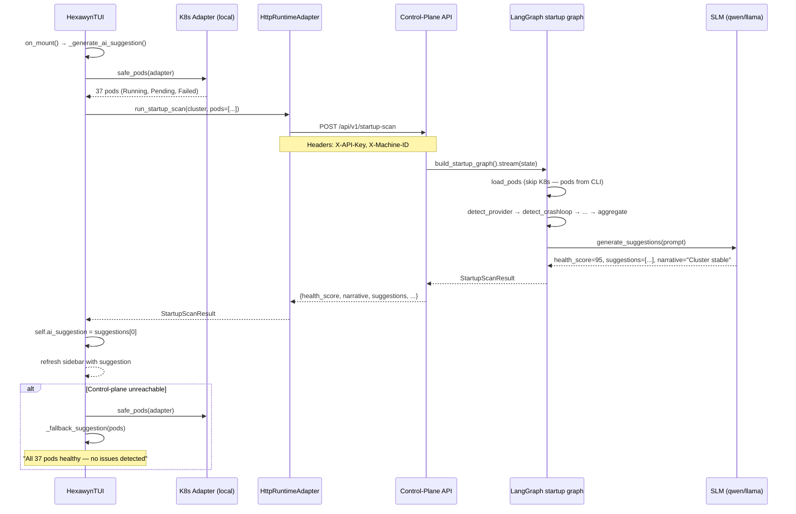
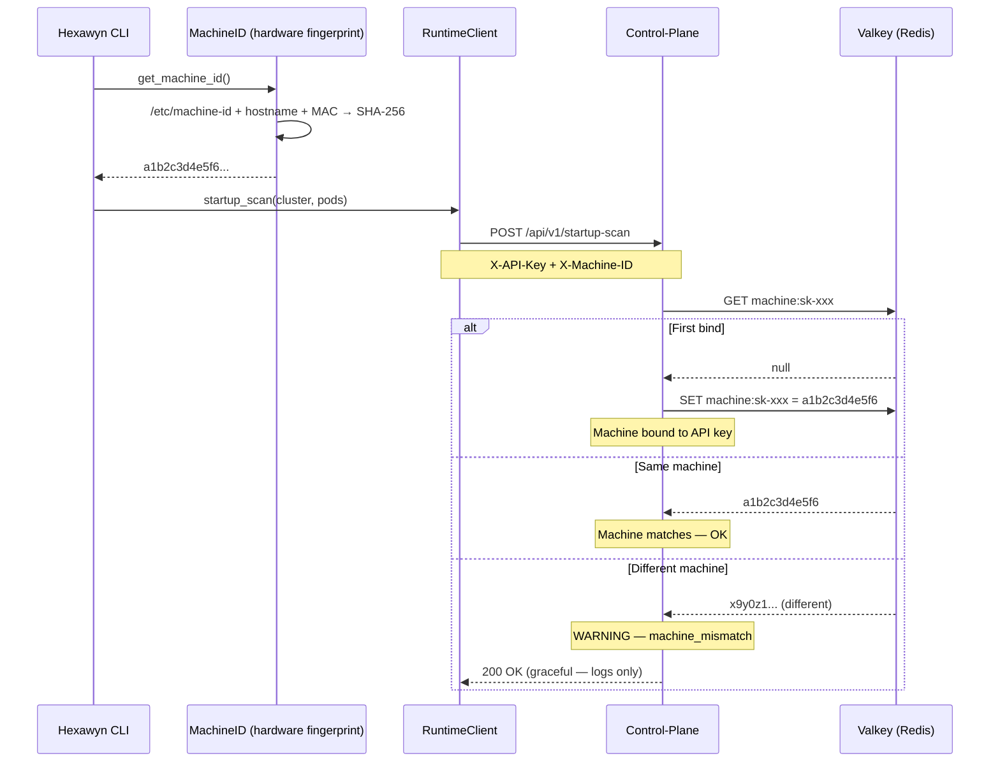

# Use Case — Startup Scan via SLM

At CLI launch, the TUI sends local pod data to the control-plane's startup scan endpoint. The control-plane's LangGraph startup graph analyzes the pods and returns health scores, suggestions, and narrative summaries via the SLM. Results are displayed in the TUI sidebar.

Replaced direct DeepSeek calls with control-plane SLM integration for better maintainability and offline resilience (pod-based fallback when control-plane unreachable).

## Sample Questions

N/A — this runs automatically at CLI startup.

---

### Flow 1 — Startup Scan with Pods from CLI

### Flow 2 — Machine Fingerprint Binding

## Key Points

- CLI sends pods to control-plane → control-plane doesn't need its own K8s connection
- Hardware fingerprint prevents API key sharing across machines
- Fallback to pod-based suggestions when control-plane is unreachable
- Error narratives (e.g., "cluster is down", "0 pods") are filtered out
- Cross-platform: Linux (/etc/machine-id), macOS (IOPlatformUUID), Windows (MachineGuid)

## Test Coverage

| Test | File | Status |
|---|---|---|
| `test_startup_scan_endpoint_returns_200` | `tests/integration/test_startup_scan_integration.py` | ✅ |
| `test_startup_scan_via_runtime_client` | `tests/integration/test_startup_scan_integration.py` | ✅ |
| `test_linux_machine_id` | `tests/unit/infrastructure/config/test_machine_id.py` | ✅ |
| `test_hardware_fingerprint_returns_24_char_hex` | `tests/unit/infrastructure/config/test_machine_id.py` | ✅ |
| `test_uses_pre_loaded_pods_when_present` | `hexa-control-plane/tests/unit/test_load_pods.py` | ✅ |

## Related Files

- `src/hexawyn/cli/tui.py` — _generate_ai_suggestion, _fallback_suggestion
- `src/hexawyn/adapters/secondary/runtime_client.py` — startup_scan(pods)
- `src/hexawyn/application/service/http_runtime_adapter.py` — run_startup_scan
- `src/hexawyn/infrastructure/config/machine_id.py` — Hardware fingerprint
- hexa-control-plane: `api/routers/startup.py`, `load_pods.py`, `runtime_adapter.py`
