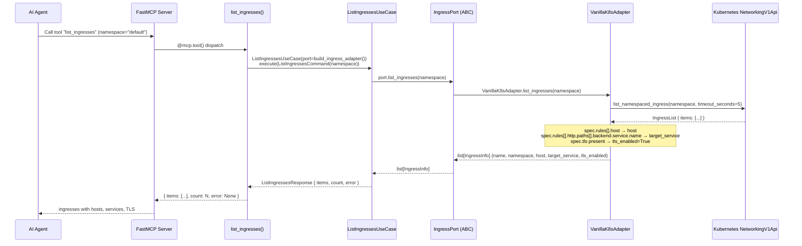
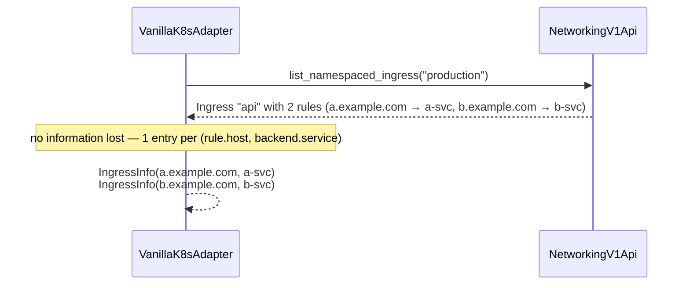
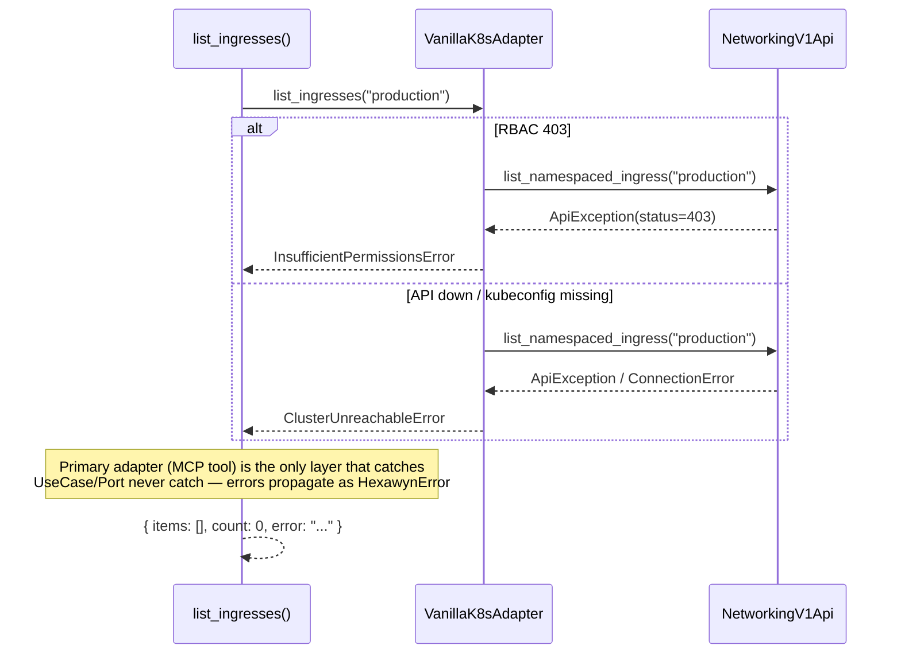
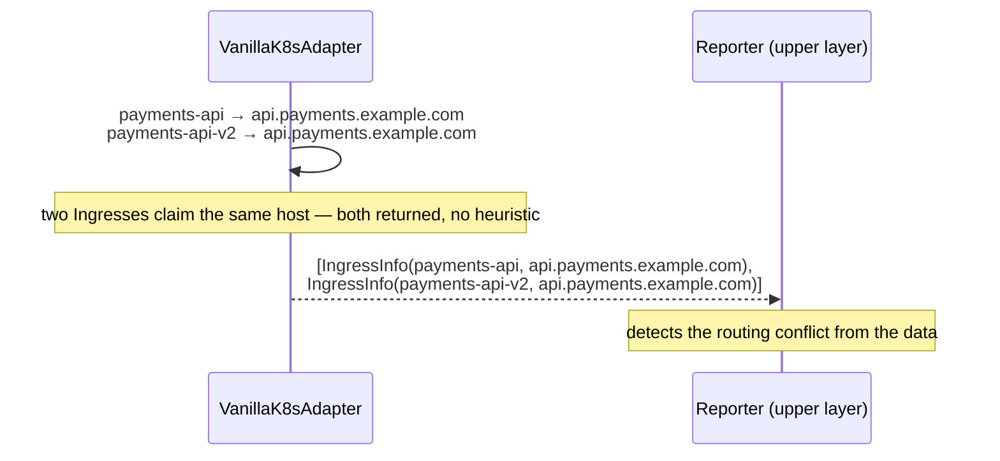

# Use Case — List Kubernetes Ingresses (vanilla)

## Sample Questions

- "List all ingress resources and their hosts"
- "Which ingresses are missing TLS?"
- "Show all ingress resources and their backend services"
- "Are there duplicate ingress hosts?"
- "Which production ingresses are exposed without TLS?"

---

The user asks an AI agent (via MCP) to inventory vanilla Kubernetes Ingress
resources. The flow goes through: MCP Tool → ListIngressesUseCase → IngressPort
(driven port) → VanillaK8sAdapter → NetworkingV1Api. One Ingress can expose
several hosts (rules) and services; each (host, backend-service) pair becomes
one `IngressInfo`, and duplicate hosts across Ingresses remain visible for the
reporter to flag as routing conflicts.

### Flow 1 — Happy Path: Tool Execution

### Flow 2 — Multi-rule Ingress: one entry per (host, service)

### Flow 3 — Errors

### Flow 4 — Duplicate hosts exposed for the reporter

## Key Points

- **No server to run**: configured via stdio (`python -m hexawyn.mcp.stdio`),
  the client spawns the server per session.
- **IngressInfo = {name, namespace, host, target_service, tls_enabled}** —
  TLS derived only from `spec.tls`, never invented.
- **Multi-rule Ingresses are flattened per (host, service)** — no silent loss.
- **Duplicate hosts stay visible** — the tool reports facts; conflict detection
  is left to the reporter (no benchmark-specific heuristic).
- **Primary adapter (MCP tool) is the only layer that catches exceptions.**
- Errors are translated: 403 → `InsufficientPermissionsError`, otherwise →
  `ClusterUnreachableError`.

## Test Coverage

| Test | File | Status |
|---|---|---|
| `test_install_configures_server` | `tests/unit/cli/integrations/mcp/test_cli_mcp.py` | ✅ |
| `test_list_ingresses_extracts_host_service_and_tls` | `tests/unit/adapters/secondary/vanilla/test_k8s_adapter.py` | ✅ |
| `test_list_ingresses_multiple_rules_produce_multiple_entries` | `tests/unit/adapters/secondary/vanilla/test_k8s_adapter.py` | ✅ |
| `test_list_ingresses_rbac_error` | `tests/unit/adapters/secondary/vanilla/test_k8s_adapter.py` | ✅ |
| `test_list_ingresses_unreachable_error` | `tests/unit/adapters/secondary/vanilla/test_k8s_adapter.py` | ✅ |
| `test_execute_returns_response` | `tests/unit/application/use_case/ingress/test_list_ingresses_use_case.py` | ✅ |
| `test_execute_passes_namespace_to_port` | `tests/unit/application/use_case/ingress/test_list_ingresses_use_case.py` | ✅ |
| `test_full_chain_lists_hosts_services_and_tls` | `tests/unit/mcp/tools/test_list_ingresses_chain.py` | ✅ |
| `test_duplicate_host_claims_are_exposed_for_the_reporter` | `tests/unit/mcp/tools/test_list_ingresses_chain.py` | ✅ |
| `test_build_ingress_adapter` | `tests/unit/test_server.py` | ✅ |

## Related Files

- `src/hexawyn/mcp/tools/list_ingresses.py` — MCP tool
- `src/hexawyn/application/use_case/ingress/list_ingresses/` — command / use case / response
- `src/hexawyn/application/ports/driven/ingress_port.py` — IngressInfo TypedDict + IngressPort ABC
- `src/hexawyn/adapters/secondary/vanilla/adapters/k8s_adapter.py` — VanillaK8sAdapter.list_ingresses
- `src/hexawyn/adapters/secondary/vanilla/vanilla_adapter.py` — IngressPort delegation
- `src/hexawyn/mcp/adapters/cluster_adapters.py` — build_ingress_adapter()
- `src/hexawyn/mcp/server.py` — registration + `__all__`
- `src/hexawyn/mcp/stdio.py` — stdio entrypoint spawned by coding agents
