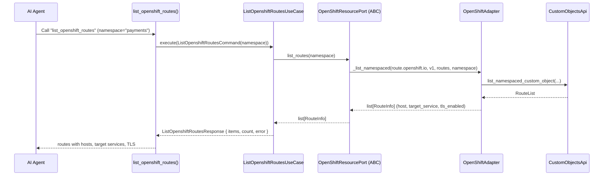
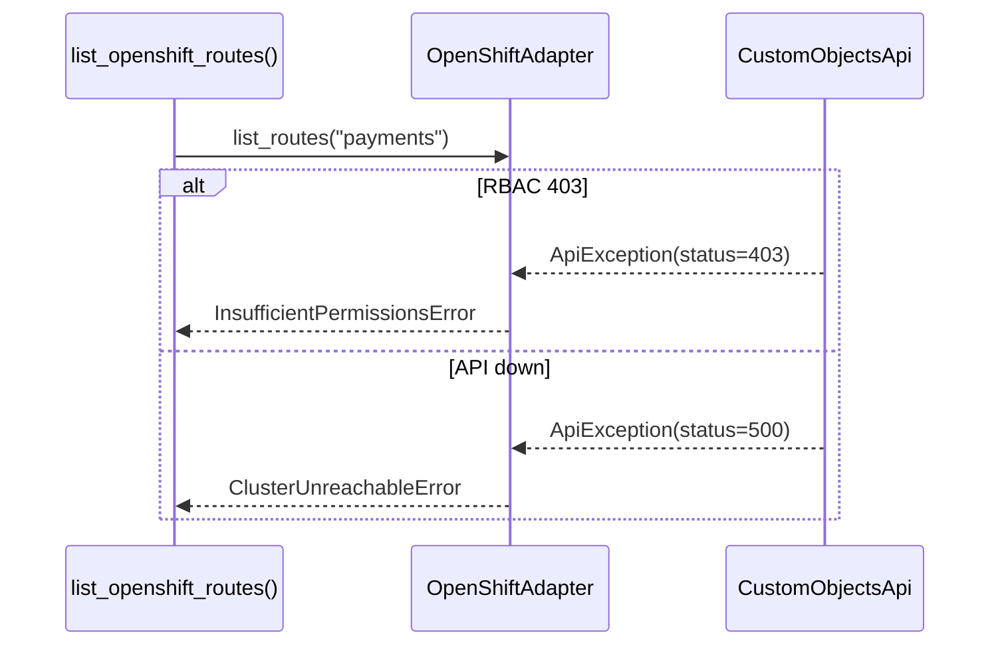

# Use Case — List OpenShift Routes

## Sample Questions

- "Which routes are exposed in the payments namespace, and are they TLS-enabled?"
- "Show me all OpenShift routes for the web namespace with their target services."
- "Are there any routes serving traffic without TLS termination?"
- "What hostnames are exposed via routes in the frontend namespace?"

---

Lists OpenShift `route.openshift.io` Routes through the OpenShift adapter. For
vanilla Kubernetes, use `list_ingresses` instead — the two capabilities stay
distinct.

### Flow 1 — Happy Path

### Flow 2 — Errors

## Key Points

- `RouteInfo = {name, namespace, host, target_service, tls_enabled}` — TLS from
  `spec.tls`, never invented.
- OpenShift-only: vanilla clusters use `list_ingresses`.
- Infra exceptions are translated by the adapter — never escape as raw `ApiException`.

## Test Coverage

| Test | File | Status |
|---|---|---|
| `test_handle_list_routes` | `tests/unit/runtime/agents/strategies/test_openshift.py` | ✅ |
| `test_maps_routes` | `tests/unit/adapters/secondary/openshift/test_openshift_adapter.py` | ✅ |
| `test_execute_returns_response` | `tests/unit/application/use_case/openshift/test_uc_list_openshift_routes_use_case.py` | ✅ |
| `test_list_openshift_routes_returns_dict` | `tests/unit/mcp/tools/test_tool_list_openshift_routes.py` | ✅ |

## Related Files

- `src/hexawyn/mcp/tools/list_openshift_routes.py`
- `src/hexawyn/application/use_case/openshift/list_openshift_routes/`
- `src/hexawyn/application/ports/driven/openshift_resource_port.py`
- `src/hexawyn/adapters/secondary/openshift/openshift_adapter.py`
