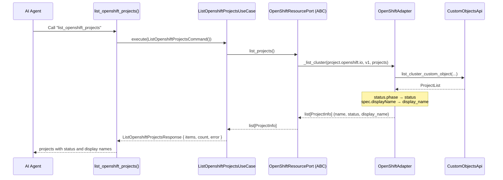
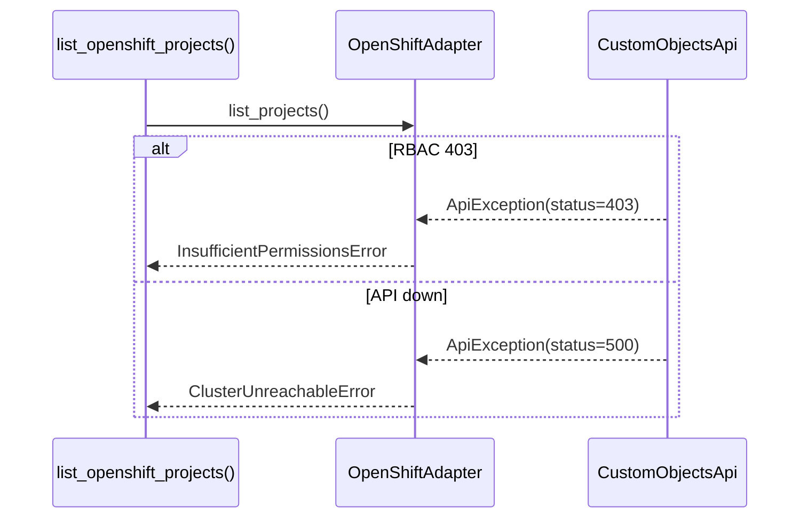

# Use Case — List OpenShift Projects

## Sample Questions

- "List all OpenShift projects and their current status."
- "What projects exist in my OpenShift cluster and how are they doing?"
- "Show me every project on this OCP cluster with its display name."
- "How many projects do we have running in production OpenShift?"

---

Lists OpenShift `project.openshift.io` Projects (the OpenShift form of
Namespaces) through the OpenShift adapter. `status.phase` drives the status;
`spec.displayName` is the human-readable name.

### Flow 1 — Happy Path

### Flow 2 — Errors

## Key Points

- `ProjectInfo = {name, status, display_name}` — status derived from
  `status.phase`, never from a `status` string.
- OpenShift-only: vanilla clusters use `list_namespaces`.

## Test Coverage

| Test | File | Status |
|---|---|---|
| `test_projects_expose_phase_and_display_name` | `tests/unit/runtime/agents/strategies/test_openshift.py` | ✅ |
| `test_maps_projects` | `tests/unit/adapters/secondary/openshift/test_openshift_adapter.py` | ✅ |
| `test_execute_returns_response` | `tests/unit/application/use_case/openshift/test_uc_list_openshift_projects_use_case.py` | ✅ |
| `test_list_openshift_projects_returns_dict` | `tests/unit/mcp/tools/test_tool_list_openshift_projects.py` | ✅ |

## Related Files

- `src/hexawyn/mcp/tools/list_openshift_projects.py`
- `src/hexawyn/application/use_case/openshift/list_openshift_projects/`
- `src/hexawyn/application/ports/driven/openshift_resource_port.py`
- `src/hexawyn/adapters/secondary/openshift/openshift_adapter.py`
