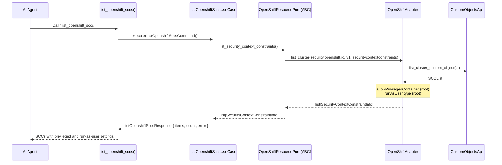
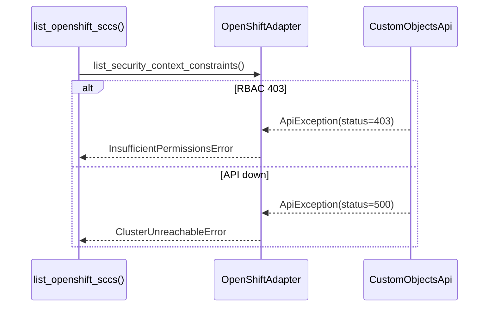

# Use Case — List OpenShift SecurityContextConstraints

## Sample Questions

- "Show me the SecurityContextConstraints that allow privileged containers."
- "Which SCCs run as RunAsAny?"
- "Audit the OpenShift SCCs for allow_privileged_container=true."

---

Lists OpenShift `security.openshift.io` SecurityContextConstraints (the
OpenShift form of PodSecurityPolicies) through the OpenShift adapter.
`allowPrivilegedContainer` and `runAsUser.type` are read at the root of the
SCC.

### Flow 1 — Happy Path

### Flow 2 — Errors

## Key Points

- `SecurityContextConstraintInfo = {name, allow_privileged_container, run_as_user_type}`
  — read at the SCC root, matching the real CRD shape.
- Cluster-wide resource (no namespace scope).

## Test Coverage

| Test | File | Status |
|---|---|---|
| `test_sccs_expose_allow_privileged_and_run_as` | `tests/unit/runtime/agents/strategies/test_openshift.py` | ✅ |
| `test_maps_sccs` | `tests/unit/adapters/secondary/openshift/test_openshift_adapter.py` | ✅ |
| `test_execute_returns_response` | `tests/unit/application/use_case/openshift/test_uc_list_openshift_sccs_use_case.py` | ✅ |
| `test_list_openshift_sccs_returns_dict` | `tests/unit/mcp/tools/test_tool_list_openshift_sccs.py` | ✅ |

## Related Files

- `src/hexawyn/mcp/tools/list_openshift_sccs.py`
- `src/hexawyn/application/use_case/openshift/list_openshift_sccs/`
- `src/hexawyn/application/ports/driven/openshift_resource_port.py`
- `src/hexawyn/adapters/secondary/openshift/openshift_adapter.py`
