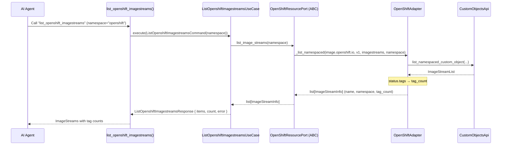
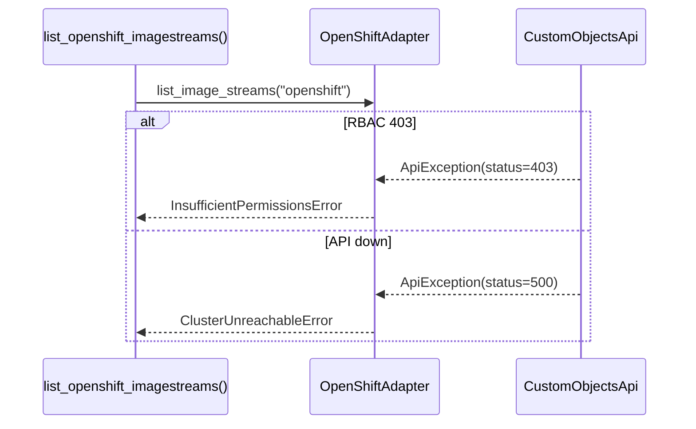

# Use Case — List OpenShift ImageStreams

## Sample Questions

- "What ImageStreams are available in the openshift namespace?"
- "Show me all ImageStreams and how many tags each one has."
- "Which ImageStreams exist in my build namespace on OpenShift?"
- "How many image tags are tracked in the frontend ImageStream?"

---

Lists OpenShift `image.openshift.io` ImageStreams (the OpenShift native
registry) through the OpenShift adapter. `status.tags` drives the tag count.

### Flow 1 — Happy Path

### Flow 2 — Errors

## Key Points

- `ImageStreamInfo = {name, namespace, tag_count}` — tag count from
  `status.tags`, never guessed.
- Namespace-scoped read.

## Test Coverage

| Test | File | Status |
|---|---|---|
| `test_image_streams_expose_tag_count` | `tests/unit/runtime/agents/strategies/test_openshift.py` | ✅ |
| `test_maps_image_streams` | `tests/unit/adapters/secondary/openshift/test_openshift_adapter.py` | ✅ |
| `test_execute_returns_response` | `tests/unit/application/use_case/openshift/test_uc_list_openshift_imagestreams_use_case.py` | ✅ |
| `test_list_openshift_imagestreams_returns_dict` | `tests/unit/mcp/tools/test_tool_list_openshift_imagestreams.py` | ✅ |

## Related Files

- `src/hexawyn/mcp/tools/list_openshift_imagestreams.py`
- `src/hexawyn/application/use_case/openshift/list_openshift_imagestreams/`
- `src/hexawyn/application/ports/driven/openshift_resource_port.py`
- `src/hexawyn/adapters/secondary/openshift/openshift_adapter.py`
