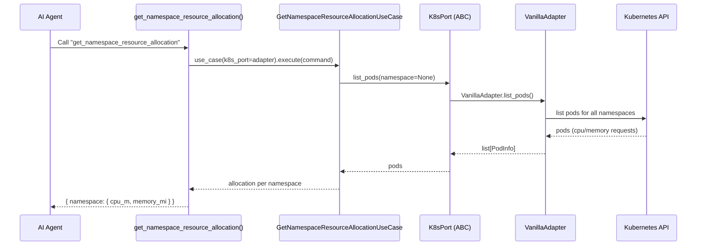
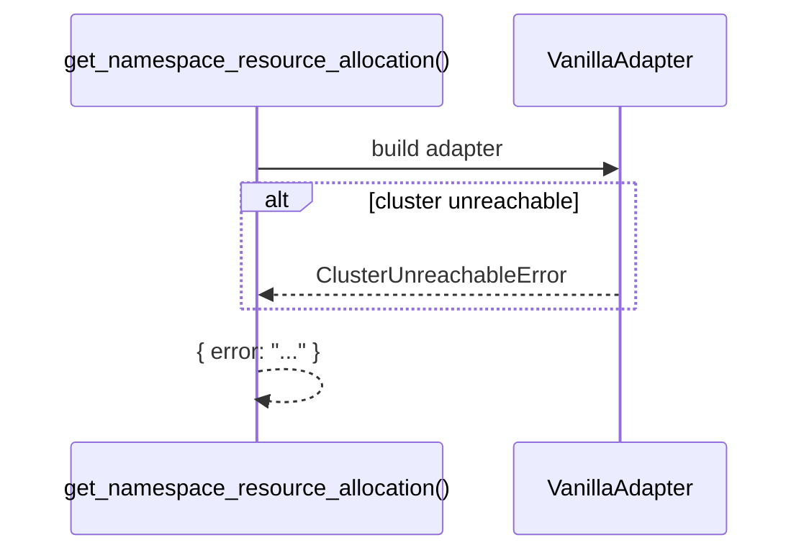

# Use Case — Get Namespace Resource Allocation

## Sample Questions

- "How much CPU and memory is allocated per namespace?"
- "What are the resource requests in the production namespace?"
- "Show the resource allocation for each namespace."

---

Computes per-namespace resource allocation (summed requests) through: MCP Tool
→ GetNamespaceResourceAllocationUseCase → K8sPort → VanillaAdapter →
Kubernetes API.

### Flow 1 — Happy Path

### Flow 2 — Errors

## Key Points

- Sums pod requests per namespace — CPU (millicores) and memory (MiB).
- Uses the shared `K8sPort`; no dedicated adapter.

## Test Coverage

| Test | File | Status |
|---|---|---|
| `test_returns_response` | `tests/unit/application/use_case/cluster/test_get_namespace_resource_allocation_use_case.py` | ✅ |
| `test_tool_returns_dict` | `tests/unit/mcp/tools/test_tool_get_namespace_resource_allocation.py` | ✅ |

## Related Files

- `src/hexawyn/mcp/tools/get_namespace_resource_allocation.py`
- `src/hexawyn/application/use_case/cluster/get_namespace_resource_allocation/`
- `src/hexawyn/application/ports/driven/k8s_port.py`
- `src/hexawyn/adapters/secondary/vanilla/vanilla_adapter.py`
