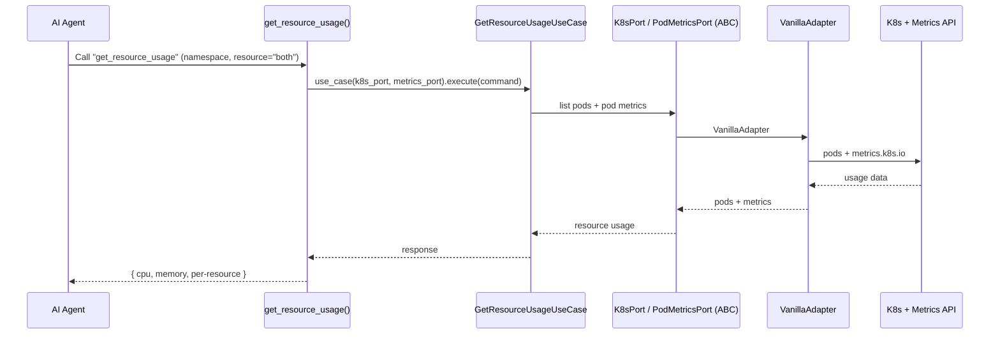
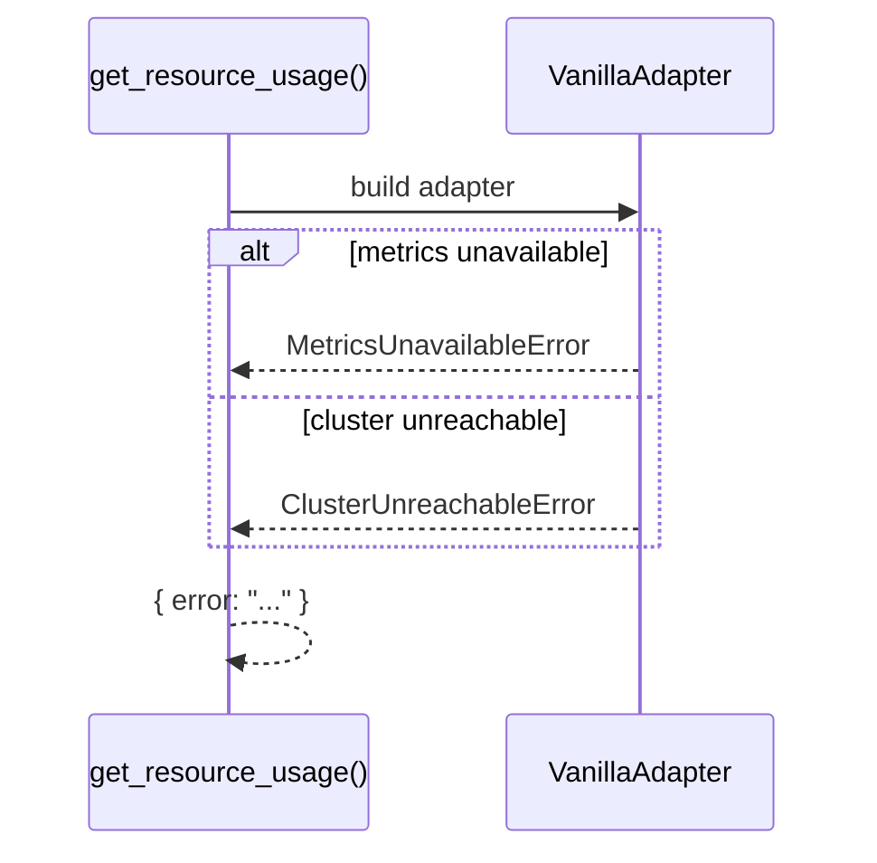

# Use Case — Get Resource Usage

## Sample Questions

- "How much CPU and memory is currently used?"
- "What is the resource usage in the production namespace?"
- "Show CPU and memory usage across the cluster."

---

Reports current resource usage through: MCP Tool → GetResourceUsageUseCase →
K8sPort + PodMetricsPort → VanillaAdapter → Kubernetes + Metrics API.

### Flow 1 — Happy Path

### Flow 2 — Errors

## Key Points

- Reads both requests (K8sPort) and usage (PodMetricsPort).
- `resource` filter selects CPU, memory, or both.

## Test Coverage

| Test | File | Status |
|---|---|---|
| `test_returns_response` | `tests/unit/application/use_case/cluster/test_get_resource_usage_use_case.py` | ✅ |
| `test_tool_returns_dict` | `tests/unit/mcp/tools/test_tool_get_resource_usage.py` | ✅ |

## Related Files

- `src/hexawyn/mcp/tools/get_resource_usage.py`
- `src/hexawyn/application/use_case/cluster/get_resource_usage/`
- `src/hexawyn/application/ports/driven/k8s_port.py`
- `src/hexawyn/application/ports/driven/pod_metrics_port.py`
- `src/hexawyn/adapters/secondary/vanilla/vanilla_adapter.py`
