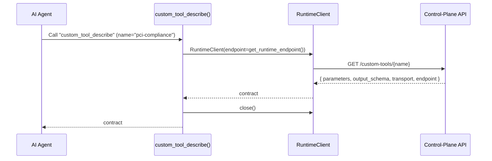
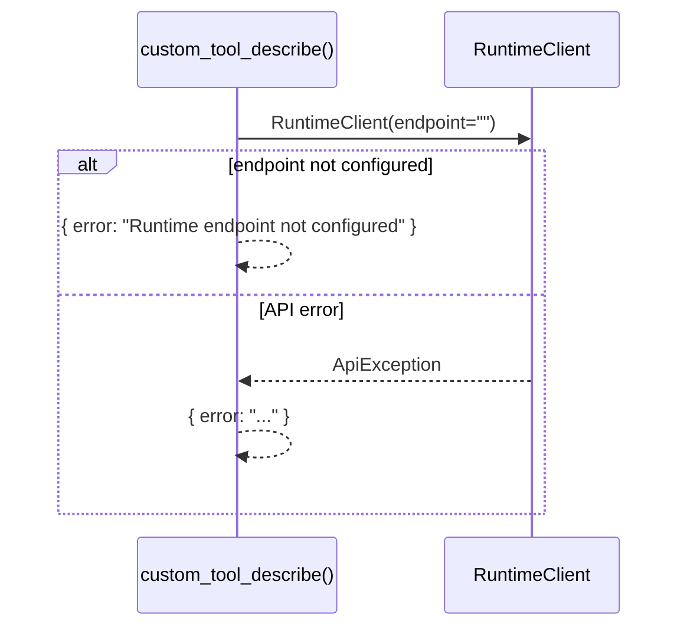

# Use Case — Describe Custom Tool

## Sample Questions

- "What does the pci-compliance custom tool do?"
- "Show the parameters and schema of a registered custom tool."

---

Returns a custom tool's contract (parameters, output schema, transport,
endpoint) from the control-plane: MCP Tool → RuntimeClient → Runtime API.

### Flow 1 — Happy Path

### Flow 2 — Errors

## Key Points

- No local use case/port — the tool proxies to the control-plane runtime.
- Requires `HEXAWYN_RUNTIME_ENDPOINT` (or config) to be set.

## Test Coverage

| Test | File | Status |
|---|---|---|
| `test_returns_dict` | `tests/unit/mcp/tools/test_tool_custom_tool_describe.py` | ✅ |

## Related Files

- `src/hexawyn/mcp/tools/custom_tool_describe.py`
- `src/hexawyn/adapters/secondary/runtime_client.py`
- `src/hexawyn/infrastructure/config/config_manager.py` — get_runtime_endpoint()
