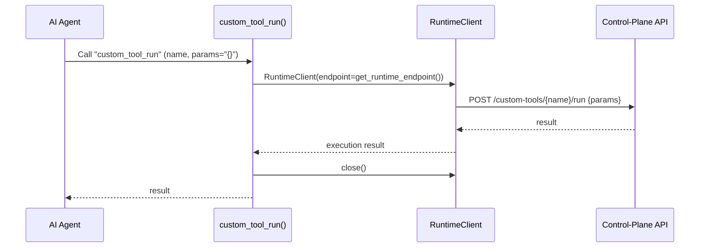
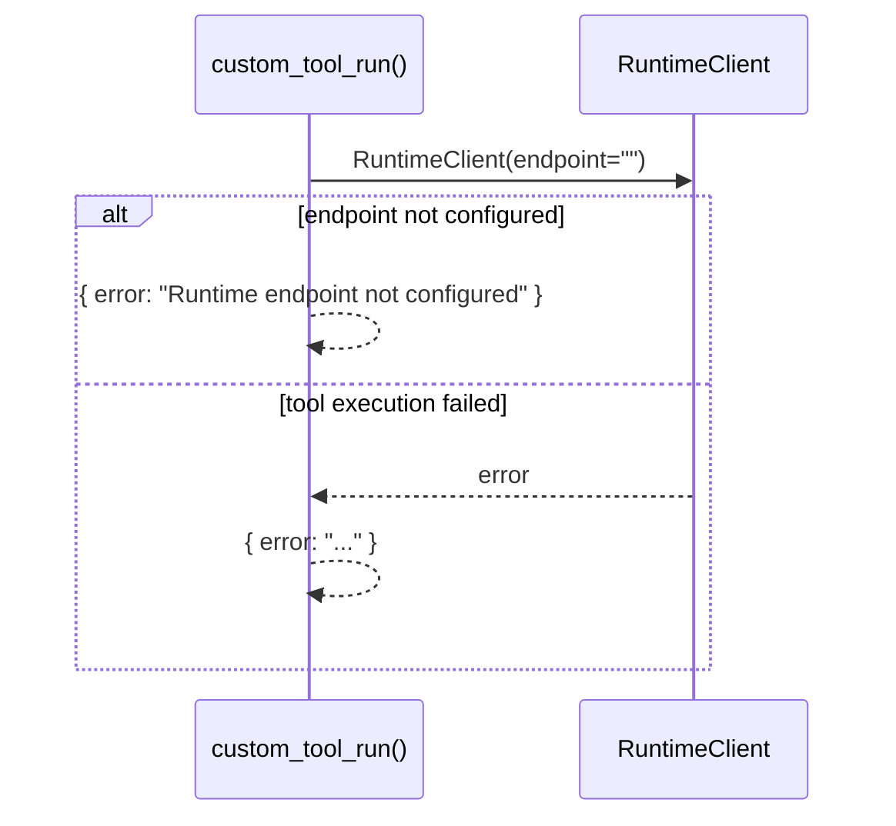

# Use Case — Run Custom Tool

## Sample Questions

- "Run my finops-zombie-check custom tool on the data namespace."
- "Execute the pci-compliance analyzer with these parameters."

---

Executes a registered custom tool through the control-plane: MCP Tool →
RuntimeClient → Runtime API.

### Flow 1 — Happy Path

### Flow 2 — Errors

## Key Points

- Thin proxy to the runtime — no local execution logic.
- `params` is a JSON string passed through to the runtime.

## Test Coverage

| Test | File | Status |
|---|---|---|
| `test_returns_dict` | `tests/unit/mcp/tools/test_tool_custom_tool_run.py` | ✅ |

## Related Files

- `src/hexawyn/mcp/tools/custom_tool_run.py`
- `src/hexawyn/adapters/secondary/runtime_client.py`
- `src/hexawyn/infrastructure/config/config_manager.py` — get_runtime_endpoint()
