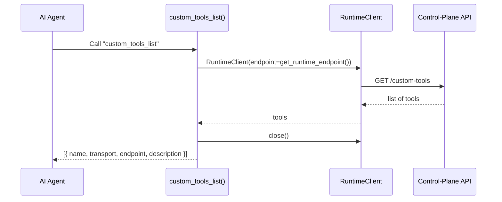
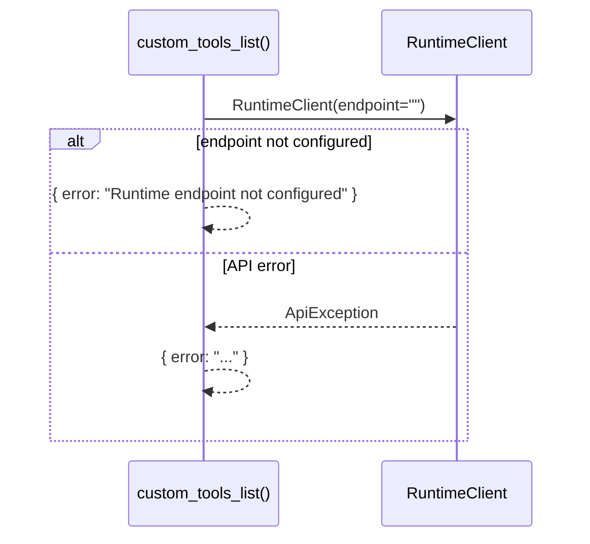

# Use Case — List Custom Tools

## Sample Questions

- "What custom tools are registered and available?"
- "List all registered custom tools with their transport and endpoint."

---

Lists all registered custom tools from the control-plane: MCP Tool →
RuntimeClient → Runtime API.

### Flow 1 — Happy Path

### Flow 2 — Errors

## Key Points

- Reads the registry from the runtime, not from a local store.
- Requires the runtime endpoint to be configured.

## Test Coverage

| Test | File | Status |
|---|---|---|
| `test_returns_dict` | `tests/unit/mcp/tools/test_tool_custom_tools_list.py` | ✅ |

## Related Files

- `src/hexawyn/mcp/tools/custom_tools_list.py`
- `src/hexawyn/adapters/secondary/runtime_client.py`
- `src/hexawyn/infrastructure/config/config_manager.py` — get_runtime_endpoint()
