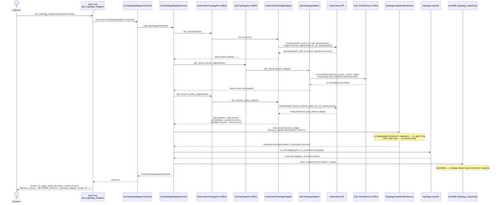
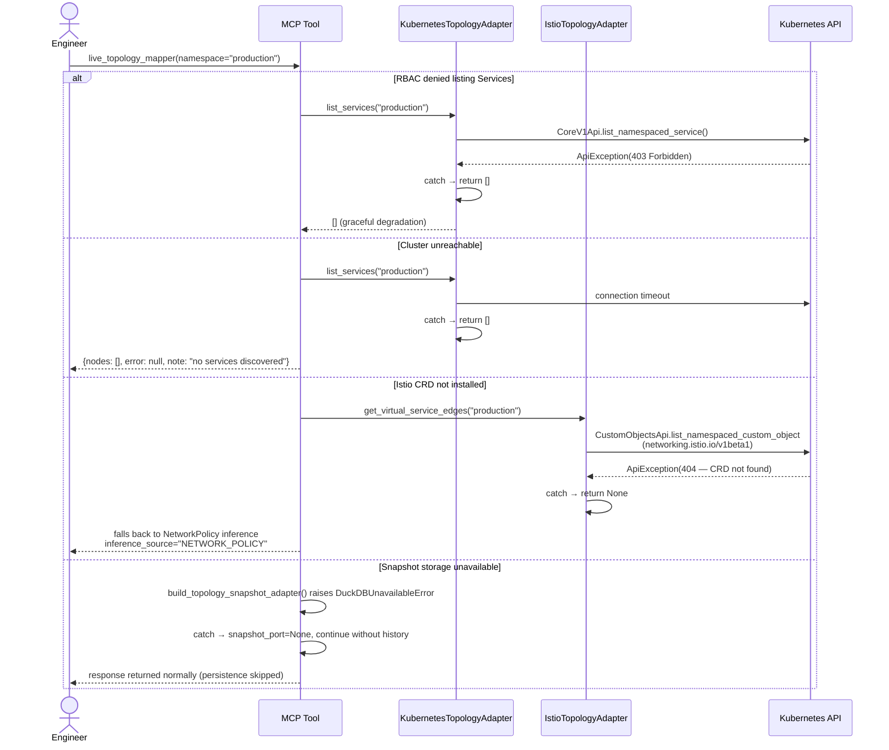
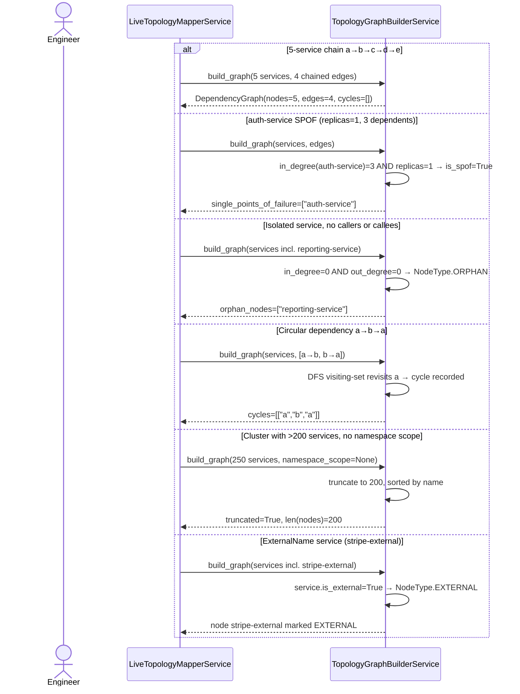
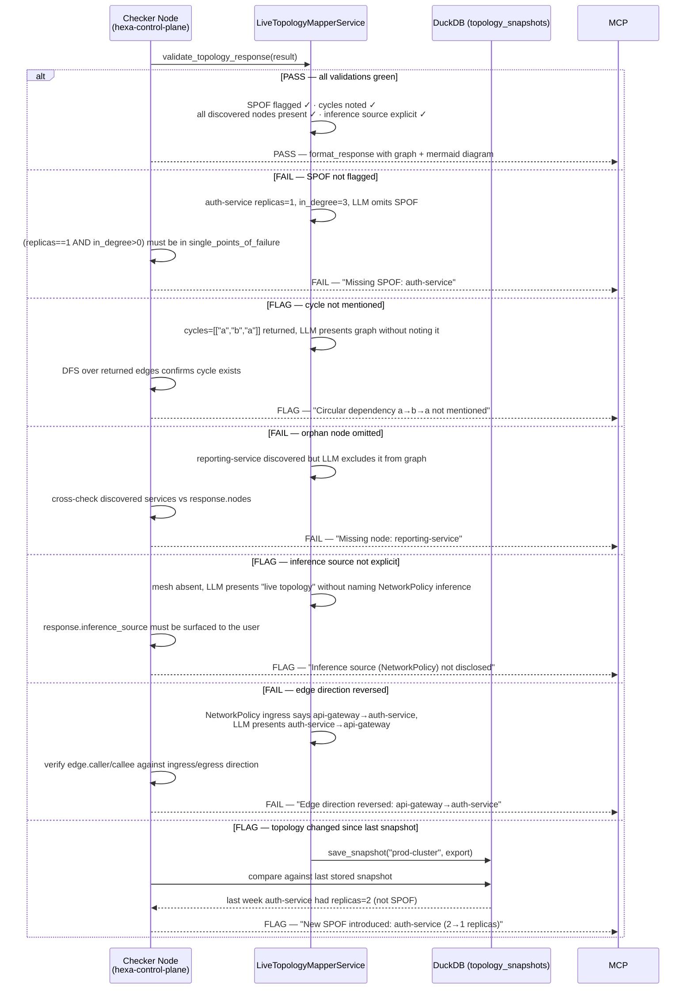

# Use Case 39 — Live Dependency Map

## Sample Questions

- "Generate a live dependency map of all services currently running in the cluster — show me which services call which, and highlight single points of failure."
- "Which services would take down the most other services if they went down right now?"
- "Can you draw me a call graph of the production namespace and flag anything risky?"
- "How much would it cost us in downtime if auth-service failed — how many services depend on it?"
- "List all single points of failure in the checkout namespace based on current service topology."
- "Are there any circular dependencies between our microservices?"

---

Discovers every Service in the cluster (or a single namespace), infers caller→callee edges from Istio `VirtualService` CRDs with a graceful fallback to `NetworkPolicy` ingress rules when the mesh is not installed, and builds a directed dependency graph. Flags services with `replicas == 1` that other services depend on as single points of failure, detects cycles via DFS, marks orphan and `ExternalName` nodes, and exports both a structured graph and a ready-to-render Mermaid diagram.

---

## Flow 1 — Happy Path (api-gateway, auth-service SPOF, payment-service)

---

## Flow 2 — Error Flows (RBAC denied, cluster unreachable, Istio CRD missing, DuckDB unavailable)

---

## Flow 3 — Edge Cases (SPOF, orphan, cycle, truncation, ExternalName)

---

## Flow 4 — Checker Node (semantic validation, hexa-control-plane)

---

## Key Points

- **SPOF rule** — `replicas == 1 AND in_degree > 0`, computed entirely in the domain engine (`TopologyGraphBuilderService`) with zero Kubernetes dependency.
- **Two independent driven ports** (`KubernetesTopologyPort`, `IstioTopologyPort`, Interface Segregation) — Istio is tried first; any failure (CRD missing, RBAC denied, unreachable) returns `None` and the service transparently falls back to NetworkPolicy inference. The active source is always recorded in `inference_source`, never left implicit.
- **Istio edge inference is a documented best-effort heuristic** — only `VirtualService` HTTP match rules with an explicit `sourceLabels.app` produce an edge; ambiguous rules are skipped rather than guessing direction. Prometheus-based mesh telemetry (`istio_requests_total`) is a future extension point, not implemented here.
- **Truncation** — graphs over 200 services are truncated (stable, sorted by name) unless a `namespace_scope` is given, matching the ">200 services" edge case.
- **DuckDB snapshot persistence is save-only and best-effort** — a storage failure never blocks the topology response. Historical SPOF-change comparison ("new SPOF introduced") is a semantic-checker concern in `hexa-control-plane`, not this repository.

## Test Coverage

| Test | File | Scenario |
|---|---|---|
| `test_single_points_of_failure_lists_spof_names` | `tests/unit/test_dependency_graph.py` | SPOF derived from node flags |
| `test_orphan_nodes_lists_orphan_names` | `tests/unit/test_dependency_graph.py` | Orphan derived from node type |
| `test_five_service_chain_returns_correct_graph` | `tests/unit/topology/test_mapper.py` | 5-service chain a→b→c→d→e |
| `test_replica_one_with_three_dependents_is_flagged_spof` | `tests/unit/topology/test_mapper.py` | auth-service SPOF (ticket test data) |
| `test_isolated_service_with_no_callers_or_callees_is_orphan` | `tests/unit/topology/test_mapper.py` | Orphan node |
| `test_circular_dependency_is_detected` | `tests/unit/topology/test_mapper.py` | a→b→a cycle detected |
| `test_external_name_service_is_marked_external` | `tests/unit/topology/test_mapper.py` | ExternalName → EXTERNAL |
| `test_truncates_when_over_200_services_and_no_namespace_scope` | `tests/unit/topology/test_mapper.py` | >200 services truncation |
| `test_namespace_scope_prevents_truncation_even_over_200` | `tests/unit/topology/test_mapper.py` | Namespace scope bypasses truncation |
| `test_edge_referencing_deleted_service_is_dropped` | `tests/unit/topology/test_mapper.py` | Deleted-service dangling edge dropped |
| `test_spof_node_gets_styled_class` | `tests/unit/topology/test_exporter.py` | Mermaid SPOF styling |
| `test_shape_matches_graph` | `tests/unit/topology/test_exporter.py` | Structured export shape |
| `test_builds_edge_from_pod_selector_labels` | `tests/unit/test_kubernetes_topology_adapter.py` | NetworkPolicy → edge inference |
| `test_returns_empty_list_when_service_listing_fails` | `tests/unit/test_kubernetes_topology_adapter.py` | RBAC denied → graceful `[]` |
| `test_builds_edge_from_source_labels` | `tests/unit/test_istio_topology_adapter.py` | VirtualService sourceLabels → edge |
| `test_returns_none_when_crd_not_installed` | `tests/unit/test_istio_topology_adapter.py` | Mesh absent → `None` fallback signal |
| `test_uses_istio_edges_when_available` | `tests/unit/test_live_topology_mapper_service.py` | Istio preferred over NetworkPolicy |
| `test_falls_back_to_network_policy_when_istio_unavailable` | `tests/unit/test_live_topology_mapper_service.py` | Fallback + inference_source |
| `test_saves_snapshot_when_snapshot_port_provided` | `tests/unit/test_live_topology_mapper_service.py` | DuckDB snapshot save wiring |
| `test_save_snapshot_failure_is_swallowed` | `tests/unit/test_topology_snapshot_repository.py` | Best-effort, non-blocking persistence |
| `test_tool_returns_structured_result` | `tests/unit/test_live_topology_mapper_mcp_tool.py` | Full MCP tool orchestration |
| `test_snapshot_adapter_failure_does_not_break_tool` | `tests/unit/test_live_topology_mapper_mcp_tool.py` | DuckDB unavailable → tool still succeeds |

## Related Files

- `src/hexawyn/domain/models/dependency_graph.py` — `NodeType`, `InferenceSource`, `ServiceNode`, `DependencyEdge`, `DependencyGraph`
- `src/hexawyn/domain/services/topology/mapper.py` — `TopologyGraphBuilderService` (SPOF, orphan, cycle, truncation)
- `src/hexawyn/domain/services/topology/exporter.py` — `to_mermaid`, `to_structured_dict`
- `src/hexawyn/application/ports/driven/kubernetes_topology_port.py` — `KubernetesTopologyPort`
- `src/hexawyn/application/ports/driven/istio_topology_port.py` — `IstioTopologyPort`
- `src/hexawyn/application/ports/driven/topology_snapshot_port.py` — `TopologySnapshotPort`
- `src/hexawyn/application/ports/driving/live_topology_mapper/` — Command, Response, ServicePort
- `src/hexawyn/application/service/live_topology_mapper_service.py` — Application service (orchestrates both ports + engine)
- `src/hexawyn/application/use_case/live_topology_mapper/live_topology_mapper_use_case.py` — UseCase (thin delegation)
- `src/hexawyn/adapters/secondary/kubernetes_topology_adapter.py` — `KubernetesTopologyAdapter`
- `src/hexawyn/adapters/secondary/istio_topology_adapter.py` — `IstioTopologyAdapter`
- `src/hexawyn/infrastructure/memory/topology_snapshot_repository.py` — `TopologySnapshotRepository`
- `src/hexawyn/mcp/tools/live_topology_mapper.py` — MCP entry point
