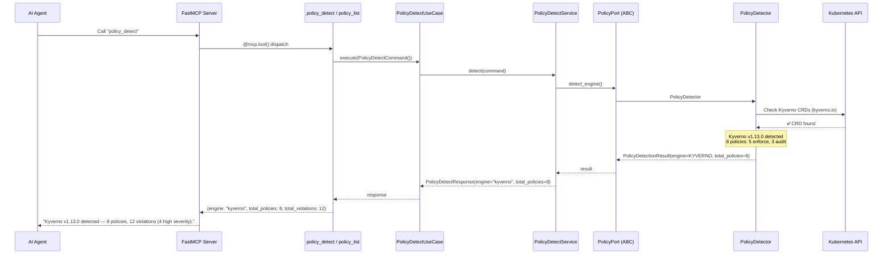
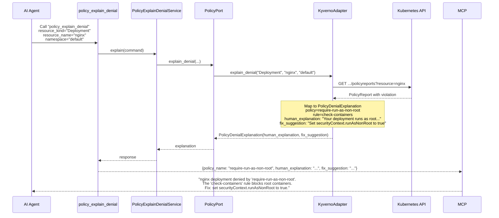
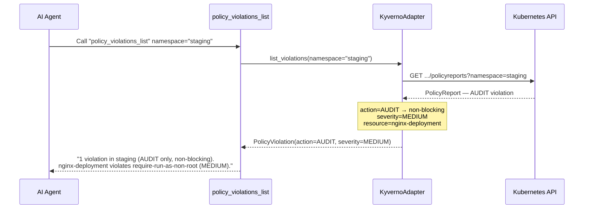
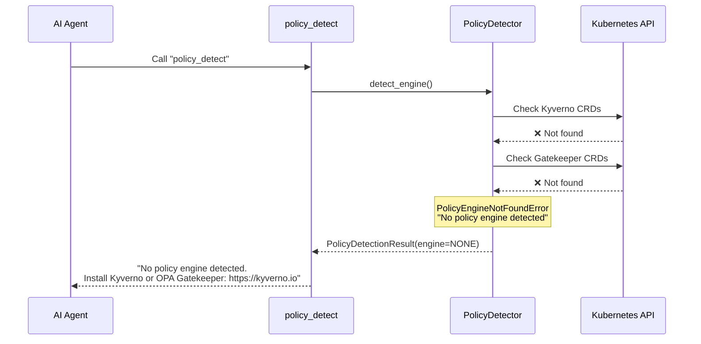

# Use Case 43 — Policy Engine Detection (Kyverno / OPA Gatekeeper)

## Sample Questions

- "Why was my deployment denied by Kyverno?"
- "What policy violations exist in the production namespace?"
- "Does my cluster use Kyverno or OPA Gatekeeper?"
- "Which policies are in enforce vs audit mode?"
- "Explain why this pod violates the security policy"
- "Are there any non-compliant resources in my cluster?"
- "What policies are blocking root containers?"

---

Six MCP tools for policy engines: `policy_detect` (auto-detects Kyverno vs Gatekeeper), `policy_list` (all policies with action and violations), `policy_get` (policy detail), `policy_violations_list` (current violations with severity), `policy_explain_denial` (natural-language explanation + fix suggestion), `policy_audit` (global compliance report per namespace). All read-only.

### Flow 1 — Happy Path: Detect + List Policies

### Flow 2 — Enforcement Denial Explained

### Flow 3 — Audit Violation (Non-Blocking)

### Flow 4 — No Policy Engine Found

## Key Points

- **Enforce vs audit** — `ENFORCE` blocks resources, `AUDIT` only logs; distinction critical for devs
- **Denial explanation** — `policy_explain_denial` always returns `human_explanation` + `fix_suggestion`
- **Violation severity** — HIGH/MEDIUM/LOW/INFO for prioritization
- **Multi-engine** — detects Kyverno (ClusterPolicy, Policy) vs Gatekeeper (ConstraintTemplate, Constraint)
- **Compliance audit** — `policy_audit` aggregates violations per namespace

## Test Coverage

| Test | File | Status |
|---|---|---|
| `test_tool_returns_detection` | `tests/unit/test_policy_tools.py` | ✅ |
| `test_tool_returns_policies` | `tests/unit/test_policy_tools.py` | ✅ |
| `test_tool_returns_violations` | `tests/unit/test_policy_tools.py` | ✅ |
| `test_tool_returns_explanation` | `tests/unit/test_policy_tools.py` | ✅ |
| `test_tool_returns_audit` | `tests/unit/test_policy_tools.py` | ✅ |
| `test_all_policy_tools_have_register` | `tests/unit/test_policy_tools.py` | ✅ |

## Related Files

- `src/hexawyn/domain/models/policy.py` — Policy, PolicyViolation, PolicyDenialExplanation, PolicyDetectionResult
- `src/hexawyn/domain/errors.py` — PolicyEngineNotFoundError
- `src/hexawyn/application/ports/driven/policy_port.py` — PolicyPort ABC
- `src/hexawyn/adapters/secondary/gitops/policy_detector.py` — PolicyDetector
- `src/hexawyn/mcp/tools/policy_detect.py` — detect tool
- `src/hexawyn/mcp/tools/policy_list.py` — list tool
- `src/hexawyn/mcp/tools/policy_get.py` — get tool
- `src/hexawyn/mcp/tools/policy_violations_list.py` — violations tool
- `src/hexawyn/mcp/tools/policy_explain_denial.py` — explain denial tool
- `src/hexawyn/mcp/tools/policy_audit.py` — audit tool
