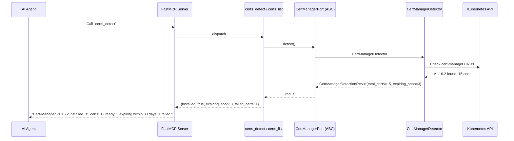
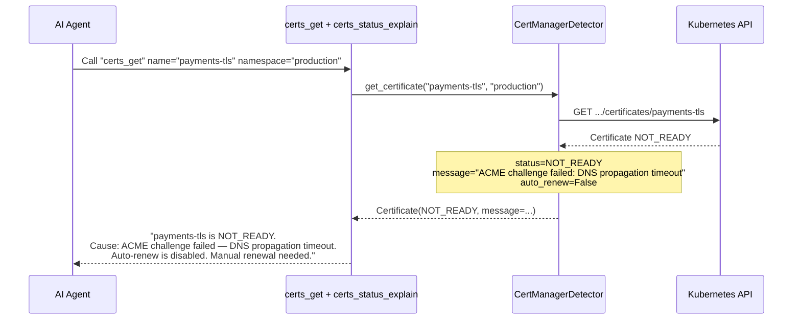
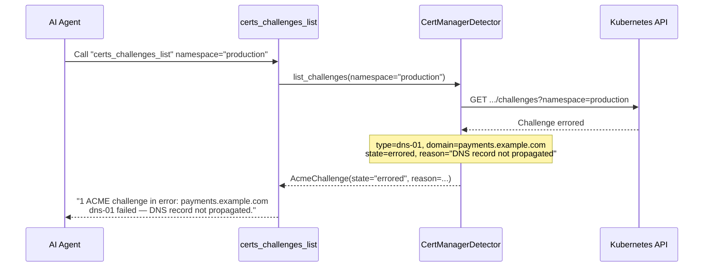
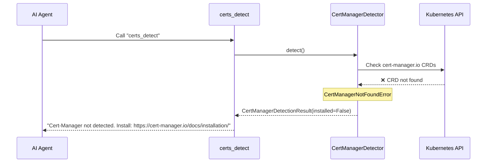

# Use Case 44 — Cert-Manager Certificate Monitoring

## Sample Questions

- "Are there any TLS certificates expiring in the next 30 days?"
- "Why was the payments-api certificate not renewed?"
- "What is the status of all my Cert-Manager certificates?"
- "Are all my Let's Encrypt certificates valid?"
- "Are there any failed ACME challenges in my cluster?"
- "Which certificate expires the soonest?"
- "Is automatic renewal working correctly?"

---

Eight MCP tools for Cert-Manager: `certs_detect`, `certs_list`, `certs_get`, `certs_status_explain`, `certs_issuers_list`, `certs_issuer_get`, `certs_challenges_list`, `certs_requests_list`. All read-only — renewal is never triggered.

### Flow 1 — Happy Path: Detect + List + Alert Expiring

### Flow 2 — Certificate Expired / Renewal Failed

### Flow 3 — ACME Challenge in Error

### Flow 4 — Cert-Manager Not Installed

## Key Points

- **Expiration alerts** — `days_until_expiry` and `expiring_soon` count (threshold: 30 days)
- **ACME challenge tracking** — `certs_challenges_list` shows pending/errored challenges with reasons
- **Issuer types** — Let's Encrypt, Vault, self-signed, CA, Venafi auto-detected
- **Read-only** — renewal is never triggered; operators retain control via `kubectl cert-manager renew`
- **Auto-renew status** — `auto_renew` field flags disabled automatic renewal

## Test Coverage

| Test | File | Status |
|---|---|---|
| `test_tool_returns_detection` | `tests/unit/test_certs_tools.py` | ✅ |
| `test_tool_returns_certs` | `tests/unit/test_certs_tools.py` | ✅ |
| `test_tool_returns_detail` | `tests/unit/test_certs_tools.py` | ✅ |
| `test_all_certs_tools_have_register` | `tests/unit/test_certs_tools.py` | ✅ |

## Related Files

- `src/hexawyn/domain/models/certificates.py` — Certificate, CertificateIssuer, AcmeChallenge, CertManagerDetectionResult
- `src/hexawyn/domain/errors.py` — CertManagerNotFoundError
- `src/hexawyn/application/ports/driven/cert_manager_port.py` — CertManagerPort ABC
- `src/hexawyn/adapters/secondary/gitops/cert_manager_detector.py` — CertManagerDetector
- `src/hexawyn/mcp/tools/certs_*.py` — 8 tools
