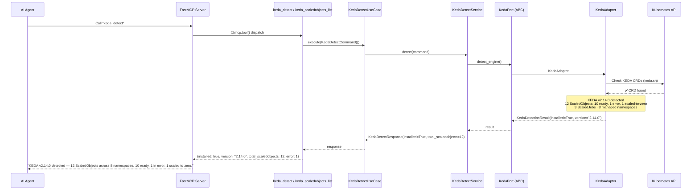
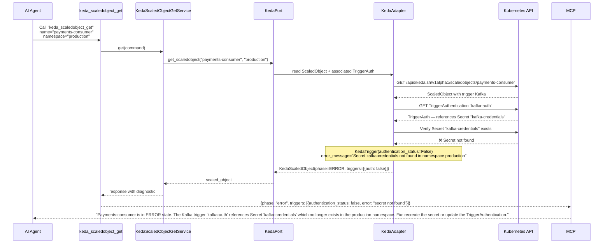
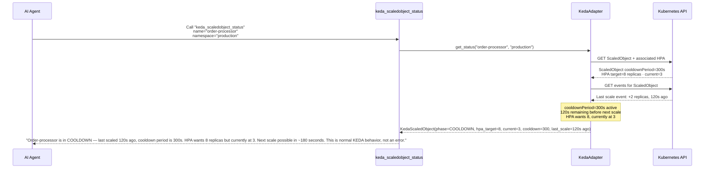
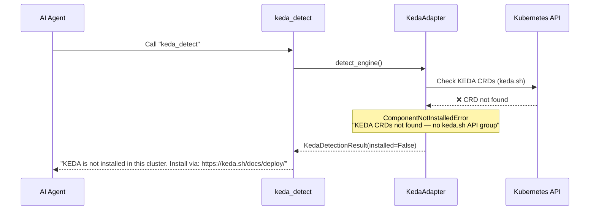
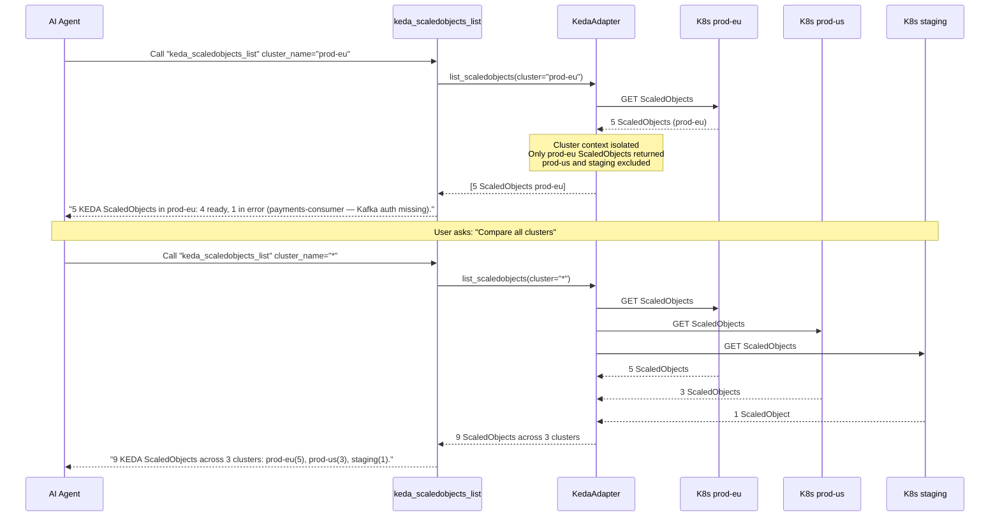

# Use Case 44 — KEDA Event-Driven Autoscaling (ScaledObjects, Triggers, HPA)

## Sample Questions

- "Why isn't my ScaledObject payments-consumer scaling even though the Kafka queue is full?"
- "What KEDA ScaledObjects are configured across my cluster?"
- "Are there any KEDA triggers with broken authentication?"
- "Which workloads are configured to scale to zero overnight?"
- "Is KEDA installed in my cluster and what version?"
- "What's the status of the HPA managed by KEDA for auth-service?"
- "Is there a ScaledObject whose cooldown is currently blocking scaling?"
- "How many KEDA ScaledObjects manage our production vs staging clusters?"
- "Did my ScaledJob batch-processing run successfully last night?"

---

Nine MCP tools for KEDA diagnostics: `keda_detect` (auto-detect KEDA installation + version + managed namespaces), `keda_scaledobjects_list` (all ScaledObjects with HPA status, triggers, multi-cluster), `keda_scaledobject_get` (full detail: triggers, HPA, cooldown, fallback), `keda_scaledobject_status` (real-time current vs HPA target replicas, last scale time), `keda_scaledobject_triggers` (all triggers with auth status), `keda_trigger_auth_list` (TriggerAuthentication + ClusterTriggerAuthentication), `keda_trigger_auth_get` (auth detail without exposing secret values), `keda_scaledjobs_list` (ScaledJobs status), `keda_scaledjob_get` (ScaledJob detail with job execution counters). All read-only — no scaling, no patching, no HPA recreation. Multi-cluster aware via optional `cluster_name` parameter.

### Flow 1 — Happy Path: KEDA Detection + List ScaledObjects

### Flow 2 — Trigger Auth Error Diagnosis

### Flow 3 — Cooldown Blocking Legitimate Scaling

### Flow 4 — KEDA Not Installed

### Flow 5 — Multi-Cluster Awareness

## Key Points

- **Trigger auth validation** — KEDA adapter verifies that referenced Secrets/ConfigMaps exist; `authentication_status=False` if missing
- **Cooldown awareness** — cooldown blocking scale is normal behavior, not an error; explained with remaining time
- **Scale to zero** — `idle_replicas=0` is intentional, not a bug; distinguished from ERROR state
- **Multi-cluster** — each tool accepts optional `cluster_name`; `*` aggregates all clusters for fleet-wide view
- **Read-only** — no scale up/down, no pause, no HPA recreation; Mutation Guard enforced on all tools

## Test Coverage

| Test | File | Status |
|---|---|---|
| `test_tool_returns_detection` | `tests/unit/test_keda_tools.py` | ⬜ |
| `test_tool_returns_scaledobjects` | `tests/unit/test_keda_tools.py` | ⬜ |
| `test_tool_returns_scaledobject_detail` | `tests/unit/test_keda_tools.py` | ⬜ |
| `test_tool_returns_scaledobject_status` | `tests/unit/test_keda_tools.py` | ⬜ |
| `test_tool_returns_triggers` | `tests/unit/test_keda_tools.py` | ⬜ |
| `test_tool_returns_trigger_auth` | `tests/unit/test_keda_tools.py` | ⬜ |
| `test_tool_returns_scaledjobs` | `tests/unit/test_keda_tools.py` | ⬜ |
| `test_tool_returns_scaledjob_detail` | `tests/unit/test_keda_tools.py` | ⬜ |
| `test_all_keda_tools_have_register` | `tests/unit/test_keda_tools.py` | ⬜ |
| `test_trigger_auth_failure_detected` | `tests/unit/test_keda_tools.py` | ⬜ |
| `test_cooldown_phase_detected` | `tests/unit/test_keda_tools.py` | ⬜ |
| `test_scaled_to_zero_not_error` | `tests/unit/test_keda_tools.py` | ⬜ |
| `test_multi_cluster_isolation` | `tests/unit/test_keda_tools.py` | ⬜ |

## Related Files

- `src/hexawyn/domain/models/keda.py` — KedaScaledObject, KedaTrigger, KedaTriggerAuth, KedaScaledJob, KedaDetectionResult
- `src/hexawyn/domain/errors.py` — ComponentNotInstalledError
- `src/hexawyn/application/ports/driven/keda_port.py` — KedaPort ABC
- `src/hexawyn/adapters/secondary/keda/keda_adapter.py` — KedaAdapter (reads KEDA CRDs)
- `src/hexawyn/adapters/secondary/keda/keda_detector.py` — KedaDetector (auto-detect CRDs)
- `src/hexawyn/mcp/tools/keda_detect.py` — detect tool
- `src/hexawyn/mcp/tools/keda_scaledobjects_list.py` — list tool
- `src/hexawyn/mcp/tools/keda_scaledobject_get.py` — get tool
- `src/hexawyn/mcp/tools/keda_scaledobject_status.py` — status tool
- `src/hexawyn/mcp/tools/keda_scaledobject_triggers.py` — triggers tool
- `src/hexawyn/mcp/tools/keda_trigger_auth_list.py` — auth list tool
- `src/hexawyn/mcp/tools/keda_trigger_auth_get.py` — auth get tool
- `src/hexawyn/mcp/tools/keda_scaledjobs_list.py` — scaledjobs list tool
- `src/hexawyn/mcp/tools/keda_scaledjob_get.py` — scaledjob get tool
