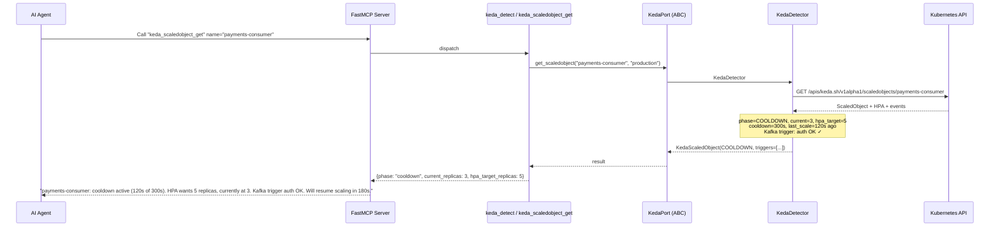
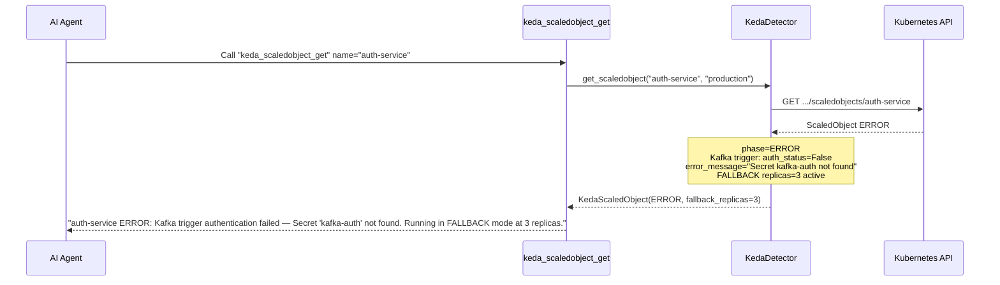
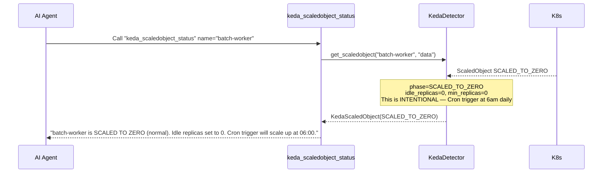
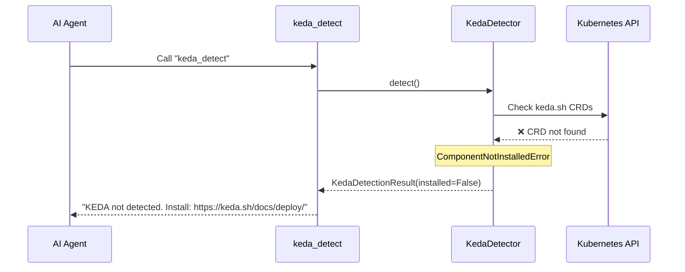

# Use Case 45 — KEDA Autoscaling

## Sample Questions

- "Why is my payments-consumer ScaledObject not scaling even though the Kafka queue is full?"
- "What ScaledObjects are configured in my cluster?"
- "Are there any KEDA triggers with authentication errors?"
- "Which workloads are configured to scale to zero at night?"
- "Is KEDA installed in my cluster and what version?"
- "What is the HPA status managed by KEDA for the auth-service?"
- "Is there a ScaledObject with an active cooldown blocking scaling right now?"
- "How many KEDA ScaledObjects are in production vs staging?"
- "Did my batch-processing ScaledJob run successfully last night?"

---

Nine MCP tools for KEDA: `keda_detect`, `keda_scaledobjects_list`, `keda_scaledobject_get`, `keda_scaledobject_status`, `keda_scaledobject_triggers`, `keda_triggerauth_list`, `keda_triggerauth_get`, `keda_scaledjobs_list`, `keda_scaledjob_get`. All read-only — never triggers scale.

### Flow 1 — Happy Path: Detect + Diagnose ScaledObject

### Flow 2 — Trigger Auth Failure

### Flow 3 — Scale to Zero (Normal Behavior)

### Flow 4 — KEDA Not Installed

## Key Points

- **Cooldown awareness** — `cooldown_period_seconds` and `last_scale_time` explain WHY scaling is waiting
- **Fallback mode** — when a trigger errors, KEDA falls back to `fallback_replicas` (safe default)
- **Scale to zero** — `idle_replicas=0` is NOT an error; it's intentional with cron triggers
- **Trigger auth** — `authentication_status` per-trigger with `error_message` for diagnosis
- **HPA correlation** — `hpa_target_replicas` vs `current_replicas` gives real scaling status
- **Read-only** — never triggers scale; operators retain control via KEDA or kubectl

## Test Coverage

| Test | File | Status |
|---|---|---|
| `test_installed` | `tests/unit/test_keda_tools.py` | ✅ |
| `test_list` | `tests/unit/test_keda_tools.py` | ✅ |
| `test_get` | `tests/unit/test_keda_tools.py` | ✅ |
| `test_all_keda_tools` | `tests/unit/test_keda_tools.py` | ✅ |

## Related Files

- `src/hexawyn/domain/models/keda.py` — KedaScaledObject, KedaTrigger, KedaTriggerAuth, KedaScaledJob, KedaDetectionResult
- `src/hexawyn/domain/errors.py` — ComponentNotInstalledError
- `src/hexawyn/application/ports/driven/keda_port.py` — KedaPort ABC
- `src/hexawyn/adapters/secondary/gitops/keda_detector.py` — KedaDetector
- `src/hexawyn/mcp/tools/keda_*.py` — 9 tools
