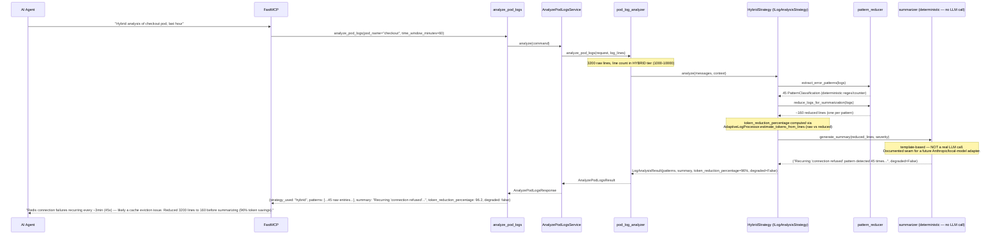
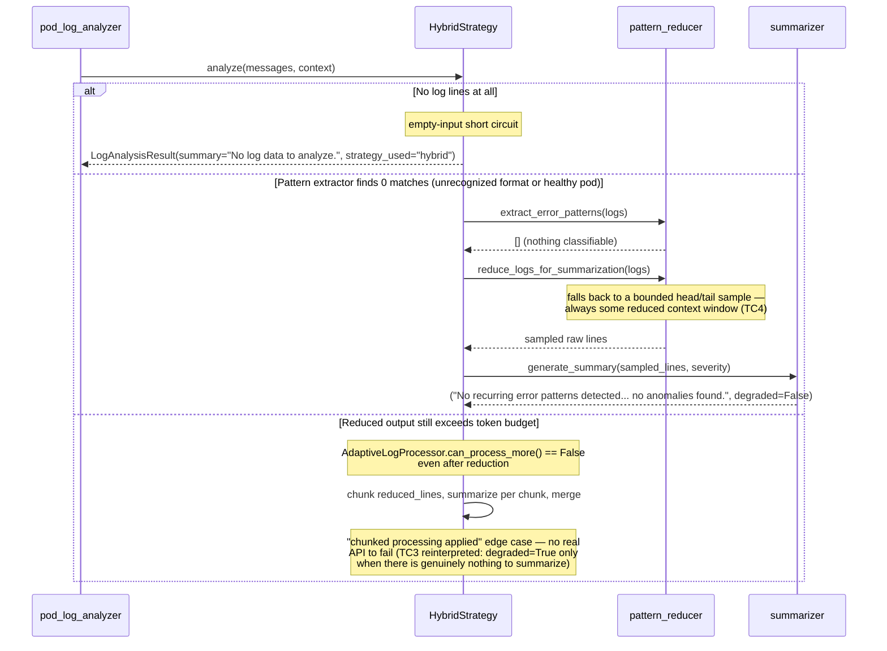

# Use Case 58 — HYBRID Log Analysis (Pattern Extraction + Summarization)

## Sample Questions

- "Give me a hybrid analysis of the checkout pod logs — combine structured pattern detection with LLM-powered summarization for the last hour."
- "Reduce and summarize the payment-service logs — I don't want to read 3000 raw lines."
- "What's the condensed, plain-English takeaway from the worker pod's error logs?"
- "Can you extract the recurring error patterns from api-gateway and give me a short summary?"
- "Give me both the raw pattern counts and a natural-language summary for the checkout pod."

---

This is the concrete HYBRID implementation of the `LogAnalysisStrategy`
(`ILogAnalysisStrategy`, ECA-14) used by the existing `analyze_pod_logs` MCP
tool for the 1000–10000 line tier. **No real LLM API call is made anywhere
in this repo** — `hexa_guard.py` forbids `anthropic`/`openai` imports in
`domain/`/`application/`, and `hexawyn` is scoped to CLI/MCP-Server/K8s
only (LLM reasoning always happens in the external MCP client or the
private `hexa-control-plane`). `generate_summary()` is a deterministic,
template-based stand-in, isolated so a real LLM-backed adapter can replace
it later without changing `HybridStrategy`'s contract.

### Flow 1 — Happy Path: Pattern Extraction Reduces, Then Summarized



### Flow 2 — Degraded Fallback / Unrecognized Format



### Flow 3 — Checker Node: False Positive Prevention

```mermaid
sequenceDiagram
    participant Checker as Checker Node
    participant LLM as LLM Response

    Checker->>LLM: Validate hybrid analysis assessment
    alt LLM claims the summary came from a real model call
        Checker-->>LLM: ❌ FAIL — summary is deterministic/template-based, not LLM-generated; must not be presented as an LLM insight
    alt LLM ignores degraded=True and reports high confidence
        Checker-->>LLM: ⚠️ FLAG — degraded output must be caveated as pattern-only
    else All checks pass
        Checker-->>LLM: ✅ PASS
    end
```

## Key Points

- **Pattern extraction always runs first, deterministically** —
  `extract_error_patterns` (regex/keyword classifier) never depends on
  summarization succeeding; the raw pattern list (AC4) is always available.
- **No real LLM call** — `generate_summary` is a documented, isolated
  deterministic stand-in. Swapping in a real Anthropic/local-model adapter
  later only touches that one function, not `HybridStrategy`'s contract.
- **Token reduction is measured, not assumed** — `token_reduction_percentage`
  is computed via the (previously orphaned, now wired-in)
  `AdaptiveLogProcessor.estimate_tokens_from_lines` on raw vs. reduced
  lines, satisfying the "up to 96%" acceptance criterion with a real number.
- **Unrecognized format always gets *some* reduced context** — when no
  pattern is classifiable, `reduce_logs_for_summarization` falls back to a
  bounded head/tail sample rather than returning nothing.
- **Chunking only triggers when the reduced output itself is still too
  large** — not on raw log size, since reduction already collapses most
  volume; this is the literal "token limit exceeded even after reduction"
  edge case.

## Test Coverage

| Test | File | Status |
|---|---|---|
| `test_groups_and_counts_repeated_pattern` | `tests/unit/log_analysis/test_pattern_reducer.py` | ✅ |
| `test_realistic_mixed_log_meets_96_percent_reduction_target` | `tests/unit/log_analysis/test_pattern_reducer.py` | ✅ |
| `test_unrecognized_format_falls_back_to_head_tail_sample` (TC4) | `tests/unit/log_analysis/test_pattern_reducer.py` | ✅ |
| `test_healthy_sample_confirms_no_anomalies` (TC2) | `tests/unit/log_analysis/test_summarizer.py` | ✅ |
| `test_empty_input_is_degraded` (TC3 analog) | `tests/unit/log_analysis/test_summarizer.py` | ✅ |
| `test_tc1_pattern_extraction_reduces_and_summarizes` (TC1) | `tests/unit/log_analysis/test_strategy.py` | ✅ |
| `test_tc2_no_errors_confirms_no_anomalies` (TC2) | `tests/unit/log_analysis/test_strategy.py` | ✅ |
| `test_tc3_degraded_fallback_when_nothing_to_summarize` (TC3) | `tests/unit/log_analysis/test_strategy.py` | ✅ |
| `test_tc4_unrecognized_format_still_reduces_and_summarizes` (TC4) | `tests/unit/log_analysis/test_strategy.py` | ✅ |
| `test_chunking_applied_when_reduced_output_still_exceeds_budget` | `tests/unit/log_analysis/test_strategy.py` | ✅ |
| `test_hybrid_strategy_propagates_token_reduction_metrics` | `tests/unit/log_analysis/test_pod_log_analyzer.py` | ✅ |
| `test_analyze_propagates_hybrid_reduction_metrics` | `tests/unit/test_analyze_pod_logs_service.py` | ✅ |
| `test_returns_hybrid_reduction_metrics` | `tests/unit/test_analyze_pod_logs_tool.py` | ✅ |

## Related Files

- `src/hexawyn/domain/services/log_analysis/pattern_reducer.py` — extract_error_patterns, reduce_logs_for_summarization
- `src/hexawyn/domain/services/log_analysis/summarizer.py` — generate_summary (deterministic; documented LLM extension seam)
- `src/hexawyn/domain/services/log_analysis/strategy.py` — HybridStrategy (concrete `ILogAnalysisStrategy`)
- `src/hexawyn/domain/services/log_analysis/strategy_port.py` — LogAnalysisStrategy (ILogAnalysisStrategy port, ECA-14)
- `src/hexawyn/domain/services/log_analysis/analyzer.py` — AdaptiveLogProcessor (token budget + chunking)
- `src/hexawyn/domain/models/log.py` — PatternClassification, LogAnalysisResult (+ token_reduction_percentage, degraded)
- `src/hexawyn/domain/models/analyze_pod_logs.py` — AnalyzePodLogsResult (+ token_reduction_percentage, degraded)
- `src/hexawyn/domain/services/log_analysis/pod_log_analyzer.py` — analyze_pod_logs (domain orchestration)
- `src/hexawyn/application/ports/driving/analyze_pod_logs/analyze_pod_logs_response.py` — AnalyzePodLogsResponse
- `src/hexawyn/application/service/analyze_pod_logs_service.py` — AnalyzePodLogsService
- `src/hexawyn/mcp/tools/analyze_pod_logs.py` — MCP tool (unchanged tool name; HYBRID is an internal strategy choice)
