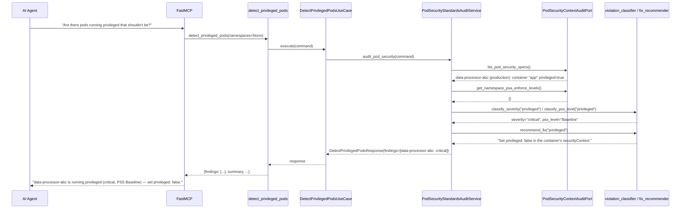
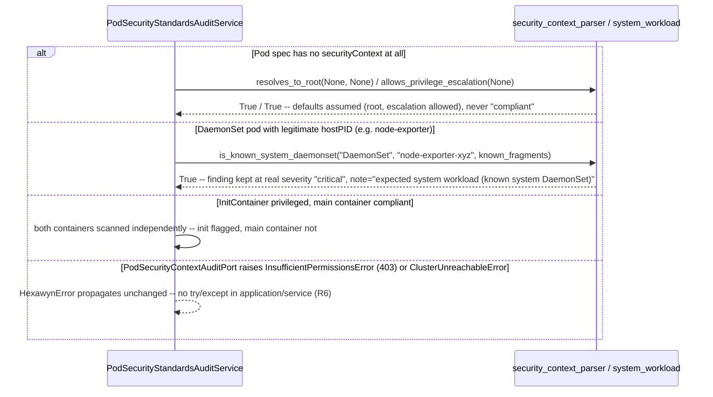

# Use Case 81 — Pod Security Standards Audit

## Sample Questions

- "Are there pods running as root or with privileged security context that shouldn't be — which workloads violate the Pod Security Standards?"
- "Is any container in production running privileged: true?"
- "Which pods are missing a runAsNonRoot setting and would default to running as root?"
- "Do any of our containers add dangerous capabilities like SYS_ADMIN or NET_ADMIN?"
- "Which namespaces enforce the restricted Pod Security Standard, and are any pods there actually violating it?"
- "Ignore node-exporter and kube-proxy — what real Pod Security violations do we have?"

---

As a security engineer, I want hexawyn to detect pods running as root or with
privileged security context so I can identify workloads that violate the Pod
Security Standards and represent a container escape risk. For every Pod
across all namespaces, this scans every container (init, regular, and
ephemeral) plus pod-level `hostPID`/`hostNetwork`/`hostIPC`, classifies each
violation with a **deterministic** severity + PSS-level matrix (privileged/
hostPID/hostNetwork/hostIPC are always `critical`/Baseline; root and dangerous
capabilities are `high`/Restricted; privilege escalation is `medium`/
Restricted), and recommends the specific securityContext fix.

**Deterministic matrix, not an LLM judgment call — same pattern as ECA-71.**
A downstream semantic-layer check verifies an LLM narrative against this tool's
ground truth. `classify_severity`/`classify_pss_level`
(`domain/services/pod_security/violation_classifier.py`) are that ground
truth: a fixed lookup, no heuristics. `NET_BIND_SERVICE` is explicitly kept
out of the dangerous-capability set (Checker case 6 / Edge Case 5) so it
scores `medium`, never `critical`.

**Security-context parsing is genuinely domain logic, not adapter
translation.** `resolves_to_root`/`allows_privilege_escalation`/`is_privileged`
(`domain/services/pod_security/security_context_parser.py`) resolve
Kubernetes' own default/override semantics from already-raw optional
booleans — container-level `runAsNonRoot` wins over pod-level, and **both
unset defaults to root** (Edge Case 3 / Checker case 3). This is the ticket's
own named "security context parsing" test target, kept pure (no k8s SDK
objects ever cross into `domain/`).

**A known system DaemonSet is annotated, never downgraded.** Checker case 4
explicitly requires a system DaemonSet's violation to still be surfaced at
its real severity — only a `note` is added
(`"expected system workload (known system DaemonSet)"`), determined by
`is_known_system_daemonset` matching the pod's owner kind and a fixed name
allow-list (`PodSecurityConstants.known_system_daemonset_name_fragments`).

**InitContainers and ephemeral containers are checked independently, not
inherited from the main container.** Each container (`init`/`container`/
`ephemeral`) carries its own `ContainerSecurityContext` and is scanned on its
own — Checker case 5 explicitly fails an implementation that only inspects
the main container.

### Flow 1 — Happy Path: Privileged Container Resolved to Critical + Fix (TC1)



### Flow 2 — Error/Edge Flows: No securityContext Defaults, DaemonSet Note, InitContainer Checked



### Flow 3 — Checker Node: Verification Cases (semantic-layer validation against the tool's deterministic ground truth)

```mermaid
sequenceDiagram
    participant Checker as Checker Node
    participant LLM as LLM Response

    Checker->>LLM: Validate detect_privileged_pods findings
    alt privileged/hostPID/hostNetwork classified anything but critical
        Checker-->>LLM: ❌ FAIL — classify_severity checks these first, unconditionally
    alt runAsNonRoot violation classified as Baseline instead of Restricted
        Checker-->>LLM: ❌ FAIL — classify_pss_level maps run_as_root/caps/escalation to Restricted, never Baseline
    alt Pod with no securityContext presented as "compliant"
        Checker-->>LLM: ❌ FAIL — resolves_to_root/allows_privilege_escalation default unset to root/allowed, never compliant
    alt Known system DaemonSet (e.g. node-exporter) presented as critical with no context
        Checker-->>LLM: ❌ FLAG — is_known_system_daemonset must attach "expected system workload" note, severity unchanged
    alt InitContainer violation ignored because main container is compliant
        Checker-->>LLM: ❌ FAIL — every container (init/regular/ephemeral) is scanned independently
    alt NET_BIND_SERVICE capability classified critical
        Checker-->>LLM: ❌ FAIL — classify_severity's dangerous-capability set excludes NET_BIND_SERVICE -> medium
    else All checks pass
        Checker-->>LLM: ✅ PASS
    end
```

## Key Points

- **Deterministic severity + PSS-level matrix, no LLM ambiguity** —
  privileged/hostPID/hostNetwork/hostIPC are always `critical`/Baseline; root
  and dangerous capabilities are `high`/Restricted; privilege escalation is
  `medium`/Restricted. `NET_BIND_SERVICE` is deliberately excluded from the
  dangerous-capability set so it never scores above `medium`.
- **Unset securityContext always defaults to the least-safe interpretation**
  — no securityContext at all means root is assumed and privilege escalation
  is assumed allowed, exactly matching Kubernetes' own defaults; such a pod
  is never reported as compliant.
- **Every container is scanned independently** — init, regular, and
  ephemeral containers each carry their own security context and can be
  flagged (or not) on their own merits; a compliant main container never
  hides a violating init container.
- **Known system DaemonSets are annotated, never silently downgraded** — a
  legitimate `hostPID` DaemonSet like `node-exporter` still reports its real
  `critical` severity, with an added `note` for context.
- **Namespace PSA `enforce` labels are cross-referenced, not scored** — the
  finding carries the namespace's Pod Security Admission level (if any) as
   informational context; it doesn't change the violation's own severity.

## Tests

Unit test stubs for the domain logic the ticket calls out by name — security
context parsing, PSS level classification, violation severity scoring — plus
the full port/service/use-case/tool/adapter stack:

| Test | File | Status |
|---|---|---|
| `TestClassifySeverity` (incl. `test_net_bind_service_capability_is_medium_not_critical`) / `TestClassifyPSSLevel` | `tests/unit/pod_security/test_violation_classifier.py` | ✅ |
| `TestResolvesToRoot` (incl. `test_both_unset_defaults_to_root`) / `TestAllowsPrivilegeEscalation` / `TestIsPrivileged` | `tests/unit/pod_security/test_security_context_parser.py` | ✅ |
| `TestRecommendFix` (one fix sentence per violation type) | `tests/unit/pod_security/test_fix_recommender.py` | ✅ |
| `TestIsKnownSystemDaemonset` | `tests/unit/pod_security/test_system_workload.py` | ✅ |
| `test_tc5_ten_violating_pods_across_three_namespaces_are_all_listed` (TC5) / `test_summary_mentions_critical_count` | `tests/unit/pod_security/test_pod_security_report_builder.py` | ✅ |
| `TestContainerSecurityContext` / `TestPodSecuritySpec` / `TestSecurityViolation` / `TestPodSecurityFinding` / `TestPodSecurityAuditReport` | `tests/unit/test_pod_security.py` | ✅ |
| `test_is_abstract` / `test_cannot_instantiate` | `tests/unit/test_pod_security_context_audit_port.py` | ✅ |
| `test_defaults_namespaces_to_none` / `test_accepts_custom_namespaces` | `tests/unit/test_detect_privileged_pods_command.py` | ✅ |
| `test_defaults` / `test_accepts_explicit_values` | `tests/unit/test_detect_privileged_pods_response.py` | ✅ |
| `test_is_abstract` / `test_cannot_instantiate` | `tests/unit/test_detect_privileged_pods_service_port.py` | ✅ |
| `test_tc1_privileged_true_is_critical_baseline` (TC1) / `test_tc2_run_as_non_root_false_is_high_restricted` (TC2) / `test_tc3_allow_privilege_escalation_true_is_medium` (TC3) / `test_tc4_all_pods_compliant_produces_no_violations` (TC4) / `test_tc5_ten_violating_pods_across_three_namespaces_all_listed` (TC5) / `test_edge_case_known_system_daemonset_shown_with_note` / `test_edge_case_init_container_with_different_security_context_is_checked` / `test_edge_case_no_security_context_defaults_to_root_and_escalation_allowed` / `test_edge_case_namespace_psa_enforce_restricted_is_cross_referenced` / `test_edge_case_net_bind_service_capability_is_medium_not_critical` | `tests/unit/test_pod_security_standards_audit_service.py` | ✅ |
| `test_execute_delegates_to_service` | `tests/unit/test_detect_privileged_pods_use_case.py` | ✅ |
| `test_returns_report` / `test_handles_error` / `test_build_pod_security_adapter_returns_pod_security_context_audit_port` / `test_has_register` | `tests/unit/test_detect_privileged_pods_tool.py` | ✅ |
| `test_iterates_init_regular_and_ephemeral_containers` / `test_pod_level_security_context_run_as_non_root_is_captured` / `test_returns_only_namespaces_with_enforce_label` / error translation tests | `tests/unit/test_kubernetes_pod_security_adapter.py` | ✅ |

## Related Files

- `src/hexawyn/domain/models/pod_security.py` — `ContainerSecurityContext`, `PodSecuritySpec`, `SecurityViolation`, `PodSecurityFinding`, `PodSecurityAuditReport`
- `src/hexawyn/domain/services/pod_security/violation_classifier.py` — `classify_severity`, `classify_pss_level`
- `src/hexawyn/domain/services/pod_security/security_context_parser.py` — `resolves_to_root`, `allows_privilege_escalation`, `is_privileged`
- `src/hexawyn/domain/services/pod_security/fix_recommender.py` — `recommend_fix`
- `src/hexawyn/domain/services/pod_security/system_workload.py` — `is_known_system_daemonset`
- `src/hexawyn/domain/services/pod_security/pod_security_report_builder.py` — `build_report`
- `src/hexawyn/application/ports/driven/pod_security_context_audit_port.py` — `PodSecurityContextAuditPort`
- `src/hexawyn/application/ports/driving/detect_privileged_pods/` — command, response, service_port
- `src/hexawyn/application/service/pod_security_standards_audit_service.py` — `PodSecurityStandardsAuditService`
- `src/hexawyn/application/use_case/detect_privileged_pods/detect_privileged_pods_use_case.py`
- `src/hexawyn/adapters/secondary/gitops/kubernetes_pod_security_adapter.py` — `KubernetesPodSecurityAdapter`
- `src/hexawyn/mcp/tools/detect_privileged_pods.py` — MCP tool (auto-registered)
- `src/hexawyn/mcp/server.py` — `build_pod_security_adapter`
