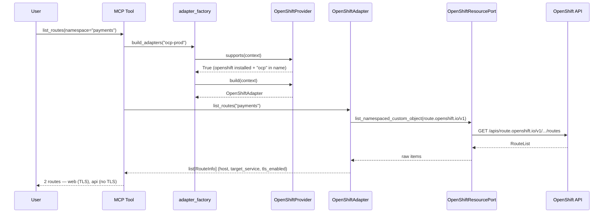
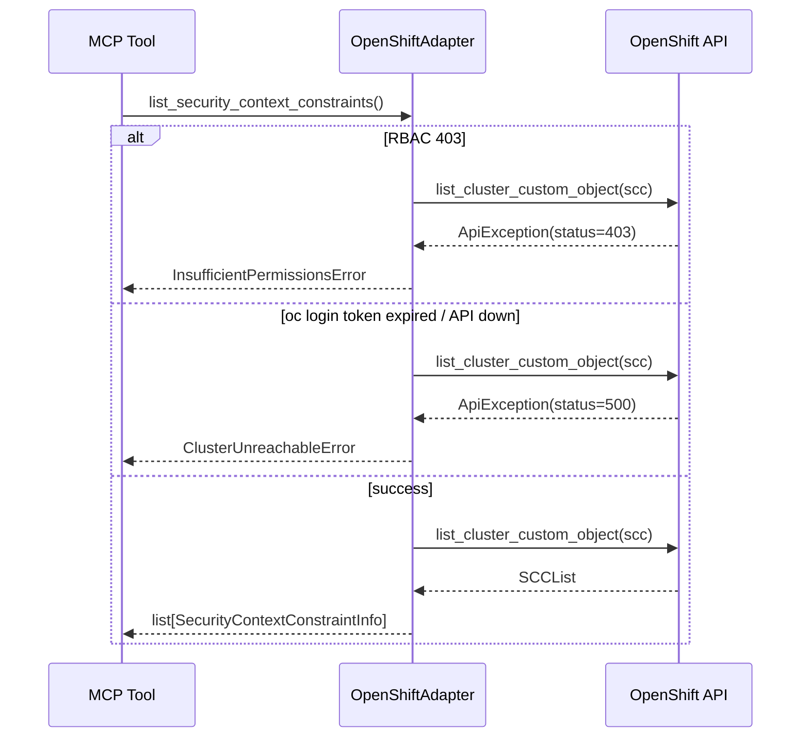
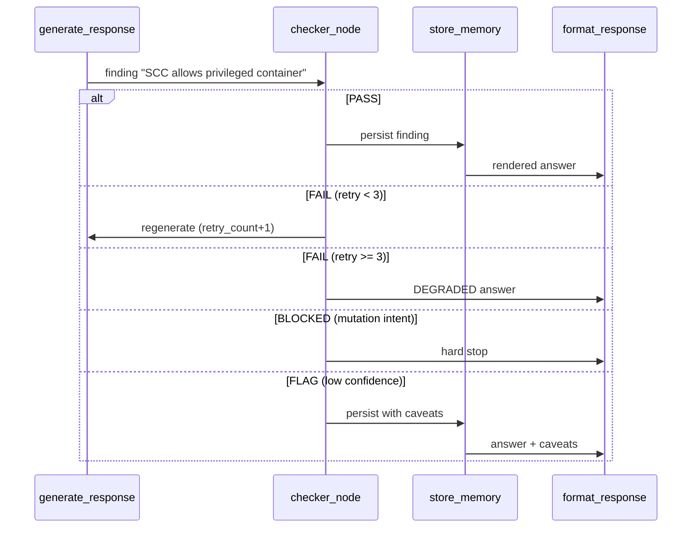

# 97 — OpenShift Native Support

hexawyn understands OpenShift-native resources (Projects, Routes, SCCs,
ImageStreams and Tekton PipelineRuns) without manual `oc` commands. The
OpenShift adapter is auto-selected when the cluster context looks like
OpenShift (`openshift`/`ocp` in the name, or `provider == "openshift"`),
including CRC local clusters.

## Sample Questions

- "List all OpenShift projects and their status."
- "Which routes are exposed in the payments namespace, and are they TLS-enabled?"
- "Show me the SecurityContextConstraints that allow privileged containers."
- "Are there any failed Tekton pipeline runs in the ci namespace?"
- "What ImageStreams are available in the openshift namespace?"

## Mapped MCP Tools

The flows below use the adapter method names (`list_routes`, ...). Each maps to
a real MCP tool that drives the same hexagonal chain:

| Capability | MCP tool | Use case | Port method |
|---|---|---|---|
| Routes | `list_openshift_routes` | `ListOpenshiftRoutesUseCase` | `list_routes(namespace)` |
| Projects | `list_openshift_projects` | `ListOpenshiftProjectsUseCase` | `list_projects()` |
| SecurityContextConstraints | `list_openshift_sccs` | `ListOpenshiftSccsUseCase` | `list_security_context_constraints()` |
| ImageStreams | `list_openshift_imagestreams` | `ListOpenshiftImagestreamsUseCase` | `list_image_streams(namespace)` |
| Failed PipelineRuns | `get_openshift_failed_pipeline_runs` | Tekton pipeline use case | `tekton.dev` CRD adapter |

---

## 1. Happy Path

Full hexagonal chain: the MCP tool resolves the OpenShift adapter through the
CloudProvider registry, then reads OpenShift-native resources via the dynamic
Kubernetes API.

---

## 2. Error Flows

Infra exceptions never escape the secondary adapter — they are translated to
`HexawynError` subclasses.

---

## 3. Checker Node

The checker validates OpenShift findings before they reach the user, retrying
on low-confidence results and degrading gracefully on repeated failure.

---

## Key Points

- OpenShift adapter is auto-selected via the CloudProvider entry-points registry
  (`openshift`/`ocp` in name or `provider == "openshift"`), CRC included.
- Vanilla Kubernetes reads (pods, namespaces, metrics, logs) are delegated to
  the shared adapters — only OpenShift-native resources use the dynamic API.
- Routes map to Ingress, Projects to Namespaces, SCCs to PodSecurityPolicies,
  ImageStreams to the native registry.
- Tekton PipelineRuns reuse the shared `tekton.dev` CRD adapter, plus a
  `get_failed_pipeline_runs` convenience.
- Monitoring uses the built-in Thanos Querier (Prometheus-compatible), logs use
  the standard Kubernetes pod-log API.

---

## Test Coverage

| Test | File | Status |
|---|---|---|
| `test_maps_routes` | `tests/unit/test_openshift_adapter.py` | ✅ |
| `test_maps_projects` | `tests/unit/test_openshift_adapter.py` | ✅ |
| `test_maps_sccs` | `tests/unit/test_openshift_adapter.py` | ✅ |
| `test_maps_image_streams` | `tests/unit/test_openshift_adapter.py` | ✅ |
| `test_forbidden_raises_insufficient_permissions` | `tests/unit/test_openshift_adapter.py` | ✅ |
| `test_other_error_raises_cluster_unreachable` | `tests/unit/test_openshift_adapter.py` | ✅ |
| `test_get_failed_pipeline_runs` | `tests/unit/test_tekton_adapter.py` | ✅ |
| `test_supports_when_ocp_in_name` | `tests/unit/test_openshift_provider.py` | ✅ |
| `test_supports_crc_local_cluster` | `tests/unit/test_openshift_provider.py` | ✅ |
| `test_build_returns_openshift_adapter` | `tests/unit/test_openshift_provider.py` | ✅ |
| `test_delegates_to_prometheus_port` | `tests/unit/test_openshift_monitoring_adapter.py` | ✅ |
| `test_delegates_to_injected_port` | `tests/unit/test_openshift_logs_adapter.py` | ✅ |

---

## Related Files

- `src/hexawyn/application/ports/driven/openshift_resource_port.py`
- `src/hexawyn/adapters/secondary/openshift/openshift_adapter.py`
- `src/hexawyn/adapters/secondary/openshift/openshift_provider.py`
- `src/hexawyn/adapters/secondary/openshift/tekton_adapter.py`
- `src/hexawyn/adapters/secondary/openshift/openshift_monitoring_adapter.py`
- `src/hexawyn/adapters/secondary/openshift/openshift_logs_adapter.py`
