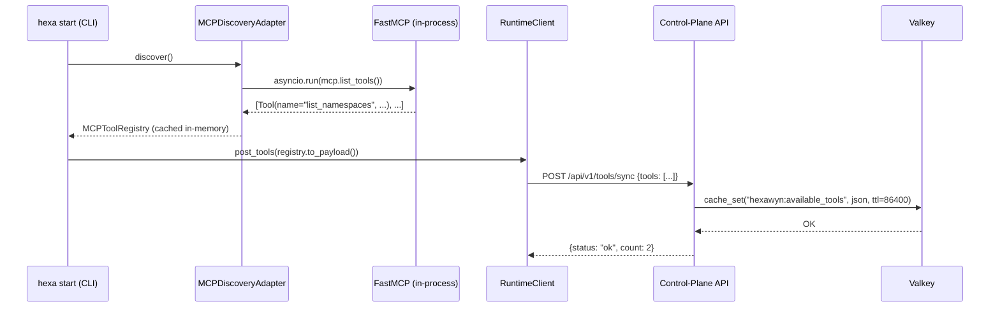
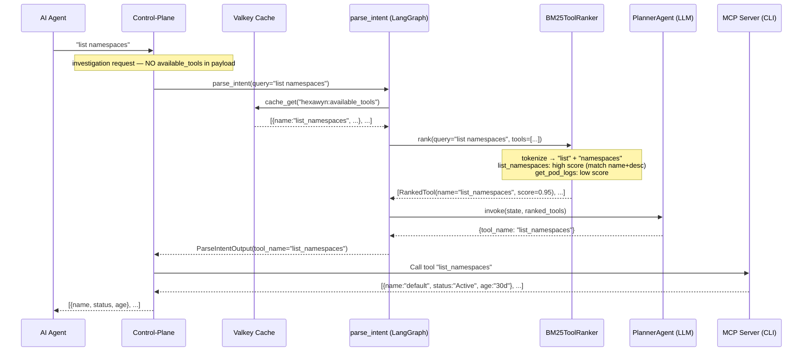
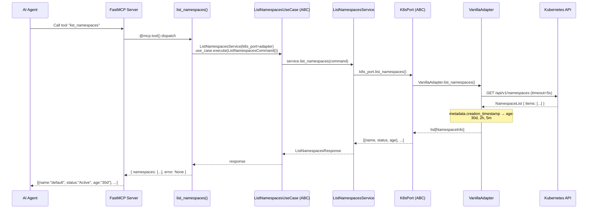
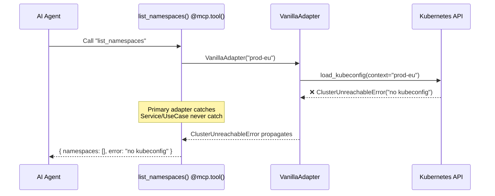

# Use Case 5 — List All Namespaces with Age Overview

## Sample Questions

- "List all Kubernetes namespaces in the cluster"
- "What namespaces exist and how old are they?"
- "Which namespaces were created recently?"
- "Show me the full namespace inventory for this cluster"

---

The user asks an AI agent (via MCP) to list all Kubernetes namespaces with their age. The flow goes through: MCP Tool → ListNamespacesUseCase (ABC) → ListNamespacesService → K8sPort (driven port) → VanillaAdapter/DemoAdapter → Kubernetes API. Tools are discovered at CLI startup and synced once to the control-plane (Valkey cache). The PlannerAgent reads tools from cache — not from the investigation payload.

### Flow 1 — Startup: Tool Discovery + Sync to Control-Plane

### Flow 2 — Investigation: Agent Routes to list_namespaces via BM25

### Flow 3 — Happy Path: Tool Execution (CLI Side)

### Flow 4 — Error: Cluster Unreachable

## Key Points

- **Tools synced once at startup** → `POST /api/v1/tools/sync` → Valkey. Not sent with every investigation.
- **parse_intent reads from Valkey** → `cache_get("hexawyn:available_tools")`. No `available_tools` in payload.
- **NamespaceInfo = {name, status, age}** — age derived from `metadata.creation_timestamp`.
- **UseCase = ABC, Service = impl** — same pattern as `ChatCliUseCase`/`ChatCliService`.
- **Primary adapter (MCP tool) is the only layer that catches exceptions.**

## Test Coverage

| Test | File | Status |
|---|---|---|
| `test_creates_namespace_info_with_all_fields` | `tests/unit/test_k8s_port.py` | ✅ |
| `test_list_namespaces_is_abstract` | `tests/unit/test_k8s_port.py` | ✅ |
| `test_implements_use_case` | `tests/unit/test_list_namespaces_use_case.py` | ✅ |
| `test_delegates_to_port` | `tests/unit/test_list_namespaces_use_case.py` | ✅ |
| `test_list_namespaces_returns_namespace_info_list` | `tests/unit/test_vanilla_adapter.py` | ✅ |
| `test_list_namespaces_terminating_status` | `tests/unit/test_vanilla_adapter.py` | ✅ |
| `test_list_namespaces_returns_list` | `tests/unit/test_demo_adapter.py` | ✅ |
| `test_list_namespaces_tool_is_registered` | `tests/unit/test_server.py` | ✅ |
| `test_sync_tools_returns_ok` | `tests/unit/test_api.py` (control-plane) | ✅ |
| `test_run_with_available_tools_ranks_and_returns` | `tests/unit/test_planner_integration.py` (control-plane) | ✅ |

## Related Files

- `src/hexawyn/application/ports/driven/k8s_port.py` — NamespaceInfo TypedDict + K8sPort ABC
- `src/hexawyn/application/use_case/list_namespaces/` — ListNamespacesUseCase (ABC)
- `src/hexawyn/application/service/list_namespaces_service.py` — ListNamespacesService (impl)
- `src/hexawyn/adapters/secondary/vanilla/vanilla_adapter.py` — VanillaAdapter
- `src/hexawyn/adapters/secondary/mock/demo_adapter.py` — DemoAdapter
- `src/hexawyn/adapters/secondary/mcp/mcp_discovery_adapter.py` — Tool discovery at startup
- `src/hexawyn/mcp/server.py` — MCP tool registration + build_k8s_adapter()
- `src/hexawyn/mcp/tools/list_namespaces.py` — MCP tool
- `src/hexawyn/cli/app.py` — _sync_tools_to_control_plane()
- `src/hexawyn/api/routers/tools.py` (control-plane) — POST /api/v1/tools/sync
- `src/hexawyn/lang_graph/nodes/parse_intent.py` (control-plane) — _load_tools_from_cache()
