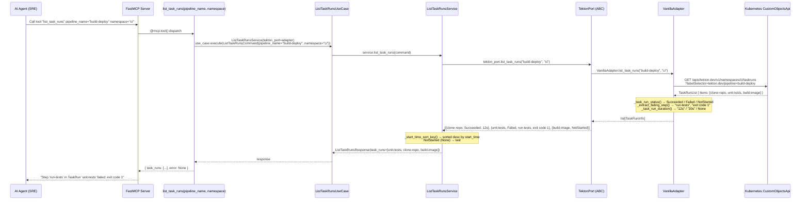
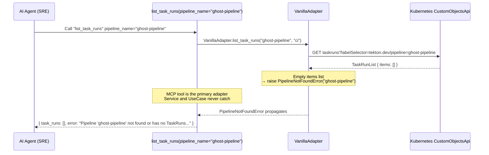
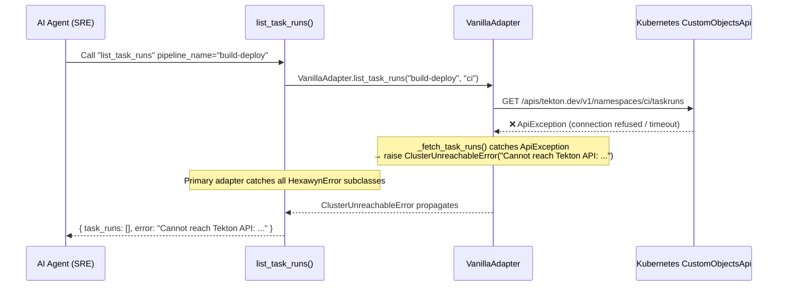
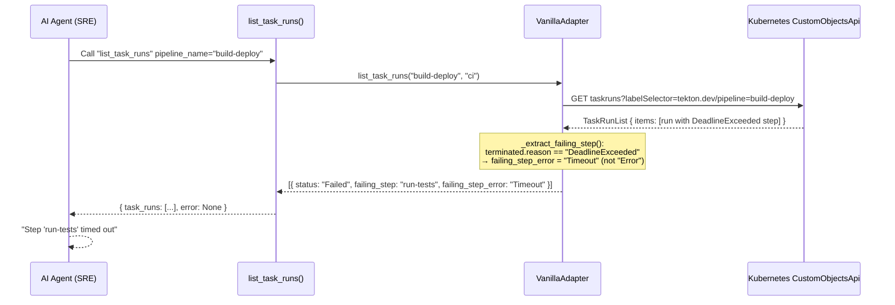

# Use Case 8 — List TaskRuns for a Pipeline

## Sample Questions

- "List all TaskRuns for the build-deploy pipeline — which step is failing?"
- "What's the status of each step in the payment-service pipeline?"
- "Which task step broke the checkout pipeline?"
- "Show me the TaskRuns for the ci/deploy-api pipeline"

---

An AI agent (SRE) asks "List all TaskRuns for the build-deploy pipeline — which task step is failing?". The flow goes through all hexagonal layers: MCP Tool → ListTaskRunsUseCase → ListTaskRunsService → TektonPort (driven port) → VanillaAdapter → Kubernetes CustomObjectsApi (Tekton CRD). TaskRuns are sorted by start time descending; failed runs expose the failing step name and error message.

### Flow 1 — Happy Path: Pipeline with 3 TaskRuns, 1 Failed

### Flow 2 — Error: Pipeline Not Found

### Flow 3 — Error: Tekton API Unreachable

### Flow 4 — Edge Case: Timeout Step

## Key Points

- **TektonPort is separate from K8sPort** — ISP: Tekton CRD operations do not belong in the core K8s port
- **Error translation in the secondary adapter** — `ApiException` → `ClusterUnreachableError`; empty result → `PipelineNotFoundError`. Domain errors never escape the adapter.
- **Service never catches** — `ListTaskRunsService` lets `PipelineNotFoundError` propagate naturally
- **Timeout shown as "Timeout" not "Error"** — `terminated.reason == "DeadlineExceeded"` is mapped explicitly
- **Sorted desc by start_time** — `NotStarted` (null start_time) always last

## Test Coverage

| Test | File | Status |
|---|---|---|
| `test_is_frozen` | `tests/unit/test_list_task_runs_use_case.py` | ✅ |
| `test_fields` | `tests/unit/test_list_task_runs_use_case.py` | ✅ |
| `test_default_task_runs_is_empty` | `tests/unit/test_list_task_runs_use_case.py` | ✅ |
| `test_accepts_task_runs_list` | `tests/unit/test_list_task_runs_use_case.py` | ✅ |
| `test_is_abstract` | `tests/unit/test_list_task_runs_use_case.py` | ✅ |
| `test_cannot_instantiate_directly` | `tests/unit/test_list_task_runs_use_case.py` | ✅ |
| `test_delegates_to_service_port` | `tests/unit/test_list_task_runs_use_case.py` | ✅ |
| `test_passes_command_to_service` | `tests/unit/test_list_task_runs_use_case.py` | ✅ |
| `test_implements_service_port` | `tests/unit/test_list_task_runs_use_case.py` | ✅ |
| `test_failed_task_run_exposes_failing_step_and_error` (TC1) | `tests/unit/test_list_task_runs_use_case.py` | ✅ |
| `test_all_succeeded_no_failing_step` (TC2) | `tests/unit/test_list_task_runs_use_case.py` | ✅ |
| `test_running_task_run_has_start_time_and_no_duration` (TC3) | `tests/unit/test_list_task_runs_use_case.py` | ✅ |
| `test_pipeline_not_found_propagates` (TC4) | `tests/unit/test_list_task_runs_use_case.py` | ✅ |
| `test_sorted_by_start_time_descending` | `tests/unit/test_list_task_runs_use_case.py` | ✅ |

## Related Files

- `src/hexawyn/application/ports/driven/tekton_port.py` — `TaskRunInfo` TypedDict + `TektonPort` ABC
- `src/hexawyn/application/ports/driving/list_task_runs/` — Command, Response, ServicePort
- `src/hexawyn/application/service/list_task_runs_service.py` — `ListTaskRunsService` (sorting)
- `src/hexawyn/application/use_case/list_task_runs/list_task_runs_use_case.py` — `ListTaskRunsUseCase`
- `src/hexawyn/adapters/secondary/vanilla/vanilla_adapter.py` — Tekton CRD parsing + error translation
- `src/hexawyn/domain/errors.py` — `PipelineNotFoundError`
- `src/hexawyn/mcp/tools/list_task_runs.py` — MCP tool (primary adapter, final catch)
- `src/hexawyn/mcp/server.py` — `build_tekton_adapter()`
