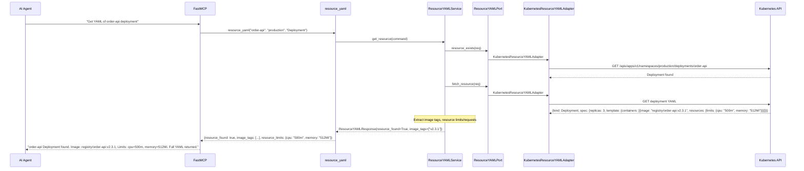
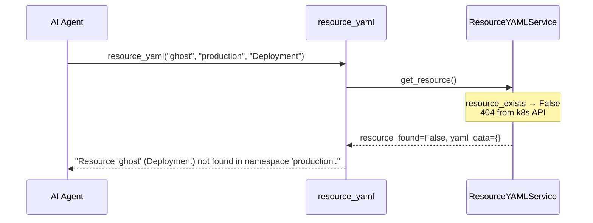
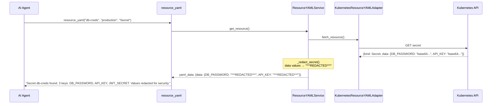

# Use Case 10 — Resource YAML Definition

## Sample Questions

- "Get the full YAML definition of the deployment order-api in namespace production"
- "What are the current resource limits and image version for the auth-service?"
- "Show me the ConfigMap for the payments service"
- "Get the Secret definition for db-creds (values redacted)"
- "What is the spec of the checkout-service StatefulSet?"

---

One MCP tool: `resource_yaml`. Retrieves full YAML/json definition of k8s resources, extracts image tags and resource limits, redacts Secret values.

### Flow 1 — Happy Path: Deployment with Limits



### Flow 2 — Resource Not Found



### Flow 3 — Secret Redacted



### Flow 4 — Checker Node: Secret Leak Prevention

```mermaid
sequenceDiagram
    participant Checker as Checker Node
    participant LLM as LLM Response

    Checker->>LLM: Validate secret redaction
    alt LLM reveals actual secret value in response
        Checker-->>LLM: ❌ FAIL — Secret values must never appear in output
    alt LLM says "resource not found" for RBAC-denied resource
        Checker-->>LLM: ⚠️ FLAG — differentiate "not found" from "permission denied"
    else All checks pass
        Checker-->>LLM: ✅ PASS
    end
```

## Key Points

- **Secret redaction** — all `data` values replaced with `***REDACTED***`, only keys shown
- **Image tag extraction** — `spec.template.spec.containers[].image` + `initContainers`
- **Resource limits** — first container's `resources.limits` + `resources.requests` extracted
- **All resource types** — Deployment, Service, ConfigMap, Secret, Ingress, StatefulSet, DaemonSet

## Test Coverage

| Test | File | Status |
|---|---|---|
| `test_deployment_with_limits` | `tests/unit/test_resource_yaml.py` | ✅ |
| `test_resource_not_found` | `tests/unit/test_resource_yaml.py` | ✅ |
| `test_secret_redacted` | `tests/unit/test_resource_yaml.py` | ✅ |
| `test_returns_yaml` | `tests/unit/test_resource_yaml_tool.py` | ✅ |

## Related Files

- `src/hexawyn/domain/models/resource_yaml.py` — ResourceYAMLResult, secret redaction
- `src/hexawyn/application/ports/driven/resource_yaml_port.py` — ResourceYAMLPort ABC
- `src/hexawyn/adapters/secondary/gitops/kubernetes_resource_yaml_adapter.py` — adapter
- `src/hexawyn/mcp/tools/resource_yaml.py` — MCP tool
