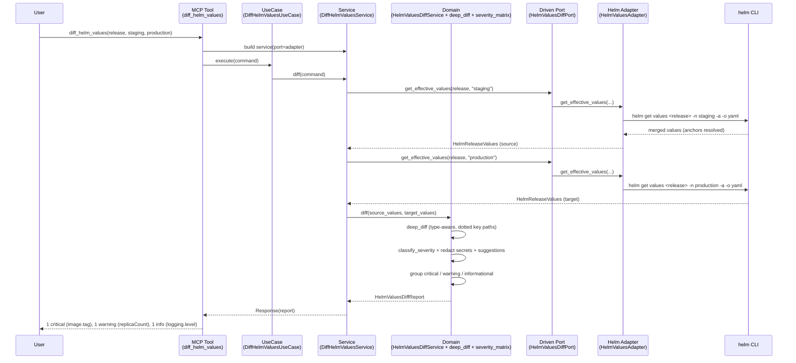
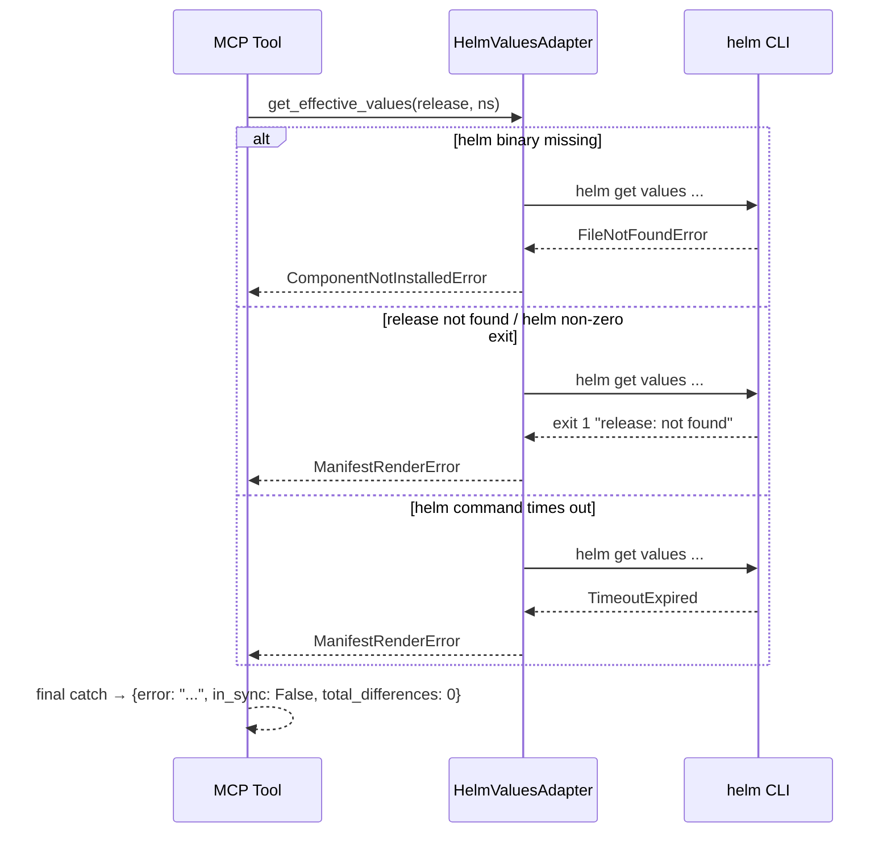
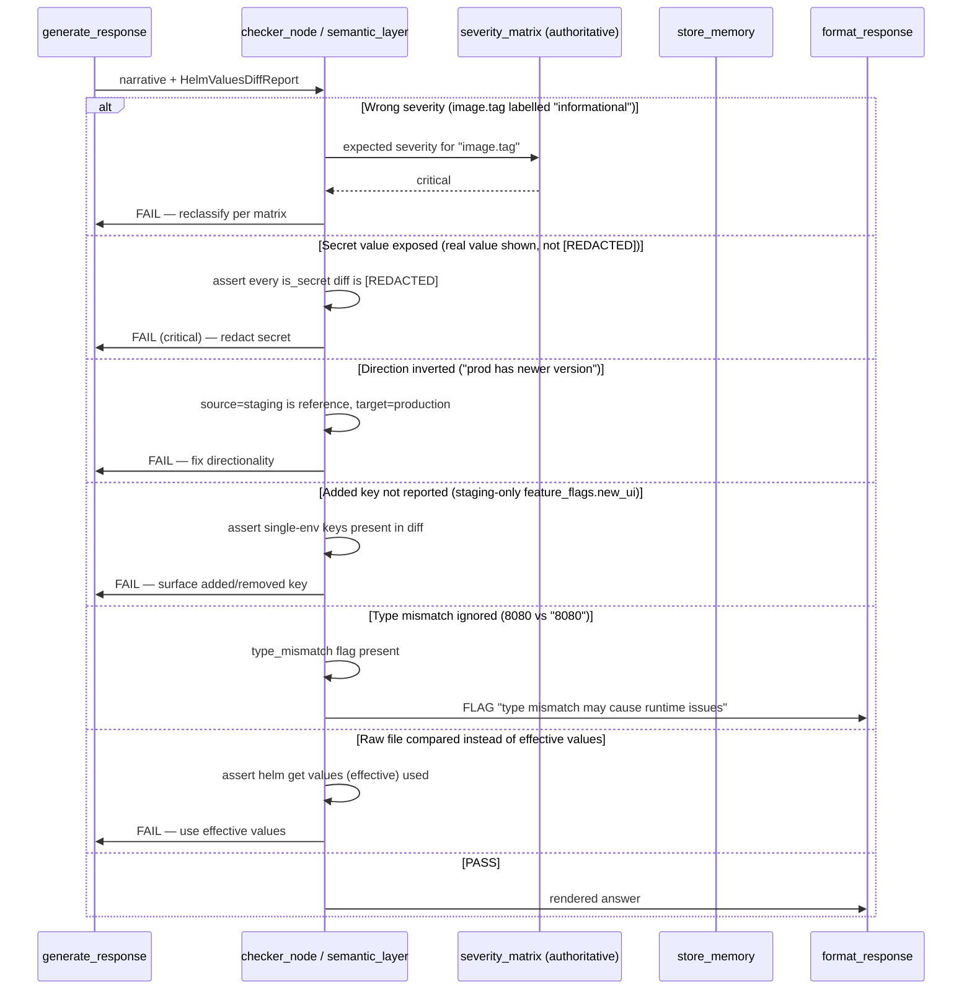

# Use Case 82 — Diff Helm Values Between Environments

Answers: *"Show me all values that differ between my staging and production Helm
values files — what configuration differences could explain behaviour
discrepancies?"*

Retrieves the effective Helm values (`helm get values -a`, not the raw
values.yaml) for a release in two namespaces, computes a type-aware structured
diff (added / removed / changed), classifies each difference against an
authoritative severity matrix, redacts secret values, and suggests which
differences could explain observed behaviour gaps.

## Sample Questions

- "Show me all values that differ between my staging and production Helm values."
- "What configuration differences could explain why prod behaves differently from staging?"
- "Diff the payment-service Helm values between staging and production."
- "Are staging and production in sync for the checkout release?"
- "Which critical Helm value differences exist between my two environments?"

---

## 1. Happy Path — Full Hexagonal Chain



---

## 2. Error Flows

Infrastructure exceptions never escape the secondary adapter — they are
translated to `HexawynError` subclasses. The MCP tool performs the final catch.



---

## 3. Checker Node

The checker/semantic layer validates the LLM narrative against the domain
report. These are the ticket's semantic edge cases.



---

## Key Points

- **Effective values, not raw files**: uses `helm get values -a` so CI `--set`
  overrides are reflected; comparing raw values.yaml would miss them.
- **Type-aware diff**: `8080` (int) vs `"8080"` (str) is flagged `type_mismatch`,
  not "no difference".
- **Authoritative severity matrix**: image tag/repository/RBAC/secrets = critical,
  replicas/resource limits/feature flags = warning, rest = informational. This is
  the single source of truth the checker verifies against.
- **Secret redaction in the domain**: secret-bearing values become `[REDACTED]`
  before leaving the domain layer — never exposed.
- **Explicit direction**: source (staging) is the reference, target (production)
  is compared against it — prevents inverted "prod is newer" narratives.

---

## Tests

Unit test stubs for the domain logic (values deep diff, severity classification,
discrepancy suggestion). Implemented across
`tests/unit/test_values_deep_diff.py`,
`tests/unit/test_helm_values_severity_matrix.py`, and
`tests/unit/test_helm_values_diff_service.py`.

```python
# ── Values deep diff (type-aware) ────────────────────────────
def test_changed_scalar_flagged():
    # replicaCount 1 -> 3 => one "changed" diff, dotted key path
    ...

def test_int_vs_string_same_repr_is_type_mismatch():
    # port: 8080 (int) vs "8080" (str) => type_mismatch True
    ...

def test_key_only_in_source_is_removed():
    # staging-only feature_flags.new_ui => change_type "removed"
    ...

def test_key_only_in_target_is_added():
    # prod-only key => change_type "added"
    ...

# ── Severity classification (authoritative matrix) ───────────
def test_image_tag_is_critical():
    # image.tag => critical (different code running)
    ...

def test_replica_count_is_warning():
    # replicaCount => warning (availability)
    ...

def test_logging_level_is_informational():
    # logging.level => informational
    ...

def test_secret_key_is_critical_and_detected():
    # database.password => critical + is_secret_key True
    ...

# ── Discrepancy suggestion + redaction + direction ───────────
def test_image_tag_suggestion_mentions_code():
    # suggestion explains "different code is running"
    ...

def test_replica_suggestion_mentions_availability():
    # suggestion explains availability impact
    ...

def test_secret_values_are_redacted():
    # is_secret diff => source/target == "[REDACTED]"
    ...

def test_source_is_staging_target_is_production():
    # directionality preserved: source_value=staging, target_value=prod
    ...

def test_type_mismatch_gets_suggestion():
    # type_mismatch => suggestion mentions "type mismatch"
    ...

def test_critical_diff_older_than_seven_days_flagged():
    # injected diff_age_provider => "persisted for N days" in suggestion
    ...
```

| Test | Scenario | File | Status |
|---|---|---|---|
| `test_changed_scalar_flagged` | replicas 1→3 changed | `test_values_deep_diff.py` | ✅ |
| `test_int_vs_string_same_repr_is_type_mismatch` | port 8080 vs "8080" | `test_values_deep_diff.py` | ✅ |
| `test_key_only_in_source_is_removed` | added/removed key | `test_values_deep_diff.py` | ✅ |
| `test_image_tag_is_critical` | severity matrix critical | `test_helm_values_severity_matrix.py` | ✅ |
| `test_replica_count_is_warning` | severity matrix warning | `test_helm_values_severity_matrix.py` | ✅ |
| `test_logging_level_is_informational` | severity matrix info | `test_helm_values_severity_matrix.py` | ✅ |
| `test_secret_values_are_redacted` | secret → [REDACTED] | `test_helm_values_diff_service.py` | ✅ |
| `test_source_is_staging_target_is_production` | directionality | `test_helm_values_diff_service.py` | ✅ |
| `test_type_mismatch_gets_suggestion` | type mismatch FLAG | `test_helm_values_diff_service.py` | ✅ |
| `test_critical_diff_older_than_seven_days_flagged` | chronic diff age | `test_helm_values_diff_service.py` | ✅ |
| `test_groups_by_severity` | 3-value grouped summary | `test_helm_values_diff_service.py` | ✅ |
| `test_identical_values_are_in_sync` | environments in sync | `test_helm_values_diff_service.py` | ✅ |
| `test_helm_error_raises_manifest_render_error` | release not found | `test_helm_values_adapter.py` | ✅ |

---

## Related Files

- `src/hexawyn/domain/models/helm_values_diff.py`
- `src/hexawyn/domain/services/helm_values_diff/values_deep_diff.py`
- `src/hexawyn/domain/services/helm_values_diff/severity_matrix.py`
- `src/hexawyn/domain/services/helm_values_diff/helm_values_diff_service.py`
- `src/hexawyn/application/ports/driven/helm_values_diff_port.py`
- `src/hexawyn/application/ports/driving/diff_helm_values/`
- `src/hexawyn/application/service/diff_helm_values_service.py`
- `src/hexawyn/application/use_case/diff_helm_values/diff_helm_values_use_case.py`
- `src/hexawyn/adapters/secondary/gitops/helm_values_adapter.py`
- `src/hexawyn/mcp/tools/diff_helm_values.py`
- `src/hexawyn/mcp/server.py` (`build_helm_values_diff_adapter`)
