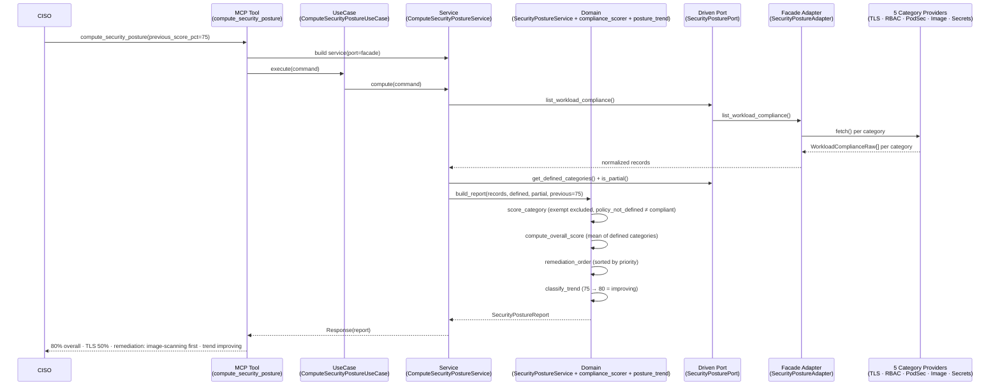
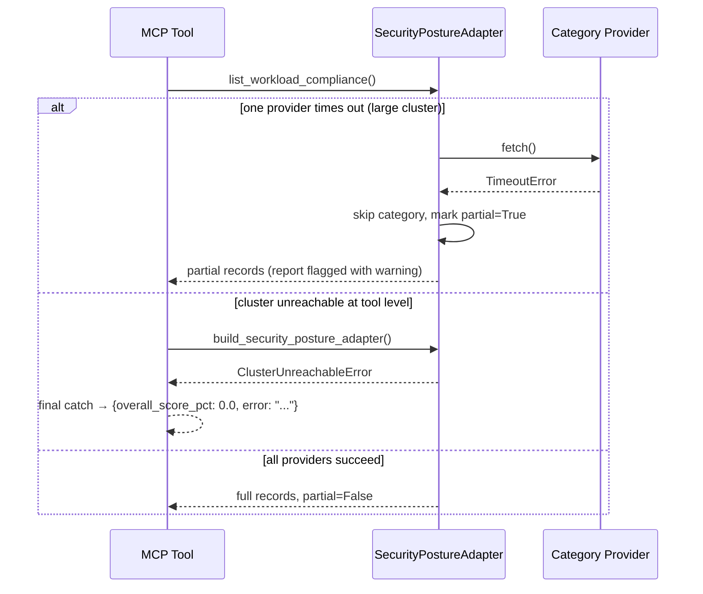
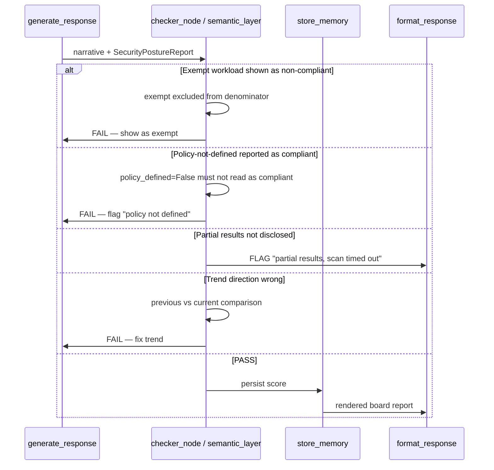

# Use Case 101 — Security Posture / Compliance Score (ECA-93)

Answers: *"What percentage of our workloads are compliant with our security
policies?"* — a board-level security posture score for a CISO.

Aggregates five security audits (TLS, RBAC, Pod Security Standards, image
scanning, secret rotation) into one overall compliance score, a per-category
breakdown, a priority-ordered remediation list, and a quarter-over-quarter
trend. Exempt workloads are excluded from the denominator; categories with no
defined policy are reported as such — never silently counted as compliant.

## Sample Questions

- "What percentage of our workloads are compliant with our security policies?"
- "Give me our overall security posture score with a breakdown by category."
- "Which non-compliant workloads should we remediate first?"
- "Is our security compliance improving or degrading versus last quarter?"
- "How many workloads are non-compliant on TLS, RBAC, Pod Security, image scanning and secret rotation?"

---

## 1. Happy Path — Full Hexagonal Chain



---

## 2. Error & Degradation Flows



---

## 3. Checker Node



---

## Key Points

- **Aggregator via Facade**: the domain never touches the 5 individual audits;
  a Facade adapter fans out to injected category providers and normalizes each
  result into a uniform `WorkloadComplianceRaw` contract.
- **Exempt excluded from denominator**: an exempt workload is neither compliant
  nor non-compliant (shown as exempt, TC edge case).
- **Policy-not-defined ≠ compliant** (TC4): a category with no policy scores 0%
  and is flagged `policy_defined=False` — a CISO is never misled.
- **Remediation priority matrix**: image scanning > RBAC > secret rotation >
  Pod Security > TLS, producing an action-ordered list for the board.
- **Graceful partial results**: a provider timeout marks the report `partial`
  with a warning instead of crashing (large-cluster edge case).

---

## Tests

All test files created for this use case:

```
tests/unit/test_security_posture.py                        # domain model
tests/unit/test_security_posture_port.py                   # driven port + TypedDict
tests/unit/test_compliance_scorer.py                       # per-category scoring, exempt, policy-not-defined, overall
tests/unit/test_posture_trend.py                           # improving/degrading/stable + tolerance
tests/unit/test_security_posture_service.py                # report assembly, remediation ordering, partial, trend
tests/unit/test_security_posture_adapter.py                # Facade fan-out + partial on provider failure
tests/unit/test_category_providers.py                      # TLS + Pod Security normalizers
tests/unit/test_compute_security_posture_command.py        # driving command
tests/unit/test_compute_security_posture_response.py       # driving response
tests/unit/test_compute_security_posture_service_port.py   # driving service port (ABC)
tests/unit/test_compute_security_posture_service.py        # application service
tests/unit/test_compute_security_posture_use_case.py       # use case
tests/unit/test_compute_security_posture_mcp.py            # MCP tool
tests/unit/test_server.py                                  # build_security_posture_adapter factory
```

Domain-logic stubs (scoring, exemption, policy-not-defined, trend, aggregation):

```python
def test_eighty_percent_compliant():
    # 8/10 compliant TLS => score 80%
    ...

def test_exempt_workloads_excluded_from_denominator():
    # exempt workload not counted compliant nor non-compliant
    ...

def test_policy_not_defined_is_not_compliant():
    # missing policy => policy_defined False, score 0%, not "compliant"
    ...

def test_non_compliant_sorted_by_priority():
    # remediation_order: image_scanning before tls
    ...

def test_trend_improving_with_previous_score():
    # current 100 vs previous 90 => improving
    ...

def test_partial_sets_warning():
    # provider timeout => partial True + warning text
    ...
```

| Test Scenario (ticket) | Test | Status |
|---|---|---|
| TC1: 80% compliant → score + breakdown | `test_eighty_percent_compliant` | ✅ |
| TC2: new workload w/o security context → non-compliant | `test_new_workload_without_security_context_is_non_compliant` | ✅ |
| TC3: all compliant → 100%, no remediation | `test_all_compliant_no_remediation` | ✅ |
| TC4: policy missing → "policy not defined" | `test_missing_policy_flagged_not_compliant` | ✅ |
| Edge: exempt workload → shown exempt | `test_exempt_workloads_excluded_from_denominator` | ✅ |
| Edge: timeout → partial results + warning | `test_failed_provider_is_skipped_and_marks_partial` | ✅ |

---

## Related Files

- `src/hexawyn/domain/models/security_posture.py`
- `src/hexawyn/domain/services/security_posture/compliance_scorer.py`
- `src/hexawyn/domain/services/security_posture/posture_trend.py`
- `src/hexawyn/domain/services/security_posture/security_posture_service.py`
- `src/hexawyn/application/ports/driven/security_posture_port.py`
- `src/hexawyn/application/ports/driving/compute_security_posture/`
- `src/hexawyn/application/service/compute_security_posture_service.py`
- `src/hexawyn/application/use_case/compute_security_posture/compute_security_posture_use_case.py`
- `src/hexawyn/adapters/secondary/security_posture/security_posture_adapter.py`
- `src/hexawyn/adapters/secondary/security_posture/category_providers.py`
- `src/hexawyn/mcp/tools/compute_security_posture.py`
- `src/hexawyn/mcp/server.py` (`build_security_posture_adapter`)
