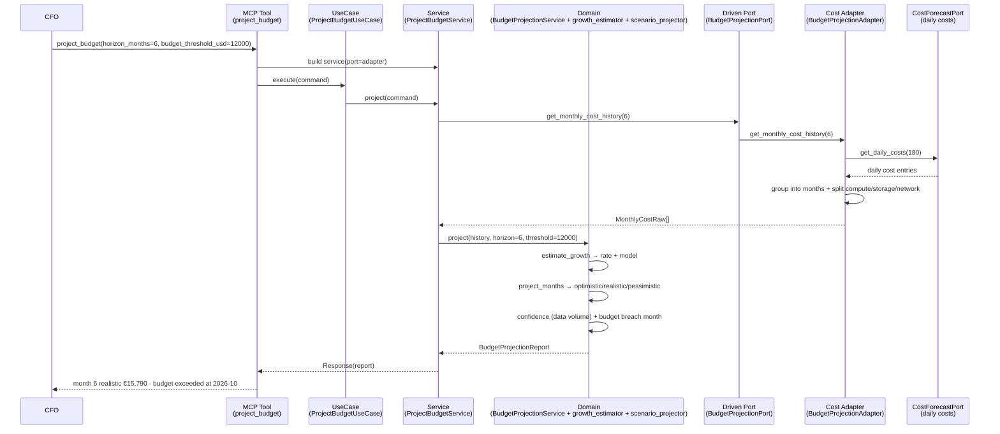
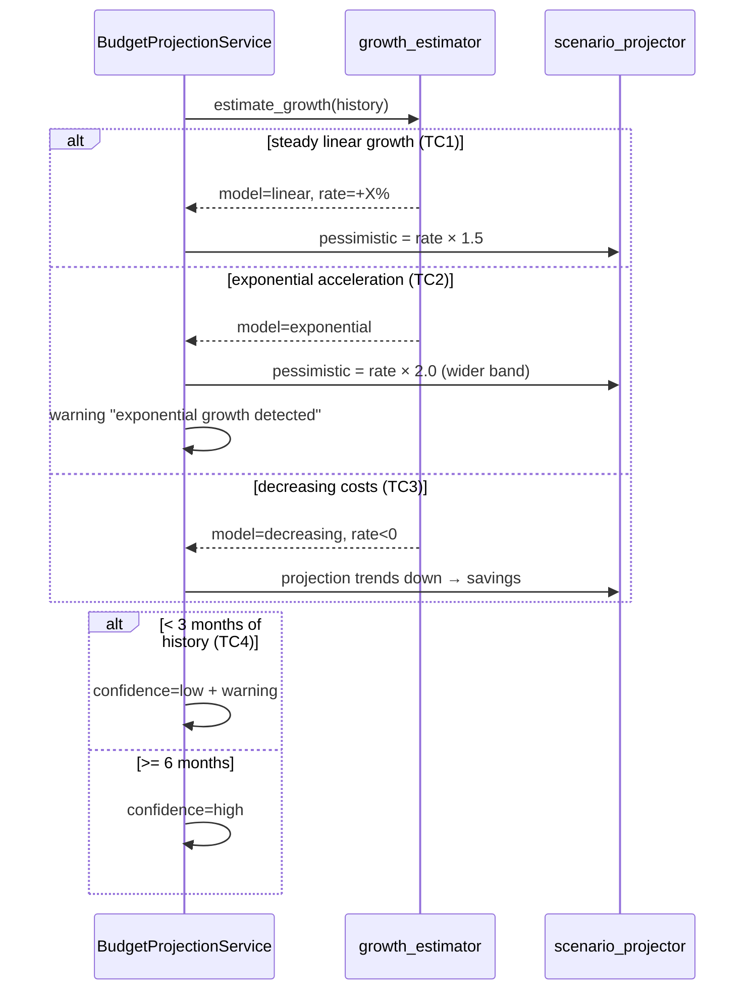
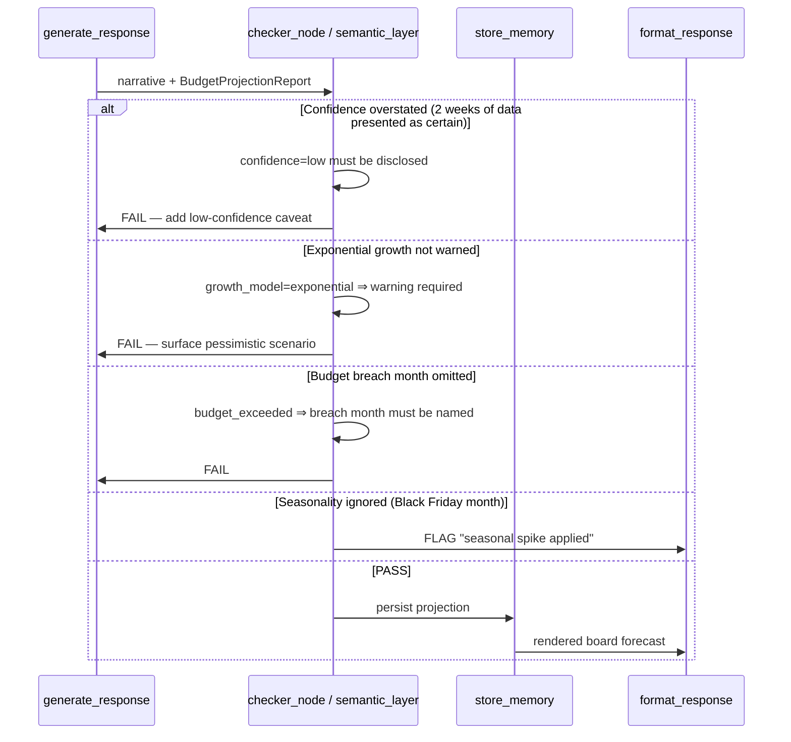
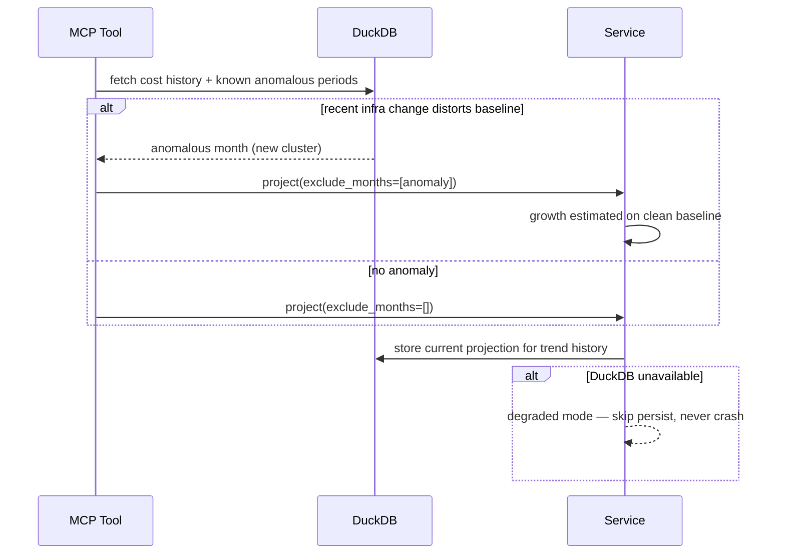

# Use Case 102 — 6-Month Budget Projection (ECA-94)

Answers: *"At current growth, what will our infrastructure cost be in 6 months?"*
— a budget projection for a CFO.

Estimates the monthly growth rate from cost history, classifies the growth
model (linear / exponential / decreasing / flat), and projects the next N months
in three scenarios (optimistic / realistic / pessimistic) with a per-category
breakdown (compute / storage / network). Confidence reflects the amount of
history available; a budget threshold triggers an alert naming the first month
the budget is exceeded.

## Sample Questions

- "At current growth, what will our infrastructure cost be in 6 months?"
- "Project our monthly cloud spend for the next two quarters with best/worst case."
- "When will we blow past our €12,000 monthly budget at this rate?"
- "Is our infrastructure cost trending up or down, and by how much per month?"
- "Give me a 6-month budget forecast broken down by compute, storage and network."

---

## 1. Happy Path — Full Hexagonal Chain



---

## 2. Growth-Model & Confidence Flows



---

## 3. Checker Node



---

## 4. DuckDB Memory (baseline & anomaly exclusion)



---

## Key Points

- **Growth model classification**: linear / exponential / decreasing / flat,
  derived from mean month-over-month change and whether it accelerates.
- **Three scenarios**: realistic applies the estimated compound rate; optimistic
  halves it; pessimistic widens it — 2× for exponential models where downside
  risk is larger.
- **Confidence from data volume** (TC4): < 3 months → low + explicit warning, a
  CFO is never handed a fragile projection as fact.
- **Budget alert names the breach month** (not just a boolean) — "you exceed
  €12,000 at 2026-10" is actionable.
- **Anomaly exclusion**: `exclude_months` drops a new-cluster spike so it does
  not distort the baseline.
- **Seasonality**: optional per-offset factors model historical spikes
  (e.g. Black Friday) without complicating the nominal case.
- Category attribution (compute/storage/network) lives in the adapter; the
  domain stays agnostic.

---

## Tests

All test files created for this use case:

```
tests/unit/test_budget_projection.py                 # domain model
tests/unit/test_budget_projection_port.py            # driven port + TypedDict
tests/unit/test_growth_estimator.py                  # rate + model classification
tests/unit/test_scenario_projector.py                # 3-scenario compound projection
tests/unit/test_budget_projection_service.py         # confidence, budget breach, exclusion, seasonality
tests/unit/test_budget_projection_adapter.py         # daily→monthly aggregation + category split
tests/unit/test_project_budget_command.py            # driving command
tests/unit/test_project_budget_response.py           # driving response
tests/unit/test_project_budget_service_port.py       # driving service port (ABC)
tests/unit/test_project_budget_service.py            # application service
tests/unit/test_project_budget_use_case.py           # use case
tests/unit/test_project_budget_mcp.py                # MCP tool
tests/unit/test_server.py                            # build_budget_projection_adapter factory
```

Domain-logic stubs (growth estimation, scenario projection, confidence):

```python
def test_steady_twelve_percent_monthly():
    # +12%/month history => rate ≈ 12%, model linear/exponential
    ...

def test_exponential_acceleration_detected():
    # accelerating MoM changes => model "exponential"
    ...

def test_decreasing_costs_detected():
    # falling costs => model "decreasing", rate < 0
    ...

def test_realistic_uses_compound_growth():
    # 8000 @ +12% over 6 months => ~15,790 realistic
    ...

def test_optimistic_below_realistic_below_pessimistic():
    # scenario ordering holds every month
    ...

def test_low_confidence_with_scarce_data():
    # < 3 months => confidence low + warning (TC4)
    ...

def test_budget_exceeded_flags_breach_month():
    # threshold crossed => budget_exceeded True + breach month named
    ...
```

| Test Scenario (ticket) | Test | Status |
|---|---|---|
| TC1: steady linear growth → upward trend + band | `test_steady_growth_upward_trend` | ✅ |
| TC2: exponential growth → warning + pessimistic | `test_exponential_growth_flags_warning` | ✅ |
| TC3: decreasing → savings trend | `test_decreasing_costs_show_savings` | ✅ |
| TC4: 2 weeks data → low confidence warning | `test_low_confidence_with_scarce_data` | ✅ |
| Edge: seasonal spike accounted | `test_seasonal_factor_applied` | ✅ |
| Edge: anomalous period excluded | `test_excluded_months_ignored` | ✅ |

---

## Related Files

- `src/hexawyn/domain/models/budget_projection.py`
- `src/hexawyn/domain/services/budget_projection/growth_estimator.py`
- `src/hexawyn/domain/services/budget_projection/scenario_projector.py`
- `src/hexawyn/domain/services/budget_projection/budget_projection_service.py`
- `src/hexawyn/application/ports/driven/budget_projection_port.py`
- `src/hexawyn/application/ports/driving/project_budget/`
- `src/hexawyn/application/service/project_budget_service.py`
- `src/hexawyn/application/use_case/project_budget/project_budget_use_case.py`
- `src/hexawyn/adapters/secondary/gitops/budget_projection_adapter.py`
- `src/hexawyn/mcp/tools/project_budget.py`
- `src/hexawyn/mcp/server.py` (`build_budget_projection_adapter`)
