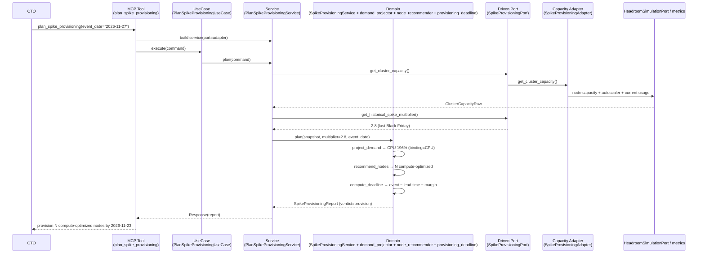
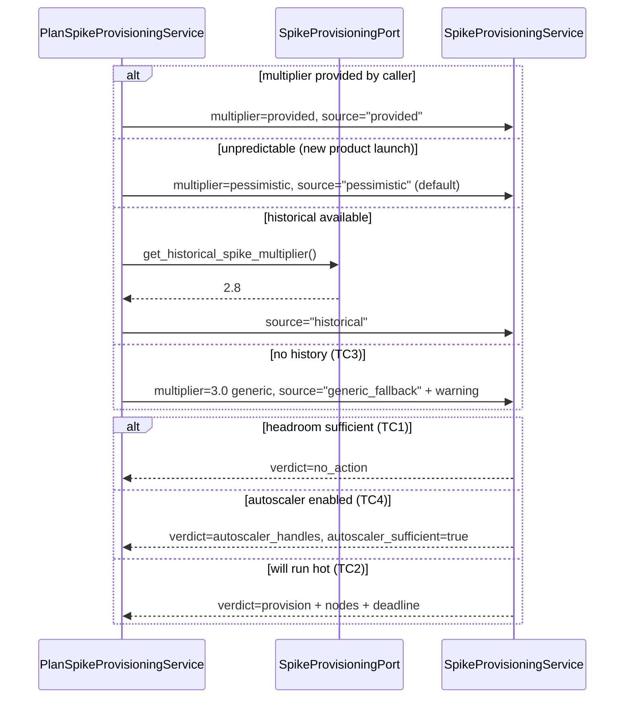
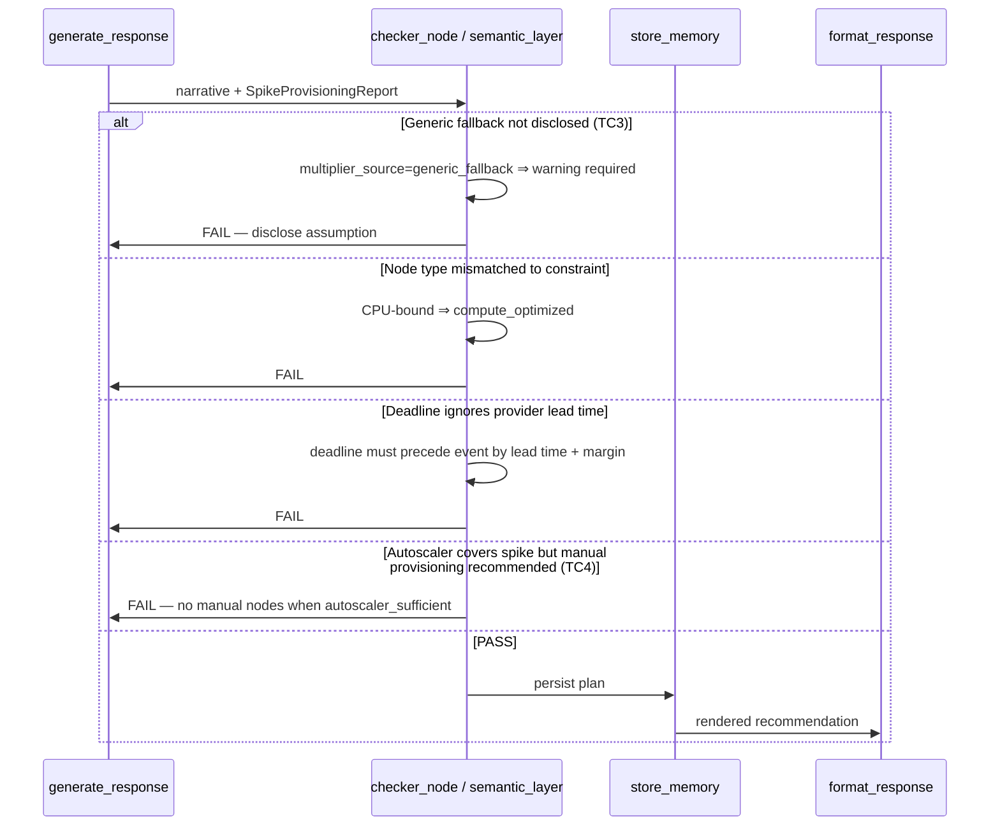

# Use Case 103 — Spike Provisioning Planner (ECA-95)

Answers: *"Do we need to provision new nodes before the Black Friday traffic
spike?"* — proactive capacity planning for a CTO.

Reads current cluster headroom, projects peak demand under a traffic multiplier
(from history, provided, or a generic fallback), and — when the cluster would
run hot — recommends how many nodes to add, of which type (compute- vs
memory-optimized), and by when (accounting for the cloud provider's node lead
time). If a cluster-autoscaler is enabled, it reports that the spike is handled
automatically.

## Sample Questions

- "Do we need to provision new nodes before the Black Friday traffic spike?"
- "Will our cluster survive a 3x traffic spike, or should we scale up first?"
- "How many nodes should we add before our product launch, and by when?"
- "What's our current CPU and memory headroom ahead of peak season?"
- "Can our autoscaler handle Black Friday, or do we need manual provisioning?"

---

## 1. Happy Path — Full Hexagonal Chain



---

## 2. Verdict & Multiplier-Source Flows



---

## 3. Checker Node



---

## Key Points

- **Traffic multiplier precedence**: unpredictable → pessimistic (default);
  else provided → historical → generic 3x fallback (TC3, with warning).
- **Binding constraint drives node type**: CPU-bound → compute-optimized,
  memory-bound → memory-optimized, neither → balanced.
- **Autoscaler awareness** (TC4): if a cluster-autoscaler is enabled, the
  verdict is `autoscaler_handles` and no manual provisioning is recommended.
- **Node count** is sized so the binding resource returns below the safe
  threshold (85% default).
- **Deadline accounts for provider lead time** (24h default) plus a safety
  margin — "provision by Nov 23" not "by Nov 27".
- **Pessimistic by default when unpredictable** (edge case: new product launch).

---

## Tests

All test files created for this use case:

```
tests/unit/test_spike_provisioning.py                        # domain model
tests/unit/test_spike_provisioning_port.py                   # driven port + TypedDict
tests/unit/test_demand_projector.py                          # projection + binding constraint
tests/unit/test_node_recommender.py                          # node count + node type
tests/unit/test_provisioning_deadline.py                     # deadline = event − lead time − margin
tests/unit/test_spike_provisioning_service.py                # verdict, autoscaler, fallback, deadline
tests/unit/test_spike_provisioning_adapter.py                # capacity mapping + historical multiplier
tests/unit/test_plan_spike_provisioning_command.py           # driving command
tests/unit/test_plan_spike_provisioning_response.py          # driving response
tests/unit/test_plan_spike_provisioning_service_port.py      # driving service port (ABC)
tests/unit/test_plan_spike_provisioning_service.py           # application service (multiplier resolution)
tests/unit/test_plan_spike_provisioning_use_case.py          # use case
tests/unit/test_plan_spike_provisioning_mcp.py               # MCP tool
tests/unit/test_server.py                                    # build_spike_provisioning_adapter factory
```

Domain-logic stubs (demand projection, node recommendation, deadline):

```python
def test_projects_cpu_and_memory_under_multiplier():
    # 70% CPU × 2.8 = 196% projected
    ...

def test_cpu_bound_recommends_compute_optimized():
    # CPU binding → node_type compute_optimized
    ...

def test_memory_bound_recommends_memory_optimized():
    # memory binding → node_type memory_optimized
    ...

def test_recommends_nodes_to_return_under_threshold():
    # sizes node count so binding resource ≤ safe threshold
    ...

def test_deadline_before_event_by_lead_time_and_margin():
    # event − 24h − 3d margin
    ...

def test_autoscaler_handles_spike():
    # autoscaler enabled → verdict autoscaler_handles, 0 manual nodes
    ...

def test_generic_fallback_flags_warning():
    # no history → generic 3x + warning
    ...
```

| Test Scenario (ticket) | Test | Status |
|---|---|---|
| TC1: enough headroom → no action | `test_no_action_when_headroom_sufficient` | ✅ |
| TC2: will run hot → provision N nodes by deadline | `test_provision_when_spike_exceeds_capacity` | ✅ |
| TC3: no history → generic 3x + warning | `test_generic_fallback_flags_warning` | ✅ |
| TC4: autoscaler → handled without manual provisioning | `test_autoscaler_handles_spike` | ✅ |
| Edge: unpredictable → pessimistic scenario | `test_unpredictable_uses_pessimistic` | ✅ |
| Edge: provider lead time factored into deadline | `test_lead_time_factored_into_deadline` | ✅ |

---

## Related Files

- `src/hexawyn/domain/models/spike_provisioning.py`
- `src/hexawyn/domain/services/spike_provisioning/demand_projector.py`
- `src/hexawyn/domain/services/spike_provisioning/node_recommender.py`
- `src/hexawyn/domain/services/spike_provisioning/provisioning_deadline.py`
- `src/hexawyn/domain/services/spike_provisioning/spike_provisioning_service.py`
- `src/hexawyn/application/ports/driven/spike_provisioning_port.py`
- `src/hexawyn/application/ports/driving/plan_spike_provisioning/`
- `src/hexawyn/application/service/plan_spike_provisioning_service.py`
- `src/hexawyn/application/use_case/plan_spike_provisioning/plan_spike_provisioning_use_case.py`
- `src/hexawyn/adapters/secondary/gitops/spike_provisioning_adapter.py`
- `src/hexawyn/mcp/tools/plan_spike_provisioning.py`
- `src/hexawyn/mcp/server.py` (`build_spike_provisioning_adapter`)
