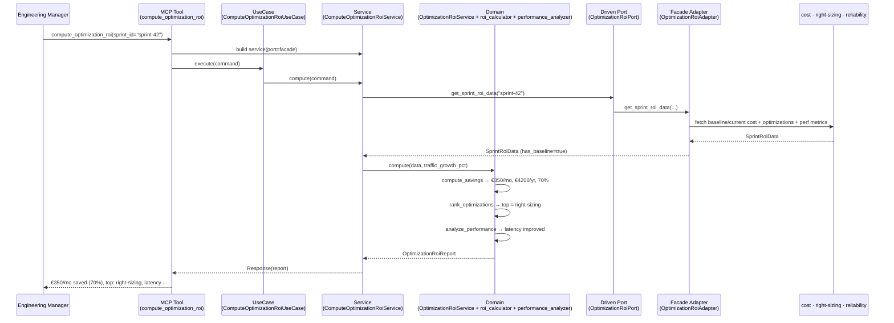
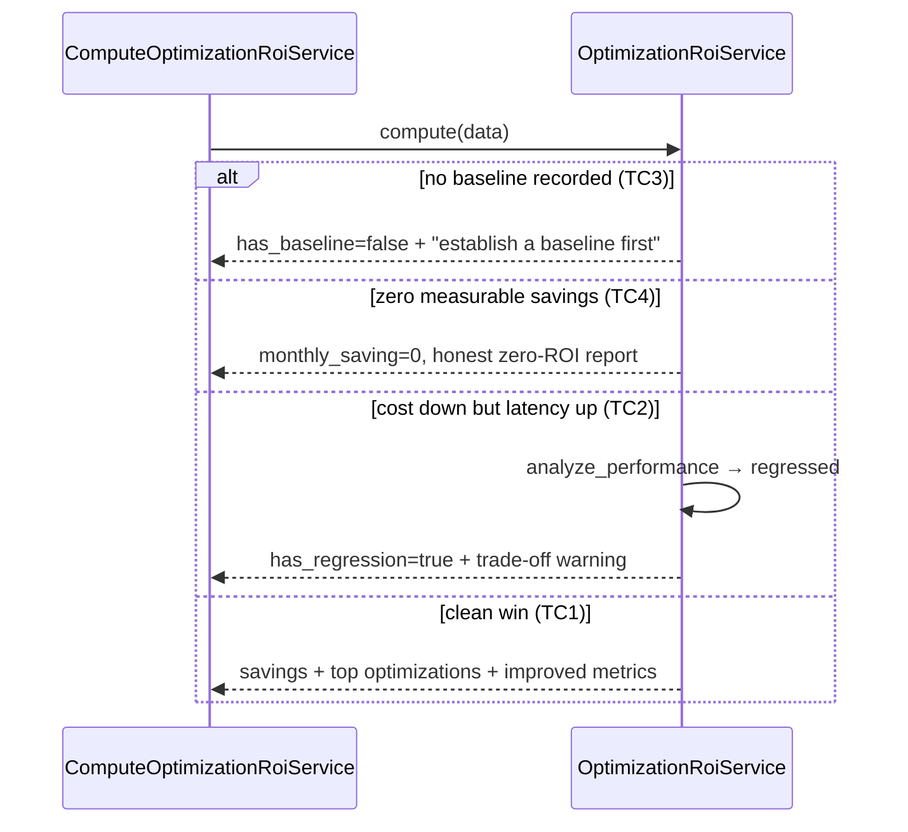
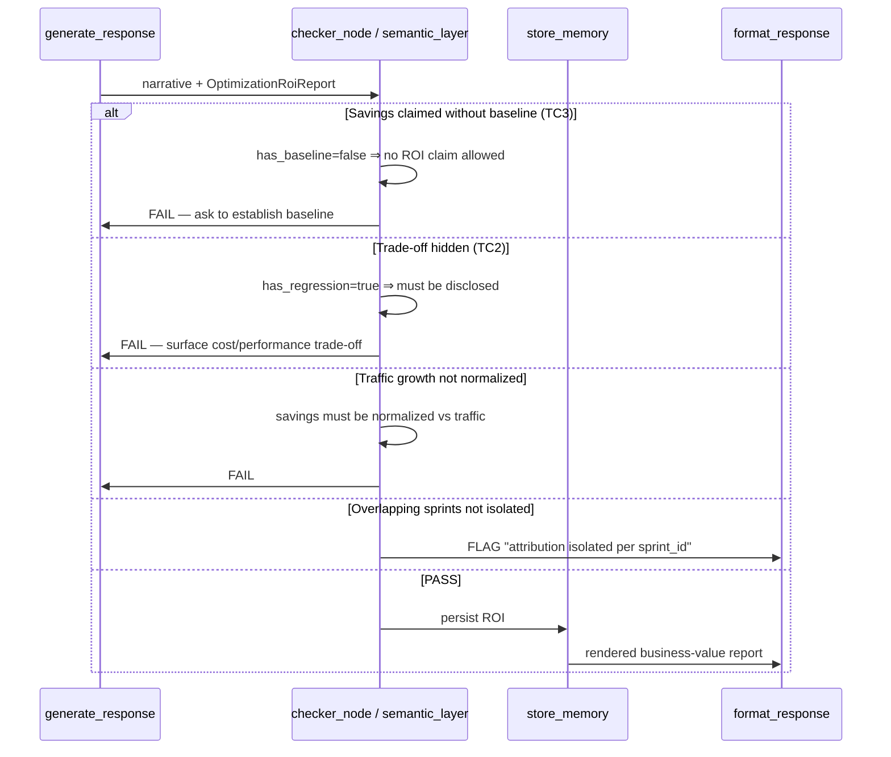
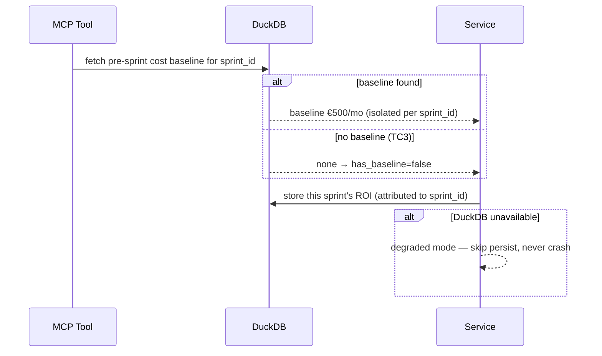

# Use Case 104 — Optimization Sprint ROI (ECA-86)

Answers: *"What is the ROI of our last Kubernetes optimization sprint?"* — so an
Engineering Manager can demonstrate business value and justify future
investment.

Aggregates the cost, right-sizing and reliability sources for a sprint into a
single ROI report: cost before and after, monthly and projected annual savings
(normalized against traffic growth), the highest-impact optimizations, and the
performance impact — flagging any cost/performance trade-off. When no pre-sprint
baseline exists, it returns guidance to establish one rather than a misleading
zero.

## Sample Questions

- "What is the ROI of our last Kubernetes optimization sprint?"
- "How much did our optimization sprint save per month and per year?"
- "Which optimizations had the biggest cost impact last sprint?"
- "Did our cost reduction hurt latency or reliability?"
- "Show me the business value of our right-sizing sprint for the board."

---

## 1. Happy Path — Full Hexagonal Chain



---

## 2. Baseline & Trade-off Flows



---

## 3. Checker Node



---

## 4. DuckDB Memory (baseline & sprint isolation)



---

## Key Points

- **Aggregator via Facade**: the domain never touches the cost / right-sizing /
  reliability sources; a Facade adapter normalizes them into one `SprintRoiData`.
- **No-baseline guidance** (TC3): without a pre-sprint baseline, ROI is not
  fabricated — the report asks the user to establish one first.
- **Honest zero-ROI** (TC4): a sprint with no measurable savings returns a
  truthful zero, not an error.
- **Trade-off detection** (TC2): if a performance metric regresses (latency up,
  uptime down), `has_regression` is set and a trade-off warning is emitted.
- **Traffic normalization**: when traffic grew during the sprint, current cost
  is normalized to baseline traffic so organic growth is not counted as savings.
- **Per-sprint attribution**: savings are computed per `sprint_id`, isolating
  overlapping sprints.
- **Highest-impact optimizations** ranked by monthly saving; `top_optimization`
  surfaced for the board.

---

## Tests

All test files created for this use case:

```
tests/unit/test_optimization_roi.py                          # domain model
tests/unit/test_optimization_roi_port.py                     # driven port + TypedDicts
tests/unit/test_roi_calculator.py                            # savings, annual, %, traffic normalization, ranking
tests/unit/test_performance_analyzer.py                      # improvement vs regression detection
tests/unit/test_optimization_roi_service.py                  # no-baseline, zero-ROI, trade-off, assembly
tests/unit/test_optimization_roi_adapter.py                  # Facade delegation
tests/unit/test_optimization_roi_source.py                   # default no-baseline source
tests/unit/test_compute_optimization_roi_command.py          # driving command
tests/unit/test_compute_optimization_roi_response.py         # driving response
tests/unit/test_compute_optimization_roi_service_port.py     # driving service port (ABC)
tests/unit/test_compute_optimization_roi_service.py          # application service
tests/unit/test_compute_optimization_roi_use_case.py         # use case
tests/unit/test_compute_optimization_roi_mcp.py              # MCP tool
tests/unit/test_server.py                                    # build_optimization_roi_adapter factory
```

Domain-logic stubs (savings, ranking, performance impact):

```python
def test_monthly_and_annual_savings():
    # 500 → 150 => €350/mo, €4200/yr, 70%
    ...

def test_normalizes_current_cost_against_traffic_growth():
    # +20% traffic => normalized current 125, savings 375
    ...

def test_optimizations_sorted_by_saving_desc():
    # highest monthly saving first, top_optimization surfaced
    ...

def test_latency_increase_is_regression():
    # p99 up => regressed True
    ...

def test_missing_baseline_returns_error_report():
    # has_baseline=false => guidance, no fabricated savings (TC3)
    ...

def test_zero_savings_honest_report():
    # baseline == current => zero-ROI, no error (TC4)
    ...
```

| Test Scenario (ticket) | Test | Status |
|---|---|---|
| TC1: 3 optimizations → individual + combined ROI | `test_three_optimizations_combined_roi` | ✅ |
| TC2: cost down but latency up → trade-off flagged | `test_cost_down_latency_up_flags_regression` | ✅ |
| TC3: no baseline → error + suggestion | `test_missing_baseline_returns_error_report` | ✅ |
| TC4: zero savings → honest zero-ROI | `test_zero_savings_honest_report` | ✅ |
| Edge: traffic growth normalized | `test_traffic_growth_normalizes_savings` | ✅ |

---

## Related Files

- `src/hexawyn/domain/models/optimization_roi.py`
- `src/hexawyn/domain/services/optimization_roi/roi_calculator.py`
- `src/hexawyn/domain/services/optimization_roi/performance_analyzer.py`
- `src/hexawyn/domain/services/optimization_roi/optimization_roi_service.py`
- `src/hexawyn/application/ports/driven/optimization_roi_port.py`
- `src/hexawyn/application/ports/driving/compute_optimization_roi/`
- `src/hexawyn/application/service/compute_optimization_roi_service.py`
- `src/hexawyn/application/use_case/compute_optimization_roi/compute_optimization_roi_use_case.py`
- `src/hexawyn/adapters/secondary/gitops/optimization_roi_adapter.py`
- `src/hexawyn/adapters/secondary/gitops/optimization_roi_source.py`
- `src/hexawyn/mcp/tools/compute_optimization_roi.py`
- `src/hexawyn/mcp/server.py` (`build_optimization_roi_adapter`)
