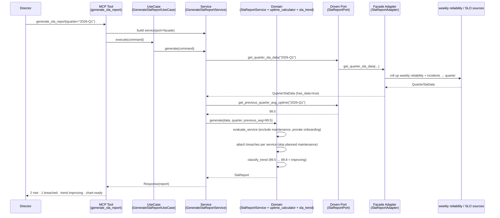
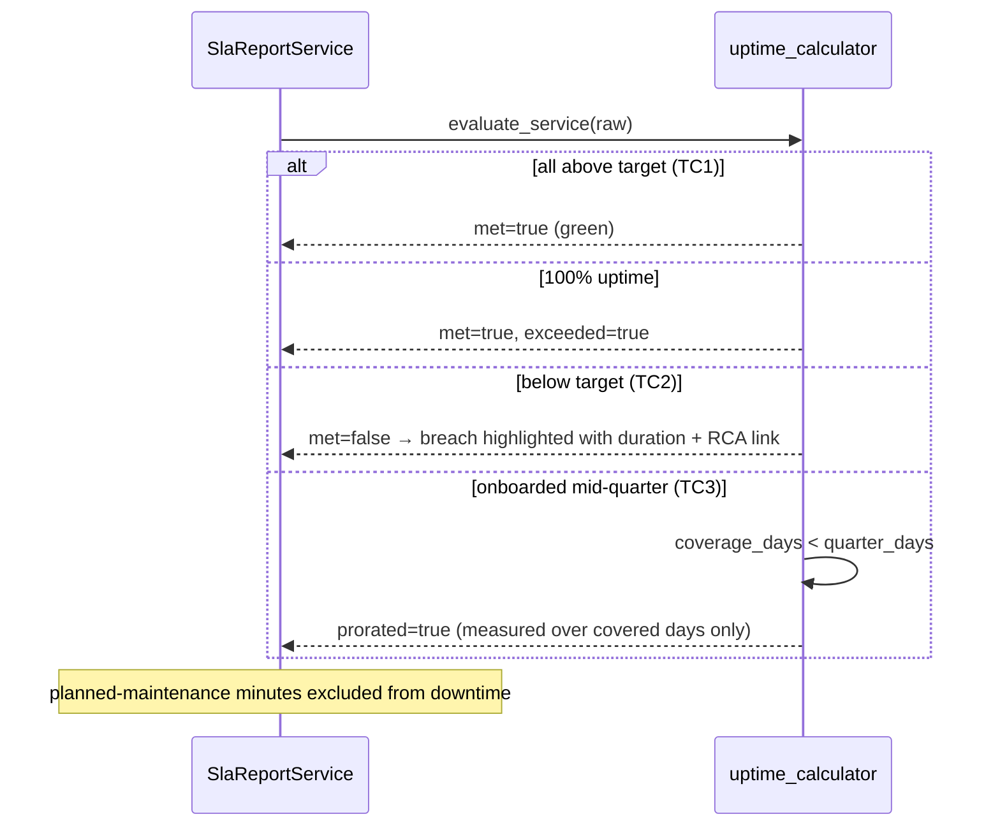
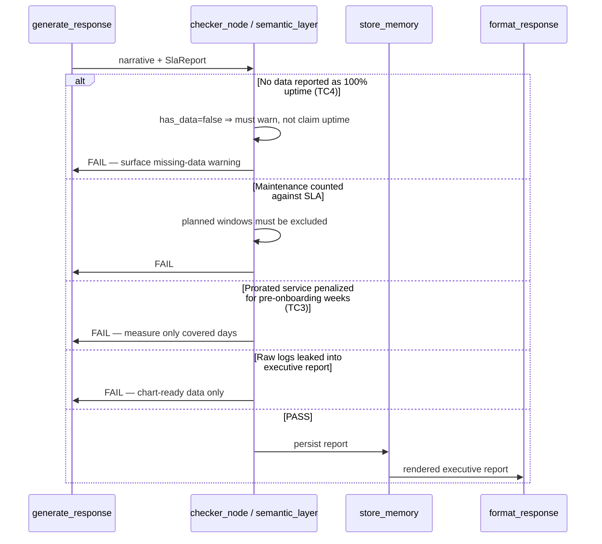

# Use Case 105 — Executive SLA Report (ECA-87)

Answers: *"Generate an executive SLA report for all customer-facing services this
quarter."* — a Director-level reliability report for stakeholders.

Produces quarterly uptime per service, SLA target vs actual, all breaches (date,
duration, impacted users, root-cause reference), and the quarter-over-quarter
reliability trend. Planned-maintenance windows are excluded from the SLA
calculation and services onboarded mid-quarter are prorated. Output is
chart-ready — no raw logs.

## Sample Questions

- "Generate an executive SLA report for all customer-facing services this quarter."
- "What was our uptime per service versus SLA target this quarter?"
- "Which services breached their SLA, and for how long?"
- "Is our reliability improving or degrading compared to last quarter?"
- "Give me a stakeholder-ready SLA summary with breaches and impacted users."

---

## 1. Happy Path — Full Hexagonal Chain



---

## 2. Status & Coverage Flows



---

## 3. Checker Node



---

## Key Points

- **Aggregator via Facade**: the domain never touches the reliability/SLO
  sources; a Facade adapter rolls weekly data up into `QuarterSlaData`.
- **Planned maintenance excluded**: scheduled windows are removed from downtime
  so they never count against the SLA (edge case).
- **Mid-quarter proration** (TC3): a service onboarded late is measured only
  over its covered days and flagged `prorated`.
- **`exceeded` distinct from `met`**: 100% uptime is shown as exceeding target,
  not merely "OK" (edge case).
- **Each incident counted separately**: multiple breaches on the same day are
  distinct entries.
- **Breaches carry impacted users + root-cause reference** — executive-friendly,
  no raw logs.
- **No-data honesty** (TC4): missing incident data yields a warning, never a
  fabricated 100% uptime.

---

## Tests

All test files created for this use case:

```
tests/unit/test_sla_report.py                             # domain model
tests/unit/test_sla_report_port.py                        # driven port + TypedDicts
tests/unit/test_uptime_calculator.py                      # status, proration, maintenance exclusion
tests/unit/test_sla_trend.py                              # improving/degrading/stable
tests/unit/test_sla_report_service.py                     # assembly, breaches, no-data, trend
tests/unit/test_sla_report_adapter.py                     # Facade delegation
tests/unit/test_sla_report_source.py                      # default no-data source
tests/unit/test_generate_sla_report_command.py            # driving command
tests/unit/test_generate_sla_report_response.py           # driving response
tests/unit/test_generate_sla_report_service_port.py       # driving service port (ABC)
tests/unit/test_generate_sla_report_service.py            # application service
tests/unit/test_generate_sla_report_use_case.py           # use case
tests/unit/test_generate_sla_report_mcp.py                # MCP tool
tests/unit/test_server.py                                 # build_sla_report_adapter factory
```

Domain-logic stubs (uptime, proration, trend):

```python
def test_met_when_uptime_equals_target():
    # uptime == target => met, not exceeded
    ...

def test_hundred_percent_exceeds():
    # 100% uptime => exceeded True
    ...

def test_prorated_when_coverage_less_than_quarter():
    # onboarded mid-quarter => prorated True (TC3)
    ...

def test_maintenance_minutes_improve_effective_uptime():
    # planned maintenance excluded from downtime
    ...

def test_planned_maintenance_breach_excluded():
    # maintenance breach not counted against SLA
    ...

def test_missing_data_warns():
    # has_data=false => warning, no fabricated uptime (TC4)
    ...
```

| Test Scenario (ticket) | Test | Status |
|---|---|---|
| TC1: all above target → green | `test_all_services_above_target_green` | ✅ |
| TC2: one breached → highlighted w/ duration + RCA | `test_ticket_scenario` / `test_breaches_attached_to_their_service` | ✅ |
| TC3: mid-quarter onboarding → prorated | `test_mid_quarter_onboarding_prorated` | ✅ |
| TC4: no data → warning | `test_missing_data_warns` | ✅ |
| Edge: planned maintenance excluded | `test_planned_maintenance_breach_excluded` | ✅ |
| Edge: multiple incidents same day counted separately | `test_breaches_attached_to_their_service` | ✅ |
| Edge: 100% uptime exceeds target | `test_hundred_percent_exceeds` | ✅ |

---

## Related Files

- `src/hexawyn/domain/models/sla_report.py`
- `src/hexawyn/domain/services/sla_report/uptime_calculator.py`
- `src/hexawyn/domain/services/sla_report/sla_trend.py`
- `src/hexawyn/domain/services/sla_report/sla_report_service.py`
- `src/hexawyn/application/ports/driven/sla_report_port.py`
- `src/hexawyn/application/ports/driving/generate_sla_report/`
- `src/hexawyn/application/service/generate_sla_report_service.py`
- `src/hexawyn/application/use_case/generate_sla_report/generate_sla_report_use_case.py`
- `src/hexawyn/adapters/secondary/gitops/sla_report_adapter.py`
- `src/hexawyn/adapters/secondary/gitops/sla_report_source.py`
- `src/hexawyn/mcp/tools/generate_sla_report.py`
- `src/hexawyn/mcp/server.py` (`build_sla_report_adapter`)
