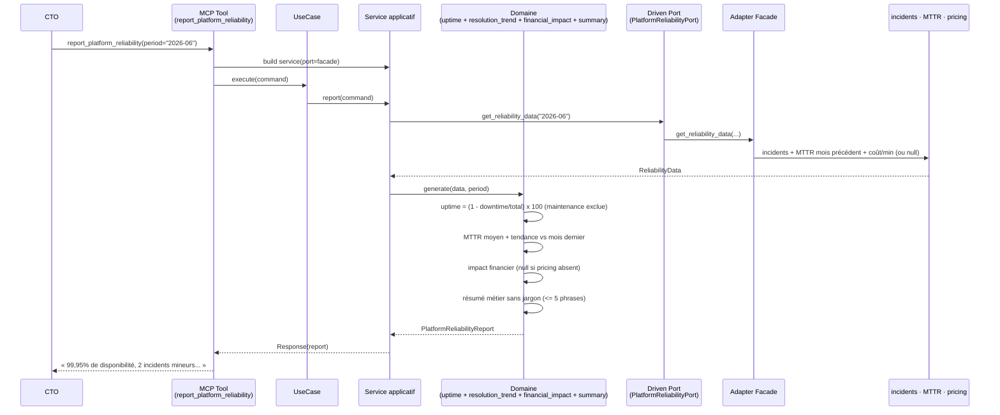
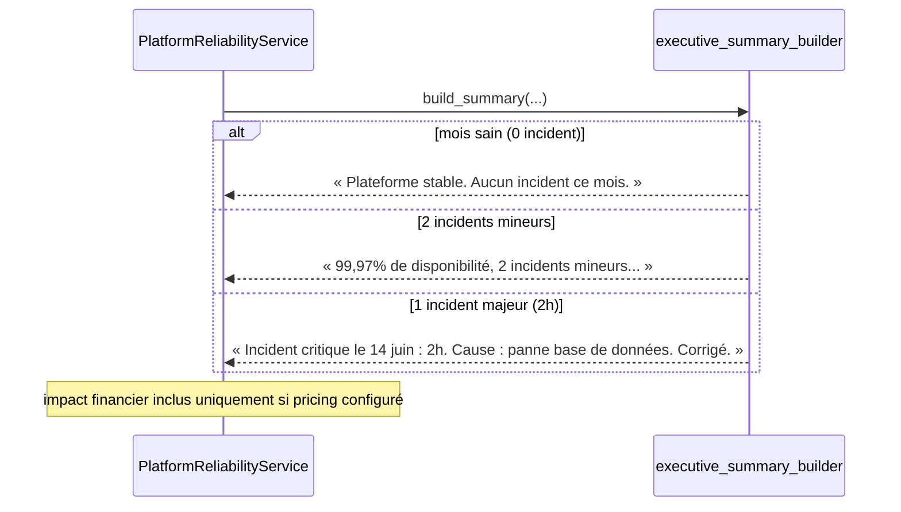
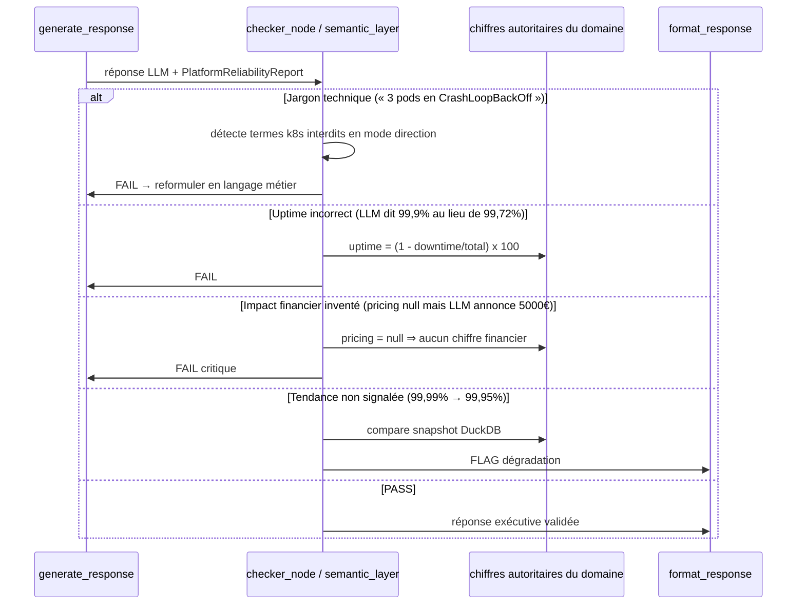
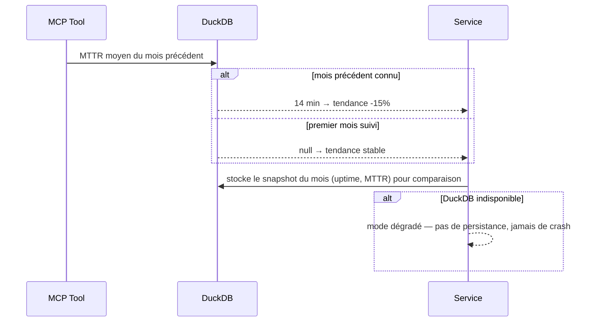

# Use Case 106 — Rapport de fiabilité CTO (langage métier)

Répond à : *« Quelle est la fiabilité de notre plateforme ce mois-ci ? »* — pour
un dirigeant non-technique, en langage métier, sans aucun jargon Kubernetes.

Agrège les incidents du mois en un rapport exécutif : taux de disponibilité en
langage humain, nombre d'incidents par sévérité (majeur/mineur), temps de
résolution moyen avec tendance vs mois précédent, et impact financier estimé
(uniquement si le pricing est configuré — jamais inventé). Le résumé exécutif
tient en moins de 5 phrases ; le détail technique reste disponible en
drill-down.

## Sample Questions

- « Quelle est la fiabilité de notre plateforme ce mois-ci ? »
- « Combien d'incidents avons-nous eu ce mois, et de quelle gravité ? »
- « Notre temps de résolution s'améliore-t-il par rapport au mois dernier ? »
- « Quel a été l'impact financier des indisponibilités ce mois-ci ? »
- « Donne-moi un résumé de santé de la plateforme en langage clair pour la direction. »

## 1. Happy Path — chaîne hexagonale complète



## 2. Scénarios de contenu



## 3. Checker Node — validations LLM (langage métier)



## 4. DuckDB Memory (snapshot mensuel & tendance)



## Key Points

- **Zéro jargon Kubernetes** : le résumé exécutif est construit dans le domaine,
  en langage métier français, et ne contient jamais pod/kubectl/namespace/node.
- **Formule d'uptime autoritaire** : `(1 - downtime/total) x 100`, maintenance
  planifiée exclue — c'est la source de vérité que le checker valide (2h/720h → 99,72%).
- **Impact financier honnête** : `None` strict si le pricing n'est pas configuré ;
  aucun chiffre financier n'est jamais inventé.
- **Tendance MTTR signée** (« -15% vs mois dernier ») + improving/degrading/stable.
- **Sévérité métier** (majeur/mineur), pas de niveaux techniques k8s.
- **Résumé ≤ 5 phrases** en mode exécutif ; drill-down technique via `incidents[]`.

## Tests

Fichiers de tests créés pour ce use case :

```
tests/unit/test_platform_reliability.py                          # domain model
tests/unit/test_platform_reliability_port.py                     # driven port + TypedDicts
tests/unit/test_platform_uptime_calculator.py                    # formule uptime + maintenance
tests/unit/test_resolution_trend.py                              # MTTR + delta% + tendance
tests/unit/test_financial_impact.py                              # null si pas de pricing
tests/unit/test_executive_summary_builder.py                     # langage métier, sans jargon, <=5 phrases
tests/unit/test_platform_reliability_service.py                  # orchestration
tests/unit/test_platform_reliability_adapter.py                  # Facade delegation
tests/unit/test_platform_reliability_source.py                   # source par défaut (mois sain)
tests/unit/test_report_platform_reliability_command.py           # driving command
tests/unit/test_report_platform_reliability_response.py          # driving response
tests/unit/test_report_platform_reliability_service_port.py      # driving service port (ABC)
tests/unit/test_report_platform_reliability_service.py           # application service
tests/unit/test_report_platform_reliability_use_case.py          # use case
tests/unit/test_report_platform_reliability_mcp.py               # MCP tool
tests/unit/test_server.py                                        # build_platform_reliability_adapter factory
```

Stubs de logique domaine (uptime, tendance, impact, résumé) :

```python
def test_two_hours_over_thirty_days_is_99_72():
    # 120 min / 43200 min => 99.72% (formule vérifiée par le checker)
    ...

def test_planned_maintenance_excluded():
    # fenêtre de maintenance => exclue du downtime
    ...

def test_none_when_pricing_not_configured():
    # cost_per_minute None => impact financier None (jamais inventé)
    ...

def test_improving_when_faster_than_previous():
    # 12 min vs 14 => -15%, tendance improving
    ...

def test_summary_contains_no_kubernetes_jargon():
    # résumé sans pod/kubectl/namespace/node
    ...

def test_summary_at_most_five_sentences():
    # mode exécutif <= 5 phrases
    ...
```

| Scénario (ticket) | Test | Statut |
|---|---|---|
| Mois sain (0 incident) → « Plateforme stable » | `test_zero_incidents` | ✅ |
| 2 incidents mineurs → 99,9x% + RCA dispo | `test_two_minor_incidents` | ✅ |
| 1 incident majeur (2h) → date + cause racine | `test_major_incident` | ✅ |
| Drill-down technique | `incidents[]` dans la réponse du tool | ✅ |
| Jargon interdit détecté | `test_summary_contains_no_kubernetes_jargon` | ✅ |
| Uptime = (1 - downtime/total) | `test_two_hours_over_thirty_days_is_99_72` | ✅ |
| Impact financier null si pas de pricing | `test_no_financial_figure_without_pricing` | ✅ |
| Tendance vs mois précédent | `test_resolution_trend_improving` | ✅ |

## Related Files

- `src/hexawyn/domain/models/platform_reliability.py`
- `src/hexawyn/domain/services/platform_reliability/uptime_calculator.py`
- `src/hexawyn/domain/services/platform_reliability/resolution_trend.py`
- `src/hexawyn/domain/services/platform_reliability/financial_impact.py`
- `src/hexawyn/domain/services/platform_reliability/executive_summary_builder.py`
- `src/hexawyn/domain/services/platform_reliability/platform_reliability_service.py`
- `src/hexawyn/application/ports/driven/platform_reliability_port.py`
- `src/hexawyn/application/ports/driving/report_platform_reliability/`
- `src/hexawyn/application/service/report_platform_reliability_service.py`
- `src/hexawyn/application/use_case/report_platform_reliability/report_platform_reliability_use_case.py`
- `src/hexawyn/adapters/secondary/gitops/platform_reliability_adapter.py`
- `src/hexawyn/adapters/secondary/gitops/platform_reliability_source.py`
- `src/hexawyn/mcp/tools/report_platform_reliability.py`
- `src/hexawyn/mcp/server.py` (`build_platform_reliability_adapter`)
