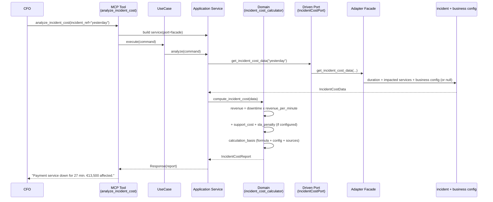
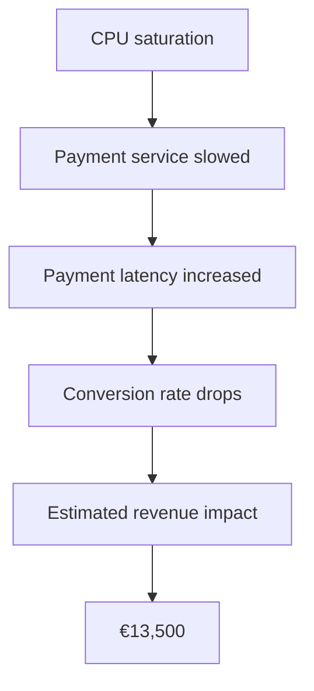
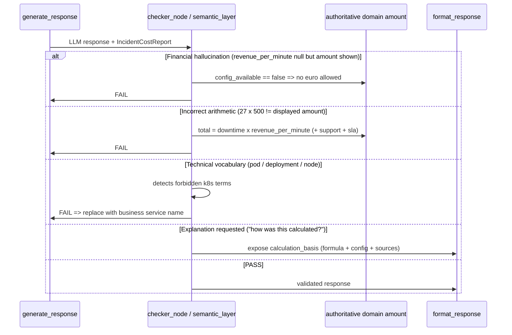

# Use Case 107 — Incident Cost Analysis (Business Impact)

Answers: *"How much did yesterday's outage cost us?"* — for a CFO / financial
decision-maker, in business language, with a **deterministic, traceable, and
never-invented** amount.

Translates an incident's downtime duration into financial impact from
configurable business parameters (`revenue_per_minute`, `support_cost_per_hour`,
`sla_penalty_per_hour`). Every euro is reproducible and exposes its formula and
sources on demand. Without revenue configuration, no amount is produced — an
explanation is returned instead.

First slice of the "Business Impact & Financial Intelligence" epic (business
config foundation + Incident Cost). Prediction ROI and Budget Intelligence
reuse this foundation in later tickets.

## Sample Questions

- "How much did yesterday's outage cost us?"
- "What was the financial impact of the Payment service incident?"
- "How much revenue did we lose during the downtime?"
- "How was this amount calculated?"
- "What is the business cost of this morning's incident?"

## 1. Happy Path — full hexagonal chain



## 2. Business Impact Graph (why it matters)



## 3. Checker Node — LLM validations (financial anti-hallucination)



## Key Points

- **Deterministic formula**: `downtime_minutes × revenue_per_minute + support_cost
  + sla_penalty`. The result is reproducible and verifiable by the checker.
- **Never an invented value**: without `revenue_per_minute`, `total_cost_eur`
  stays `None` and an explanation is returned ("Configure revenue_per_minute").
- **Traceability**: `calculation_basis` exposes the formula, the config values
  used, and the source metrics — every euro is explainable.
- **Conditional support & SLA**: added only if configured; the SLA penalty only
  applies on a breach.
- **Business language**: the domain only handles `business_service_name`
  ("Payment service") — no pod/deployment name can leak.

## Tests

Test files created for this use case:

```
tests/unit/test_incident_cost.py                             # domain model
tests/unit/test_incident_cost_port.py                        # driven port + TypedDicts
tests/unit/test_incident_cost_calculator.py                  # formula, missing config, basis, business language
tests/unit/test_analyze_incident_cost_command.py             # driving command
tests/unit/test_analyze_incident_cost_response.py            # driving response
tests/unit/test_analyze_incident_cost_service_port.py        # driving service port (ABC)
tests/unit/test_analyze_incident_cost_service.py             # application service
tests/unit/test_analyze_incident_cost_use_case.py            # use case
tests/unit/test_incident_cost_adapter.py                     # Facade delegation
tests/unit/test_incident_cost_source.py                      # business config read (nullable)
tests/unit/test_analyze_incident_cost_mcp.py                 # MCP tool
tests/unit/test_server.py                                    # build_incident_cost_adapter factory
```

Domain logic stubs (formula, missing config, traceability):

```python
def test_twenty_seven_min_at_500_is_13500():
    # 27 x 500 => €13,500 (primary demo)
    ...

def test_no_revenue_yields_no_euro_amount():
    # revenue_per_minute null => total None (never invented)
    ...

def test_no_revenue_returns_explanation():
    # explanation returned instead of the amount
    ...

def test_sla_penalty_only_when_breached():
    # SLA penalty only on breach
    ...

def test_basis_records_formula_and_config():
    # calculation_basis exposes formula + config + sources
    ...
```

| Scenario (ticket) | Test | Status |
|---|---|---|
| 27 min @ €500/min → €13,500 | `test_twenty_seven_min_at_500_is_13500` | ✅ |
| Revenue not configured → duration only | `test_no_revenue_keeps_duration_facts` | ✅ |
| "How was this calculated?" → formula + sources | `test_calculation_basis_exposed` (mcp) | ✅ |
| Zero Kubernetes jargon | `test_no_kubernetes_jargon_in_service_name` (mcp) | ✅ |
| Missing config → explanation, no estimate | `test_missing_config_returns_explanation_no_amount` (mcp) | ✅ |

## Related Files

- `src/hexawyn/domain/models/incident_cost.py`
- `src/hexawyn/domain/services/incident_cost/incident_cost_calculator.py`
- `src/hexawyn/application/ports/driven/incident_cost_port.py`
- `src/hexawyn/application/ports/driving/analyze_incident_cost/`
- `src/hexawyn/application/service/analyze_incident_cost_service.py`
- `src/hexawyn/application/use_case/analyze_incident_cost/analyze_incident_cost_use_case.py`
- `src/hexawyn/adapters/secondary/gitops/incident_cost_adapter.py`
- `src/hexawyn/adapters/secondary/gitops/incident_cost_source.py`
- `src/hexawyn/mcp/tools/analyze_incident_cost.py`
- `src/hexawyn/mcp/server.py` (`build_incident_cost_adapter`)
