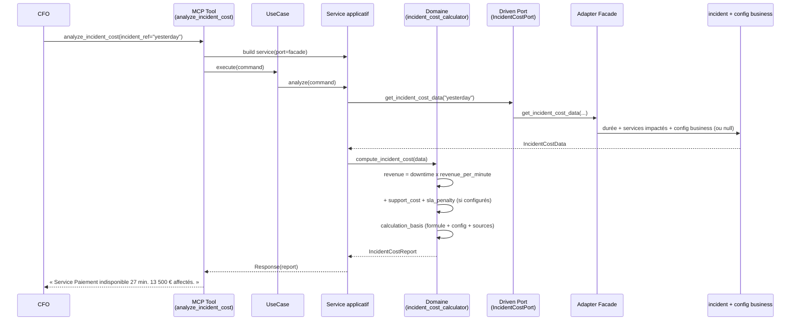
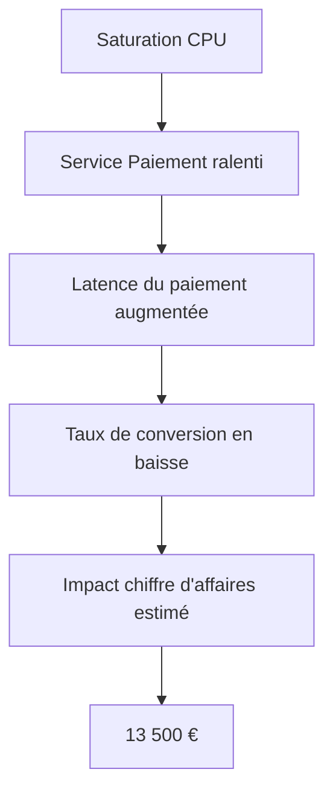
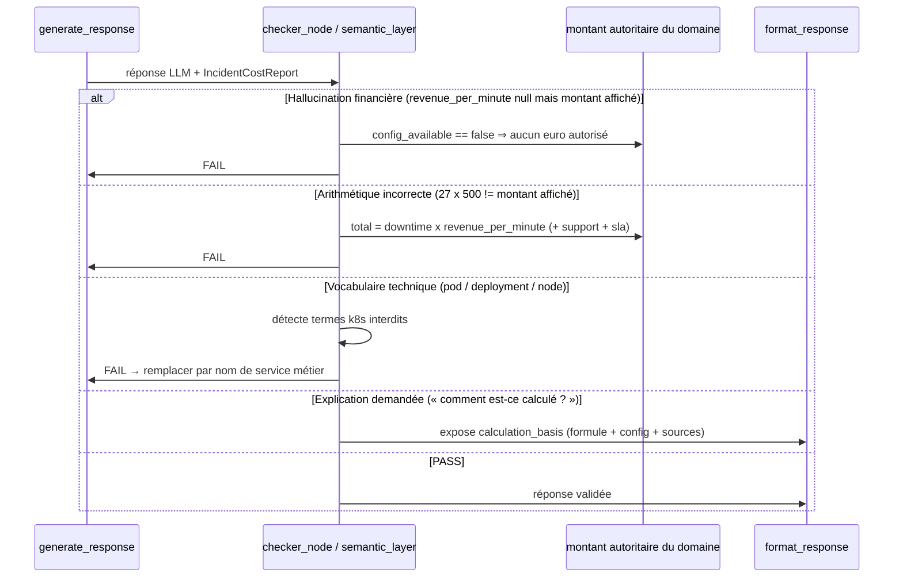
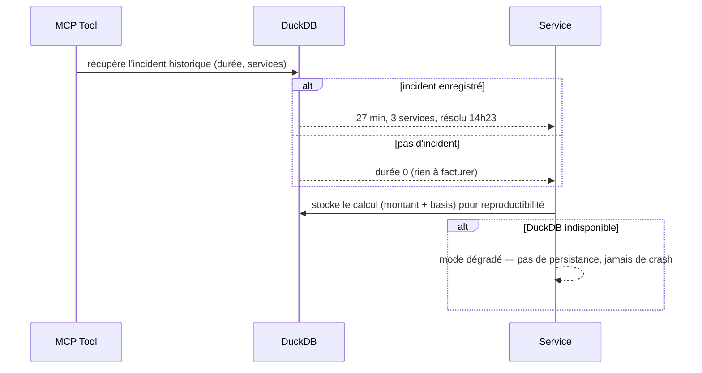

# Use Case 107 — Analyse du coût d'un incident (Business Impact)

Répond à : *« Combien nous a coûté la panne d'hier ? »* — pour un CFO / décideur
financier, en langage métier, avec un montant **déterministe, traçable et jamais
inventé**.

Traduit la durée d'indisponibilité d'un incident en impact financier à partir de
paramètres business configurables (`revenue_per_minute`, `support_cost_per_hour`,
`sla_penalty_per_hour`). Chaque euro est reproductible et expose sa formule et ses
sources sur demande. Sans configuration de revenu, aucun montant n'est produit —
une explication est renvoyée à la place.

Premier slice de l'épopée « Business Impact & Financial Intelligence » (socle
config business + Incident Cost). Prediction ROI et Budget Intelligence
réutiliseront ce socle dans des tickets suivants.

## Sample Questions

- « Combien nous a coûté la panne d'hier ? »
- « Quel a été l'impact financier de l'incident du service Paiement ? »
- « Combien de chiffre d'affaires avons-nous perdu pendant l'indisponibilité ? »
- « Comment ce montant a-t-il été calculé ? »
- « Quel est le coût métier de l'incident de ce matin ? »

## 1. Happy Path — chaîne hexagonale complète



## 2. Business Impact Graph (pourquoi ça compte)



## 3. Checker Node — validations LLM (anti-hallucination financière)



## 4. DuckDB Memory (traçabilité & reproductibilité)



## Key Points

- **Formule déterministe** : `downtime_minutes × revenue_per_minute + support_cost
  + sla_penalty`. Le résultat est reproductible et vérifiable par le checker.
- **Jamais de valeur inventée** : sans `revenue_per_minute`, `total_cost_eur`
  reste `None` et une explication est renvoyée (« Configurez revenue_per_minute »).
- **Traçabilité** : `calculation_basis` expose la formule, les valeurs de config
  utilisées et les métriques sources — chaque euro est explicable.
- **Support & SLA conditionnels** : ajoutés seulement si configurés ; la pénalité
  SLA uniquement en cas de breach.
- **Langage métier** : le domaine ne manipule que `business_service_name`
  (« Service Paiement ») — aucun nom de pod/deployment ne peut fuiter.

## Tests

Fichiers de tests créés pour ce use case :

```
tests/unit/test_incident_cost.py                             # domain model
tests/unit/test_incident_cost_port.py                        # driven port + TypedDicts
tests/unit/test_incident_cost_calculator.py                  # formule, config manquante, basis, langage métier
tests/unit/test_analyze_incident_cost_command.py             # driving command
tests/unit/test_analyze_incident_cost_response.py            # driving response
tests/unit/test_analyze_incident_cost_service_port.py        # driving service port (ABC)
tests/unit/test_analyze_incident_cost_service.py             # application service
tests/unit/test_analyze_incident_cost_use_case.py            # use case
tests/unit/test_incident_cost_adapter.py                     # Facade delegation
tests/unit/test_incident_cost_source.py                      # lecture config business (nullable)
tests/unit/test_analyze_incident_cost_mcp.py                 # MCP tool
tests/unit/test_server.py                                    # build_incident_cost_adapter factory
```

Stubs de logique domaine (formule, config manquante, traçabilité) :

```python
def test_twenty_seven_min_at_500_is_13500():
    # 27 x 500 => 13 500 € (démo principale)
    ...

def test_no_revenue_yields_no_euro_amount():
    # revenue_per_minute null => total None (jamais inventé)
    ...

def test_no_revenue_returns_explanation():
    # explication renvoyée à la place du montant
    ...

def test_sla_penalty_only_when_breached():
    # pénalité SLA uniquement si breach
    ...

def test_basis_records_formula_and_config():
    # calculation_basis expose formule + config + sources
    ...
```

| Scénario (ticket) | Test | Statut |
|---|---|---|
| 27 min @ 500 €/min → 13 500 € | `test_twenty_seven_min_at_500_is_13500` | ✅ |
| Revenu non configuré → durée seule | `test_no_revenue_keeps_duration_facts` | ✅ |
| « Comment est-ce calculé ? » → formule + sources | `test_calculation_basis_exposed` (mcp) | ✅ |
| Zéro jargon Kubernetes | `test_no_kubernetes_jargon_in_service_name` (mcp) | ✅ |
| Config manquante → explication, pas d'estimation | `test_missing_config_returns_explanation_no_amount` (mcp) | ✅ |

## Related Files

- `src/hexawyn/domain/models/incident_cost.py`
- `src/hexawyn/domain/services/incident_cost/incident_cost_calculator.py`
- `src/hexawyn/application/ports/driven/incident_cost_port.py`
- `src/hexawyn/application/ports/driving/analyze_incident_cost/`
- `src/hexawyn/application/service/analyze_incident_cost_service.py`
- `src/hexawyn/application/use_case/analyze_incident_cost/analyze_incident_cost_use_case.py`
- `src/hexawyn/adapters/secondary/gitops/incident_cost_adapter.py`
- `src/hexawyn/adapters/secondary/gitops/incident_cost_source.py`
- `src/hexawyn/mcp/tools/analyze_incident_cost.py`
- `src/hexawyn/mcp/server.py` (`build_incident_cost_adapter`)
