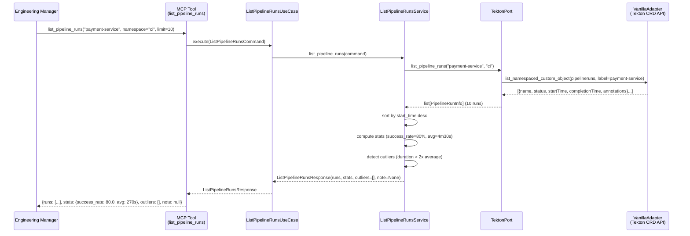
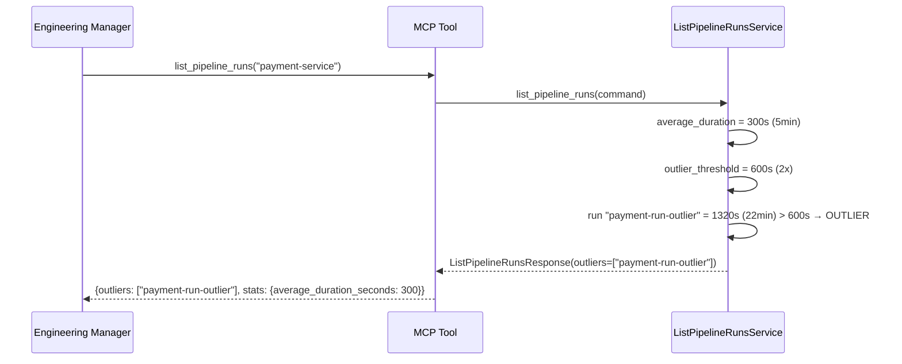
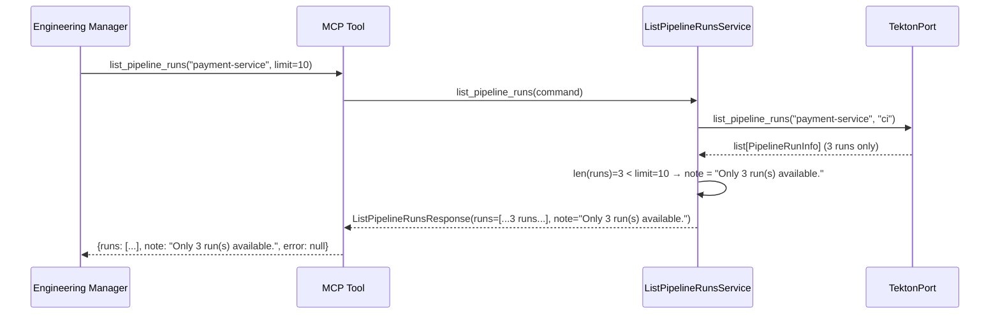
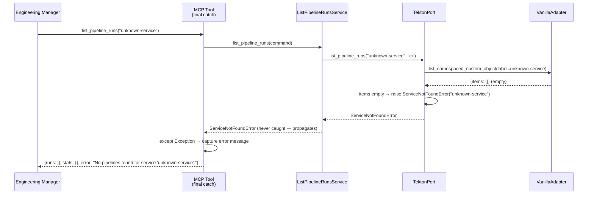

# Use Case 11 — List Pipeline Runs

## Sample Questions

- "Show me the last 10 pipeline runs for the payment-service — what is the success rate?"
- "How often does the checkout pipeline fail?"
- "What's the average build time for the auth-service?"
- "Are there any abnormally slow runs in the payment pipeline recently?"

---

## Happy Path — 10 runs, stats computed

---

## TC2 — Outlier detected (run took 22min vs average 5min)

---

## TC3 — Fewer than 10 runs available

---

## TC4 — Service not found

