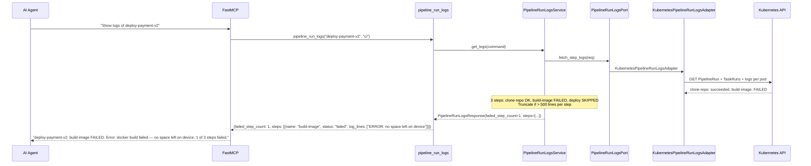
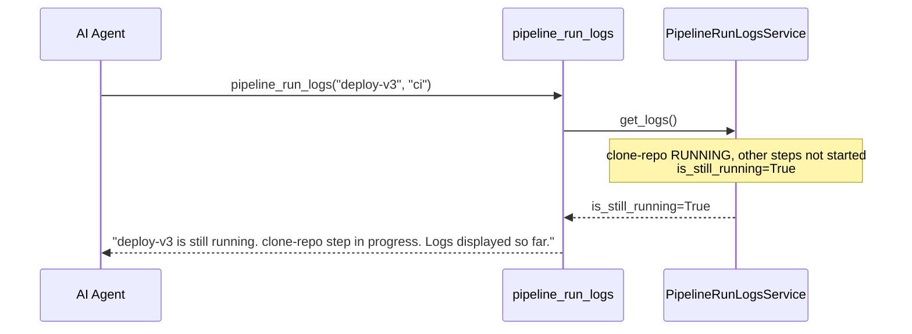
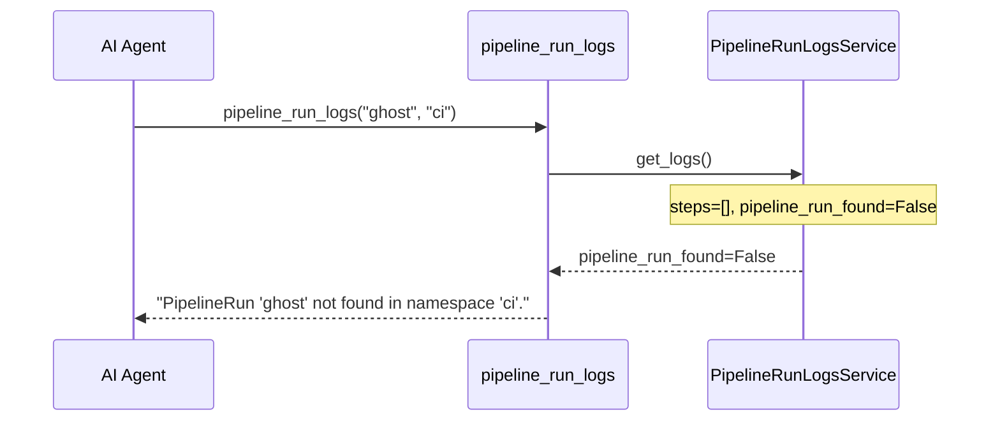
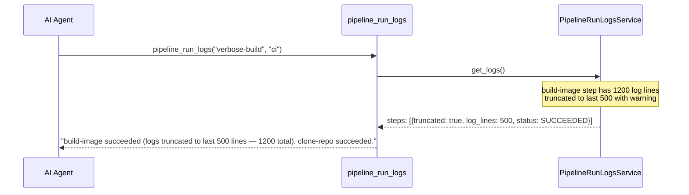

# Use Case 11 — Pipeline Run Logs

## Sample Questions

- "Show me the full logs of the failed PipelineRun deploy-payment-v2"
- "At which step did the build pipeline break and why?"
- "Get the logs for the last failed Tekton pipeline run"
- "Show me all TaskRun logs for PipelineRun deploy-v3 in the ci namespace"
- "What caused the checkout pipeline to fail — show the error logs"

---

One MCP tool: `pipeline_run_logs`. Retrieves logs from all TaskRuns in a PipelineRun, highlights failed steps with error output, truncates large logs to last 500 lines.

### Flow 1 — Happy Path: Failed Step Highlighted

### Flow 2 — Still Running

### Flow 3 — PipelineRun Not Found

### Flow 4 — Truncation Warning

## Key Points

- **Failed step highlighting** — FAILED steps returned first with full error output
- **Truncation** — logs > 500 lines truncated to last 500 with `truncated=True` flag
- **Still running** — steps in RUNNING status flagged, logs returned so far
- **Not found** — empty steps → `pipeline_run_found=False`

## Test Coverage

| Test | File | Status |
|---|---|---|
| `test_failed_step_highlighted` | `tests/unit/test_pipeline_run_logs.py` | ✅ |
| `test_not_found` | `tests/unit/test_pipeline_run_logs.py` | ✅ |
| `test_still_running` | `tests/unit/test_pipeline_run_logs.py` | ✅ |
| `test_returns_logs_with_failed` | `tests/unit/test_pipeline_run_logs_tool.py` | ✅ |

## Related Files

- `src/hexawyn/domain/models/pipeline_run_logs.py` — StepLog, PipelineRunLogsResult
- `src/hexawyn/application/ports/driven/pipeline_run_logs_port.py` — PipelineRunLogsPort ABC
- `src/hexawyn/adapters/secondary/gitops/kubernetes_pipeline_run_logs_adapter.py` — adapter
- `src/hexawyn/mcp/tools/pipeline_run_logs.py` — MCP tool
