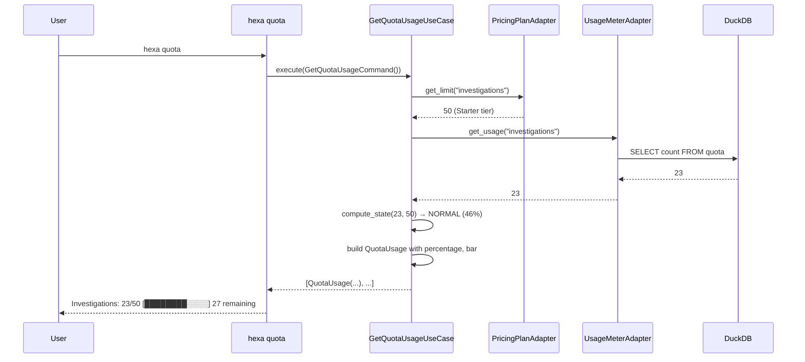
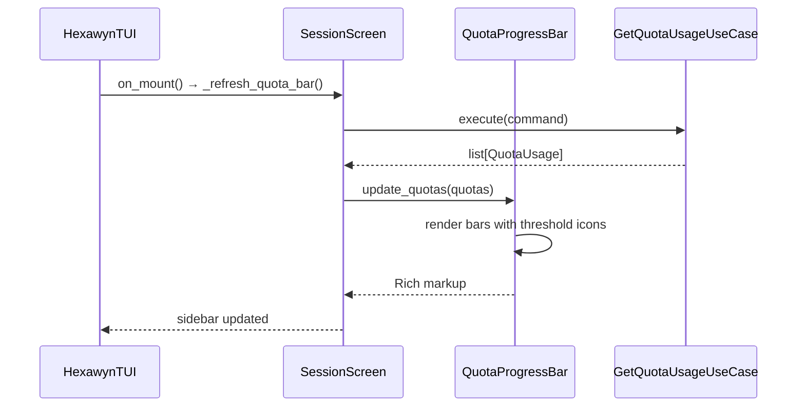

# Use Case — Quota Progress Bar (ECA-165)

Displays monthly usage quotas in the CLI sidebar (Textual TUI) and via `hexa quota` CLI command. Shows 2 resources (investigations, Slack alerts) with threshold-based visual indicators: NORMAL (<70%), WARNING (70-89%), CRITICAL (90-99%), EXHAUSTED (100%), UNLIMITED (∞).

The quotas come from the PricingPlanAdapter (reads tier limits from domain models) and UsageMeterAdapter (reads current consumption from DuckDB). The progress bar is read-only — quota enforcement is handled by ECA-112.

## Sample Questions

- "Show me my remaining investigations this month"
- "How many Slack alerts have I used today?"
- "What's my quota usage?"
- "Am I close to my investigation limit?"
- "Show quota"

---

### Flow 1 — Quota Display via CLI

### Flow 2 — TUI Sidebar Progress Bar

## Key Points

- Progress bar is read-only — does NOT block investigations (ECA-112 handles enforcement)
- 3 tiers: Starter ($1/mo) / Team ($99/mo) / Scale-up ($199/mo)
- UNLIMITED state shows "∞ Illimité" — no bar
- EXHAUSTED state shows "❌ 50/50" with upgrade message
- DuckDB stores consumption counts; tier limits from domain models

## Test Coverage

| Test | File | Status |
|---|---|---|
| `test_state_from_usage_below_70` | `tests/unit/domain/models/test_quota_state.py` | ✅ |
| `test_starter_shows_investigation_count` | `tests/unit/domain/models/test_quota_command.py` | ✅ |
| `test_scale_up_returns_unlimited_state` | `tests/unit/domain/models/test_get_quota_usage_service.py` | ✅ |
| `test_increment_quota_called_after_investigation` | `tests/unit/application/service/test_chat_cli_service.py` | ✅ |

## Related Files

- `src/hexawyn/domain/models/quota.py` — QuotaState, QuotaUsage, LicenseTier
- `src/hexawyn/application/ports/driven/plan_port.py` — PlanPort ABC
- `src/hexawyn/application/ports/driven/usage_meter_port.py` — UsageMeterPort ABC
- `src/hexawyn/application/service/get_quota_usage_service.py` — GetQuotaUsageService
- `src/hexawyn/adapters/secondary/pricing_plan_adapter.py` — PricingPlanAdapter
- `src/hexawyn/adapters/secondary/usage_meter_adapter.py` — UsageMeterAdapter
- `src/hexawyn/cli/commands/quota_command.py` — CLI command
- `src/hexawyn/cli/widgets/quota_bar.py` — TUI widget
- `src/hexawyn/cli/screens/session.py` — Sidebar integration
