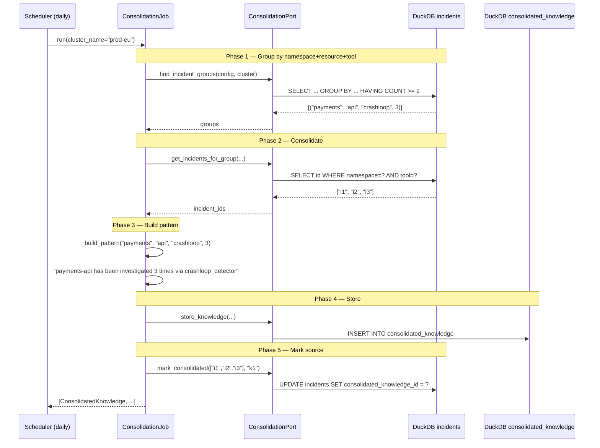
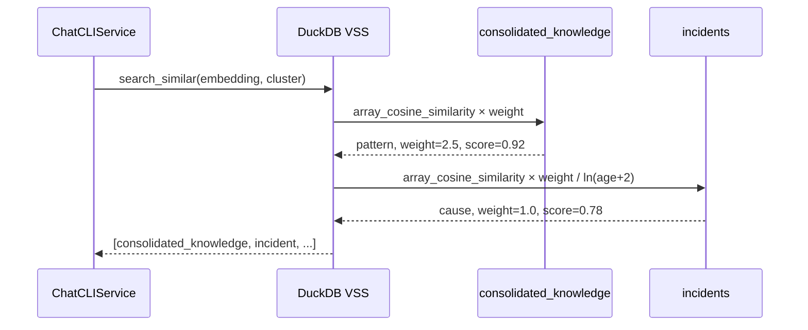

# Use Case — Memory Consolidation (ECA-174)

Periodic batch job that groups similar investigation results by namespace+resource+tool, deduplicates via cosine similarity, generates consolidated knowledge patterns, and stores them in a dedicated DuckDB table for VSS retrieval with higher weight than individual incidents.

Target: help SLMs by providing pre-digested patterns ("payments-api is prone to OOM — check memory limits first") instead of raw scattered incidents.

## Sample Questions

- "Run memory consolidation on my cluster"
- "Consolidate all crashloop incidents for payments namespace"
- "What patterns have emerged from past investigations?"
- "Show me consolidated knowledge for prod-eu"
- "Are there recurring issues we should auto-document?"

---

### Flow 1 — Consolidation Job

### Flow 2 — VSS Search with Consolidated Knowledge

## Key Points

- Consolidation is a batch job, not real-time — runs daily or on-demand via MCP tool
- Patterns get higher weight (1.0 + (N-1)×0.5, capped at 5.0) for VSS ranking
- Source incidents are never deleted — only marked with `consolidated_knowledge_id`
- SLM-generated patterns (via control-plane) for production quality
- Minimum 2 occurrences to trigger consolidation

## Test Coverage

| Test | File | Status |
|---|---|---|
| `test_run_consolidates_valid_group` | `tests/unit/domain/models/test_consolidation_job.py` | ✅ |
| `test_run_returns_empty_when_no_groups` | `tests/unit/domain/models/test_consolidation_job.py` | ✅ |
| `test_find_incident_groups_queries_db` | `tests/unit/domain/models/test_consolidation_repository.py` | ✅ |
| `test_store_knowledge_inserts_row` | `tests/unit/domain/models/test_consolidation_repository.py` | ✅ |
| `test_returns_consolidated_result` | `tests/unit/mcp/tools/test_run_consolidation_tool.py` | ✅ |

## Related Files

- `src/hexawyn/domain/models/consolidation.py` — ConsolidatedKnowledge, ConsolidationConfig
- `src/hexawyn/domain/services/consolidation_job.py` — ConsolidationJob
- `src/hexawyn/application/ports/driven/consolidation_port.py` — ConsolidationPort ABC
- `src/hexawyn/infrastructure/memory/consolidation_repository.py` — DuckDB adapter
- `src/hexawyn/infrastructure/memory/sql/` — consolidated_schema, search_consolidated, find_groups, etc.
- `src/hexawyn/mcp/tools/run_consolidation.py` — MCP tool
