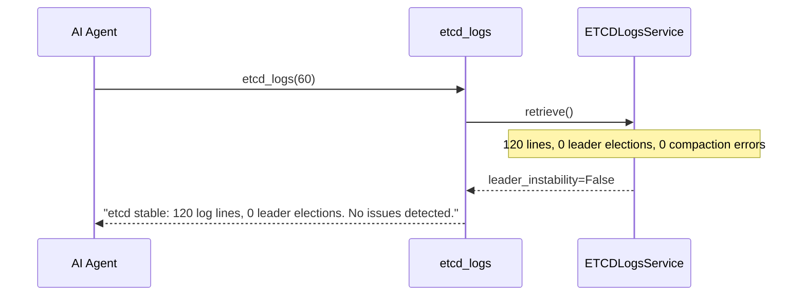
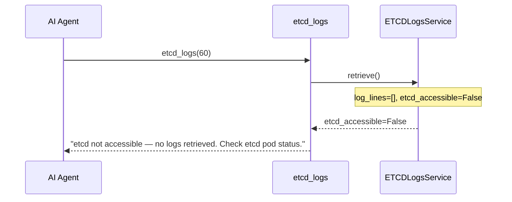

# Use Case 12 — ETCD Log Analysis

## Sample Questions

- "Show me the etcd logs from the last hour — are there any leader election issues?"
- "Are there compaction errors in the etcd logs?"
- "Is the etcd cluster stable — check for leader changes"
- "Retrieve etcd errors from the last 30 minutes"
- "Has there been any etcd leader election instability recently?"

---

One MCP tool: `etcd_logs`. Retrieves etcd pod logs, detects leader election events and compaction errors, flags instability.

### Flow 1 — Happy Path: Anomalies Detected

```mermaid
sequenceDiagram
    participant AI as AI Agent
    participant MCP as FastMCP
    participant Tool as etcd_logs
    participant Service as ETCDLogsService
    participant Port as ETCDLogsPort
    participant Adapter as KubernetesETCDLogsAdapter
    participant K8s as Kubernetes API

    AI->>MCP: "Check etcd for leader issues"
    MCP->>Tool: etcd_logs(time_window_minutes=60)

    Tool->>Service: retrieve(command)
    Service->>Port: fetch_logs(req)
    Port->>Adapter: KubernetesETCDLogsAdapter
    Adapter->>K8s: GET etcd pod logs, last 60min
    K8s-->>Adapter: 150 lines, 3 leader elections, 1 compaction error

    Note over Service: leader_election_count=3 ≥ 2 → INSTABILITY<br/>compaction_errors=1 → disk space warning

    Service-->>Tool: ETCDLogsResponse(leader_instability=True, compaction_errors=1)
    Tool-->>MCP: {leader_election_count: 3, compaction_errors: 1, leader_instability: true, summary: "leader instability detected (3 elections); compaction error"}
    MCP-->>AI: "etcd instability: 3 leader elections in 1h (threshold: 2). Compaction error: mvcc database space exceeded — check disk."
```

### Flow 2 — No Anomalies



### Flow 3 — ETCD Not Accessible



### Flow 4 — Checker Node: False Positive Prevention

```mermaid
sequenceDiagram
    participant Checker as Checker Node
    participant LLM as LLM Response

    Checker->>LLM: Validate etcd assessment
    alt LLM says "leader instability" for single election (threshold=2)
        Checker-->>LLM: ❌ FAIL — single election is normal, not instability
    alt LLM misreports compaction error as "minor warning"
        Checker-->>LLM: ⚠️ FLAG — compaction error requires disk space investigation
    else All checks pass
        Checker-->>LLM: ✅ PASS
    end
```

## Key Points

- **Leader election detection** — ≥2 elections in window → instability flagged
- **Compaction errors** — `mvcc: database space exceeded` → disk space issue
- **Error-first ordering** — ERROR/FATAL/WARN logs returned first
- **Static pod detection** — works for both static pod and deployment etcd topologies

## Test Coverage

| Test | File | Status |
|---|---|---|
| `test_leader_election_detected` | `tests/unit/test_etcd_logs.py` | ✅ |
| `test_no_anomalies` | `tests/unit/test_etcd_logs.py` | ✅ |
| `test_etcd_not_accessible` | `tests/unit/test_etcd_logs.py` | ✅ |
| `test_returns_anomalies` | `tests/unit/test_etcd_logs_tool.py` | ✅ |

## Related Files

- `src/hexawyn/domain/models/etcd_logs.py` — ETCDLogLine, ETCDLogsResult
- `src/hexawyn/application/ports/driven/etcd_logs_port.py` — ETCDLogsPort ABC
- `src/hexawyn/adapters/secondary/gitops/kubernetes_etcd_logs_adapter.py` — adapter
- `src/hexawyn/mcp/tools/etcd_logs.py` — MCP tool
