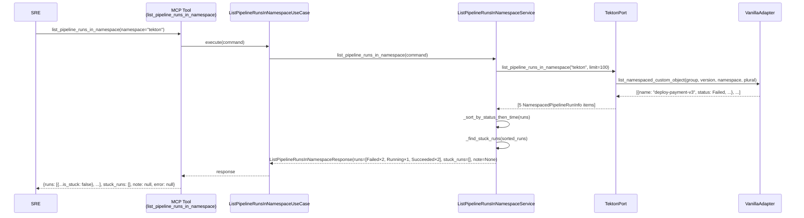
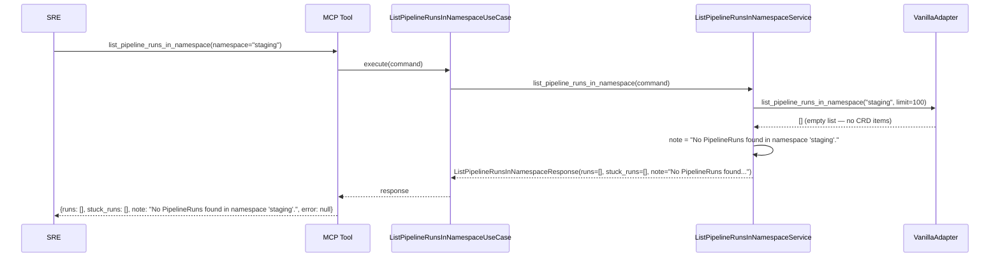
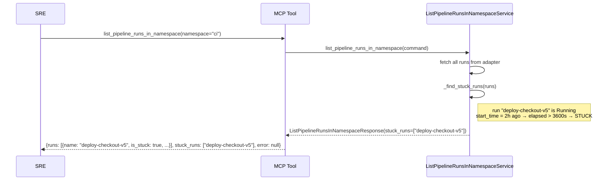
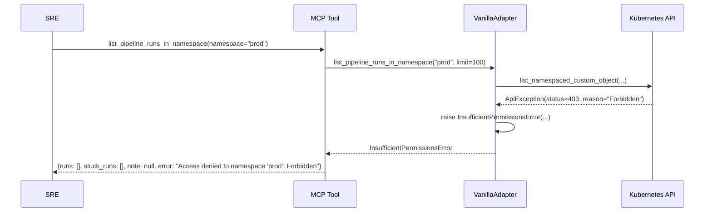
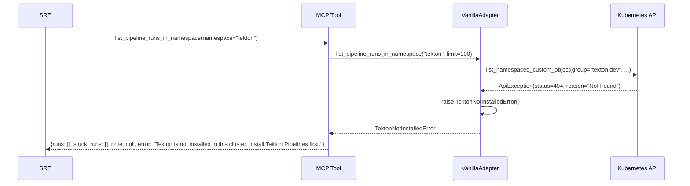

# Use Case 12 — List PipelineRuns in Namespace

**Actor:** SRE / On-call engineer  
**Goal:** Get an operational overview of all PipelineRuns in a given namespace, sorted by urgency (Failed first, then Running, then Succeeded), with stuck detection for Running pipelines that have been running for more than 1 hour.

---

## TC1 — Happy Path (5 runs: 2 Failed, 1 Running, 2 Succeeded)

---

## TC2 — Empty Namespace (returns informative note, not an error)

---

## TC3 — Stuck Detection (Running > 1 hour)

---

## TC4 — RBAC Denied (InsufficientPermissionsError)

---

## TC5 — Tekton Not Installed (TektonNotInstalledError)

