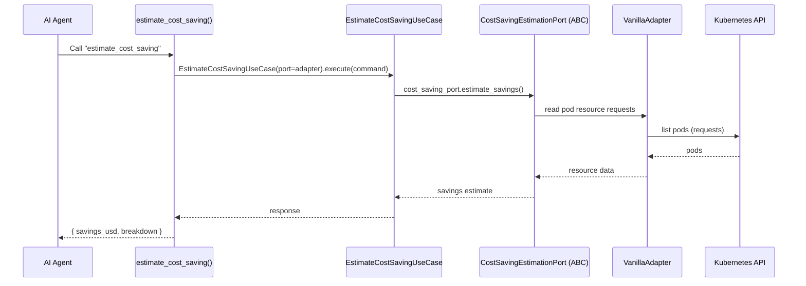
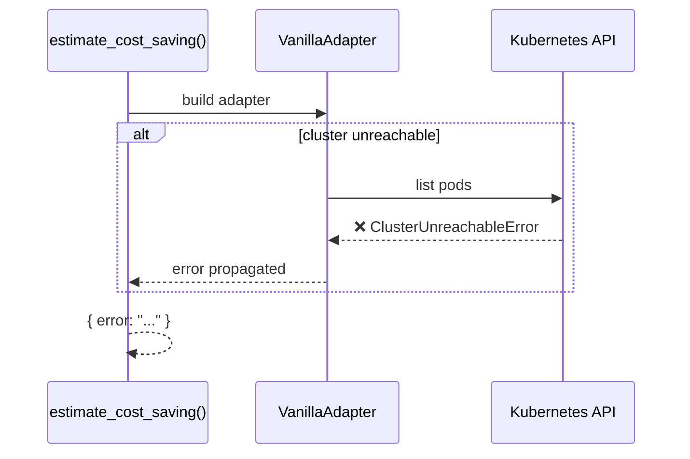

# Use Case — Estimate Cost Saving

## Sample Questions

- "How much could we save by right-sizing these deployments?"
- "What is the cost saving potential of removing idle pods?"
- "Estimate the monthly savings from optimizing resources."

---

Estimates monthly cost savings from resource right-sizing. The flow goes
through: MCP Tool → EstimateCostSavingUseCase → CostSavingEstimationPort →
VanillaAdapter → Kubernetes resource requests.

### Flow 1 — Happy Path

### Flow 2 — Errors

## Key Points

- Right-sizing savings based on resource requests vs usage.
- Adapter failures propagate as `HexawynError`; the MCP tool catches last.

## Test Coverage

| Test | File | Status |
|---|---|---|
| `test_returns_response` | `tests/unit/application/use_case/finops/test_uc_estimate_cost_saving_use_case.py` | ✅ |
| `test_tool_returns_dict` | `tests/unit/mcp/tools/test_tool_estimate_cost_saving.py` | ✅ |

## Related Files

- `src/hexawyn/mcp/tools/estimate_cost_saving.py`
- `src/hexawyn/application/use_case/finops/estimate_cost_saving/`
- `src/hexawyn/application/ports/driven/cost_saving_estimation_port.py`
- `src/hexawyn/adapters/secondary/vanilla/vanilla_adapter.py`
