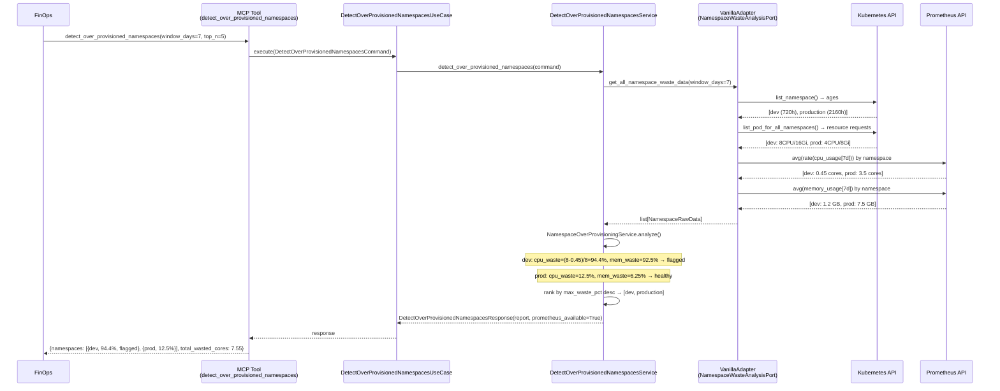
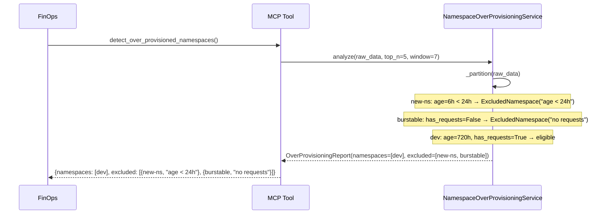
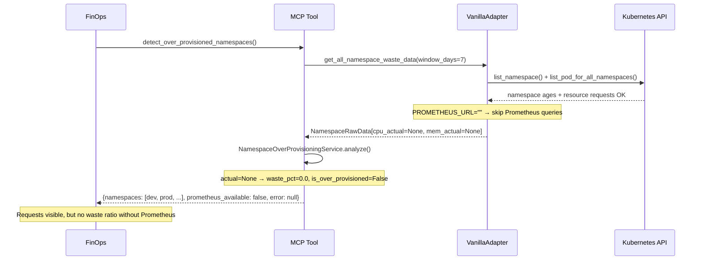
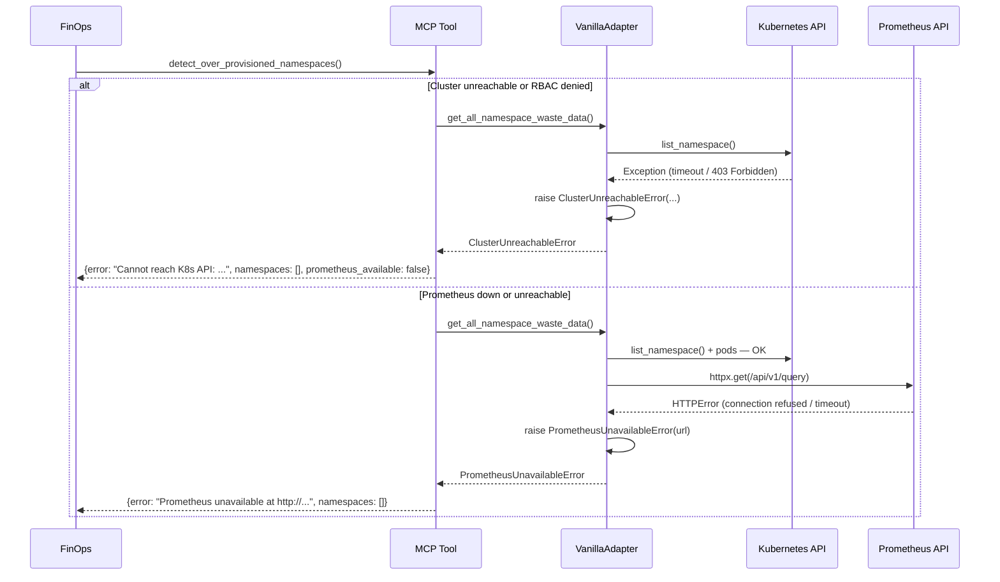

# Use Case 13 — Detect Over-Provisioned Namespaces

## Sample Questions

- "Which namespaces are wasting the most CPU and memory?"
- "Where can we reduce resource costs in the cluster?"
- "Show me the top 5 over-provisioned namespaces over the last 7 days"
- "The dev namespace has 8 CPUs allocated — how much is it actually using?"
- "What's our total estimated waste in cores and GB across all namespaces?"

---

FinOps use case: identifies namespaces where resource requests far exceed actual usage over a configurable window (default 7 days).
Waste ratio is computed independently for CPU and memory: `(requested - actual) / requested * 100`.
Namespaces with `max(cpu_waste_pct, memory_waste_pct) > 50%` are flagged as over-provisioned candidates.

---

## Flow 1 — Happy Path (dev=94% waste flagged, production=12% healthy)

---

## Flow 2 — Exclusions (new namespace < 24h + BestEffort pods with no requests)

---

## Flow 3 — Prometheus Unavailable (K8s-only mode, waste ratio not computable)

---

## Flow 4 — Error Flows (Cluster RBAC denied / Prometheus down)

---

## Key Points

- CPU and memory waste computed **independently** — `max(cpu_waste_pct, memory_waste_pct)` determines if a namespace is over-provisioned
- Over-provisioned threshold: **> 50%** waste on either resource
- Namespaces younger than 24h or with no resource requests are **excluded**, never errored
- Prometheus is **optional** — without it, requests are listed but `waste_pct = 0.0`
- Results ranked by `max_waste_pct` descending; `top_n` (default 5) caps output

## Test Coverage

| Test | File | Scenario |
|---|---|---|
| `test_dev_namespace_94_pct_cpu_waste` | `test_namespace_over_provisioning_service.py` | Formula: (8-0.45)/8×100 = 94.4% |
| `test_dev_94pct_waste_is_flagged` | `test_namespace_over_provisioning_service.py` | Flagging threshold > 50% |
| `test_no_resource_requests_excluded` | `test_namespace_over_provisioning_service.py` | BestEffort exclusion |
| `test_recently_created_namespace_excluded` | `test_namespace_over_provisioning_service.py` | Age < 24h exclusion |
| `test_ranking_dev_before_staging_before_prod` | `test_namespace_over_provisioning_service.py` | Ranking by max_waste_pct |
| `test_namespace_included_when_no_prometheus_data` | `test_namespace_over_provisioning_service.py` | Prometheus unavailable — no flagging |
| `test_tc1_dev_flagged_production_healthy` | `test_detect_over_provisioned_namespaces_integration.py` | Integration TC1 |
| `test_tc2_recently_created_namespace_excluded` | `test_detect_over_provisioned_namespaces_integration.py` | Integration TC2 |
| `test_prometheus_unavailable_raises_error` | `test_detect_over_provisioned_namespaces_integration.py` | Prometheus down → error |
| `test_waste_ratio_formula_correct` | `test_detect_over_provisioned_namespaces_integration.py` | Formula end-to-end |

## Related Files

- `src/hexawyn/domain/models/namespace_waste.py` — `NamespaceWaste`, `ExcludedNamespace`, `OverProvisioningReport`
- `src/hexawyn/domain/services/namespace_waste/namespace_over_provisioning_service.py` — pure waste computation
- `src/hexawyn/application/ports/driven/namespace_waste_port.py` — `NamespaceRawData`, `NamespaceWasteAnalysisPort`
- `src/hexawyn/application/service/detect_over_provisioned_namespaces_service.py` — orchestration
- `src/hexawyn/adapters/secondary/vanilla/vanilla_adapter.py` — K8s + Prometheus data fetch
- `src/hexawyn/mcp/tools/detect_over_provisioned_namespaces.py` — MCP entry point
