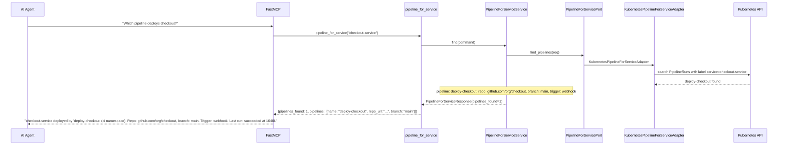
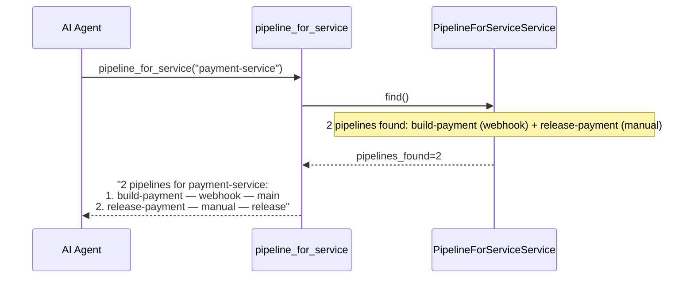
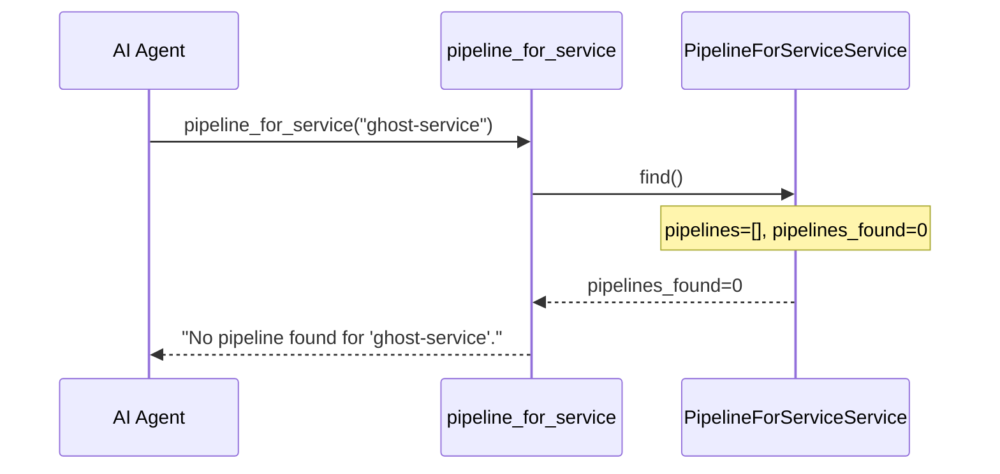

# Use Case 13 — Pipeline for Service

## Sample Questions

- "Find the pipeline responsible for deploying the checkout service"
- "Which repository and branch does the payment-service pipeline use?"
- "What pipeline builds the auth-service and what is its trigger?"
- "Are there multiple pipelines for the order service?"
- "Show me the last run status of the deployment pipeline for checkout-service"

---

One MCP tool: `pipeline_for_service`. Finds Tekton/ArgoCD pipelines associated with a service, returns repo URL, branch, trigger config, last run status.

### Flow 1 — Happy Path: Pipeline Found



### Flow 2 — Multiple Pipelines



### Flow 3 — Not Found



### Flow 4 — Checker Node: Monorepo Detection

```mermaid
sequenceDiagram
    participant Checker as Checker Node
    participant LLM as LLM Response

    Checker->>LLM: Validate pipeline attribution
    alt Pipeline uses monorepo but subdirectory not mentioned
        Checker-->>LLM: ⚠️ FLAG — monorepo subdirectory path must be shown
    alt LLM confuses webhook trigger with cron schedule
        Checker-->>LLM: ❌ FAIL — trigger type must match actual config
    else All checks pass
        Checker-->>LLM: ✅ PASS
    end
```

## Key Points

- **Service→Pipeline mapping** — searches by label/annotation matching service name
- **Trigger types** — webhook, schedule (cron), manual
- **Multi-pipeline** — all pipelines returned if service has build + release
- **Last run** — most recent PipelineRun status + timestamp

## Test Coverage

| Test | File | Status |
|---|---|---|
| `test_pipeline_found` | `tests/unit/test_pipeline_for_service.py` | ✅ |
| `test_multiple_pipelines` | `tests/unit/test_pipeline_for_service.py` | ✅ |
| `test_not_found` | `tests/unit/test_pipeline_for_service.py` | ✅ |
| `test_finds_pipeline` | `tests/unit/test_pipeline_for_service_tool.py` | ✅ |

## Related Files

- `src/hexawyn/domain/models/pipeline_for_service.py` — ServicePipeline, PipelineForServiceResult
- `src/hexawyn/application/ports/driven/pipeline_for_service_port.py` — PipelineForServicePort ABC
- `src/hexawyn/adapters/secondary/gitops/kubernetes_pipeline_for_service_adapter.py` — adapter
- `src/hexawyn/mcp/tools/pipeline_for_service.py` — MCP tool
