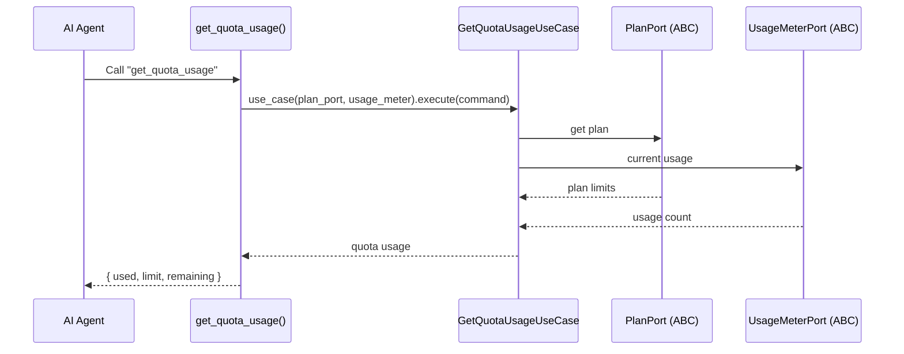
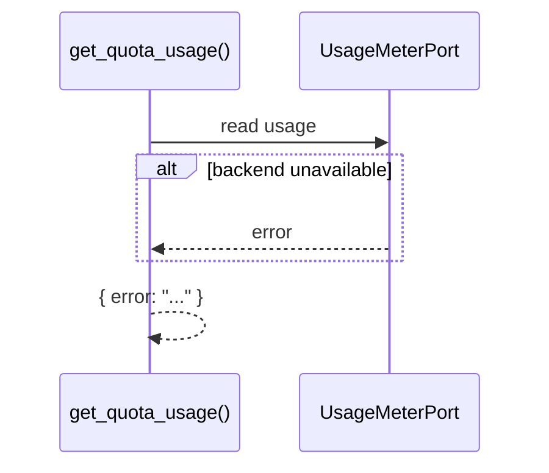

# Use Case — Get Quota Usage

## Sample Questions

- "What is our current quota usage?"
- "How many investigations have we used this month?"
- "Am I close to my quota limit?"

---

Reports plan quota usage through: MCP Tool → GetQuotaUsageUseCase → PlanPort +
UsageMeterPort → pricing/usage adapters.

### Flow 1 — Happy Path

### Flow 2 — Errors

## Key Points

- Combines plan limits (PlanPort) with metered usage (UsageMeterPort).
- No cluster dependency — purely quota/billing data.

## Test Coverage

| Test | File | Status |
|---|---|---|
| `test_returns_response` | `tests/unit/application/use_case/cluster/test_uc_get_quota_usage_use_case.py` | ✅ |
| `test_tool_returns_dict` | `tests/unit/tools/test_get_quota_usage.py` | ✅ |

## Related Files

- `src/hexawyn/mcp/tools/get_quota_usage.py`
- `src/hexawyn/application/use_case/cluster/get_quota_usage/`
- `src/hexawyn/application/ports/driven/plan_port.py`
- `src/hexawyn/application/ports/driven/usage_meter_port.py`
