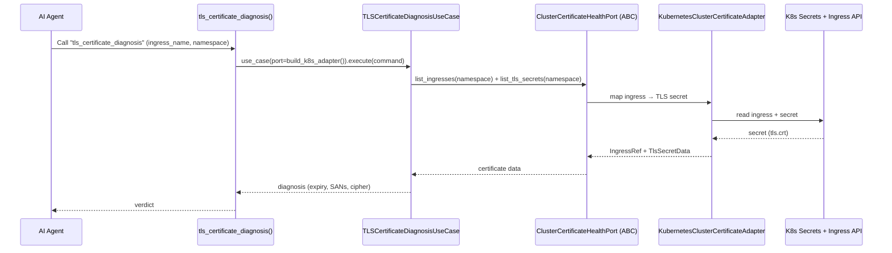
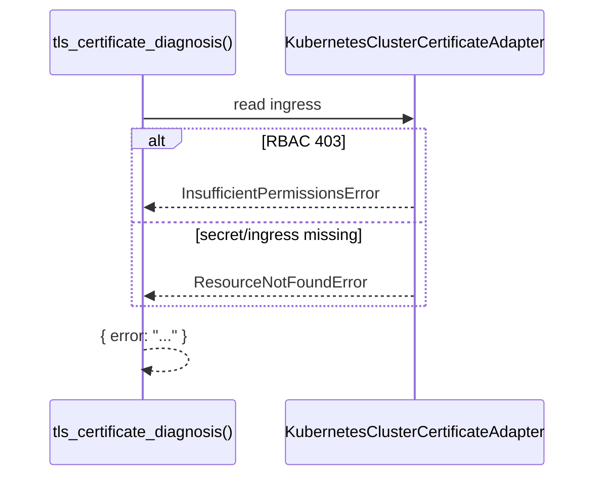

# Use Case — TLS Certificate Diagnosis

## Sample Questions

- "Diagnose the TLS certificate on the payment-service ingress."
- "Is the ingress certificate expired, misconfigured, or using a deprecated cipher?"
- "Check the TLS certificate validity and SANs for the production ingress."
- "Why is the checkout ingress returning SSL handshake errors?"

---

Diagnoses the TLS certificate backing an Ingress through: MCP Tool →
TLSCertificateDiagnosisUseCase → ClusterCertificateHealthPort →
KubernetesClusterCertificateAdapter → Kubernetes Networking/Secrets API.

### Flow 1 — Happy Path

### Flow 2 — Errors

## Key Points

- Maps an Ingress to its TLS secret, parses `tls.crt`, checks expiry/SANs.
- 403 → `InsufficientPermissionsError`, missing resource → `ResourceNotFoundError`.

## Test Coverage

| Test | File | Status |
|---|---|---|
| `test_returns_response` | `tests/unit/application/use_case/cert_manager/test_uc_tls_certificate_diagnosis_use_case.py` | ✅ |
| `test_parse_pem` | `tests/unit/domain/models/test_tls_certificate_diagnosis.py` | ✅ |
| `test_tool_returns_dict` | `tests/unit/mcp/tools/test_tool_tls_certificate_diagnosis.py` | ✅ |

## Related Files

- `src/hexawyn/mcp/tools/tls_certificate_diagnosis.py`
- `src/hexawyn/application/use_case/cert_manager/tls_certificate_diagnosis/`
- `src/hexawyn/application/ports/driven/cluster_certificate_health_port.py`
- `src/hexawyn/adapters/secondary/kubernetes_cluster_certificate_adapter.py`
