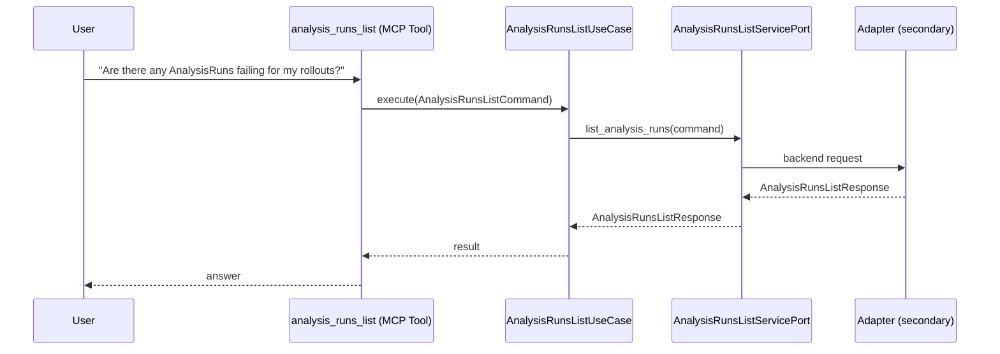

# Use Case 133 — Analysis Runs List

## Sample Questions

- "Are there any AnalysisRuns failing for my rollouts?"
- "Which metrics failed in the payments-api analysis?"
- "List all AnalysisRuns associated with the checkout rollout"
- "Has the automated analysis passed for the production canary?"
- "Show me all failed AnalysisRuns with their error messages"

---

"List Argo Rollouts AnalysisRuns and their metric results, showing which automated canary analyses passed or failed" The user asks via analysis_runs_list. The flow crosses the hexagonal layers: MCP Tool → AnalysisRunsListUseCase → AnalysisRunsListServicePort (driven port) → secondary adapter (via adapter_factory) → pipelines infrastructure.

### Flow 1 — Analysis Runs List execution

## Key Points

- `AnalysisRunsListUseCase` depends only on `AnalysisRunsListServicePort` — never on a cloud SDK.
- Adapter selection is by `adapter_factory`, never hardcoded.
- `{slug}` is registered in `mcp/tools/{slug}.py` and synced to the control-plane cache.

## Related Files

- `src/hexawyn/application/ports/driving/analysis_runs_list/analysis_runs_list_service_port.py`
- `src/hexawyn/application/use_case/pipelines/analysis_runs_list/analysis_runs_list_use_case.py`
- `src/hexawyn/mcp/tools/analysis_runs_list.py`

