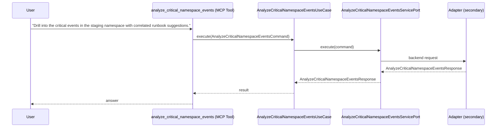

# Use Case 134 — Analyze Critical Namespace Events

## Sample Questions

- "Drill into the critical events in the staging namespace with correlated runbook suggestions."
- "What are the critical incidents in production and what runbooks apply?"
- "Is there a recurring OOMKilling incident in staging, and what's the recommended fix?"
- "Correlate the critical events in checkout namespace into incidents and suggest runbooks."
- "Give me the detailed critical-event analysis for payment-namespace with root cause grouping."

---

"Identify critical Kubernetes events in a namespace, group them into incidents with root cause, and suggest matching runbooks for OOMKilling and recurring failures" The user asks via analyze_critical_namespace_events. The flow crosses the hexagonal layers: MCP Tool → AnalyzeCriticalNamespaceEventsUseCase → AnalyzeCriticalNamespaceEventsServicePort (driven port) → secondary adapter (via adapter_factory) → troubleshooting infrastructure.

### Flow 1 — Analyze Critical Namespace Events execution

## Key Points

- `AnalyzeCriticalNamespaceEventsUseCase` depends only on `AnalyzeCriticalNamespaceEventsServicePort` — never on a cloud SDK.
- Adapter selection is by `adapter_factory`, never hardcoded.
- `{slug}` is registered in `mcp/tools/{slug}.py` and synced to the control-plane cache.

## Related Files

- `src/hexawyn/application/ports/driving/analyze_critical_namespace_events/analyze_critical_namespace_events_service_port.py`
- `src/hexawyn/application/use_case/troubleshooting/analyze_critical_namespace_events/analyze_critical_namespace_events_use_case.py`
- `src/hexawyn/mcp/tools/analyze_critical_namespace_events.py`

