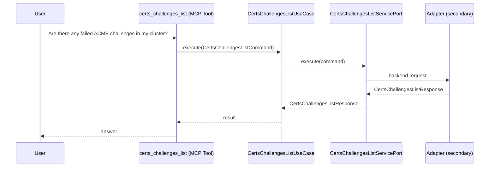

# Use Case 135 — Certs Challenges List

## Sample Questions

- "Are there any failed ACME challenges in my cluster?"
- "Show me all pending ACME DNS-01 challenges"
- "Which domains have errored HTTP-01 challenges?"
- "List all ACME challenges in the production namespace"
- "Why is my DNS challenge stuck in pending?"

---

"List cert-manager ACME challenges (DNS-01, HTTP-01) that are pending, failed or errored, and explain why a challenge is stuck" The user asks via certs_challenges_list. The flow crosses the hexagonal layers: MCP Tool → CertsChallengesListUseCase → CertsChallengesListServicePort (driven port) → secondary adapter (via adapter_factory) → cert_manager infrastructure.

### Flow 1 — Certs Challenges List execution

## Key Points

- `CertsChallengesListUseCase` depends only on `CertsChallengesListServicePort` — never on a cloud SDK.
- Adapter selection is by `adapter_factory`, never hardcoded.
- `{slug}` is registered in `mcp/tools/{slug}.py` and synced to the control-plane cache.

## Related Files

- `src/hexawyn/application/ports/driving/certs_challenges_list/certs_challenges_list_service_port.py`
- `src/hexawyn/application/use_case/cert_manager/certs_challenges_list/certs_challenges_list_use_case.py`
- `src/hexawyn/mcp/tools/certs_challenges_list.py`

